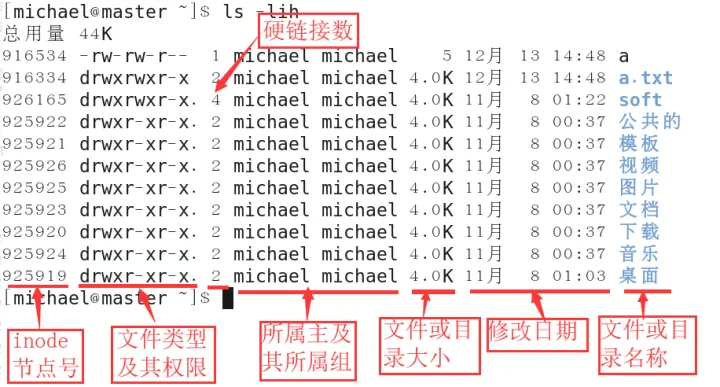
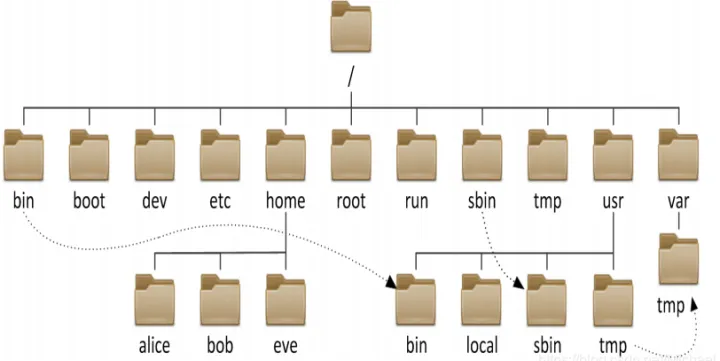
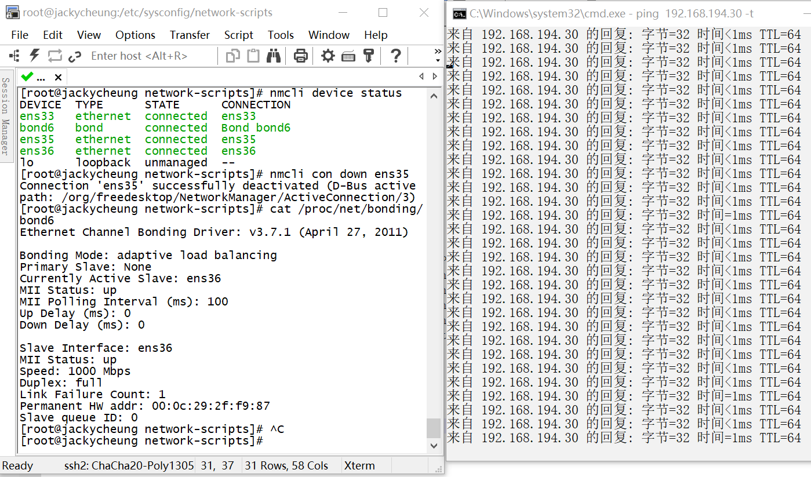
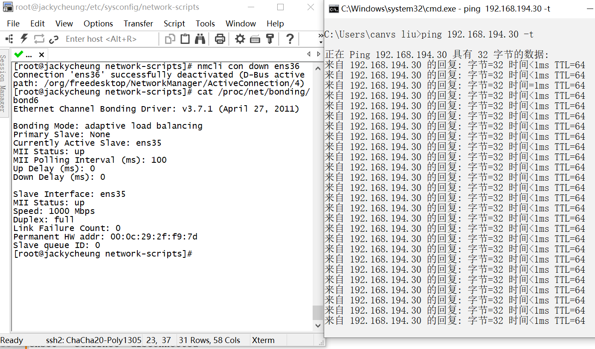
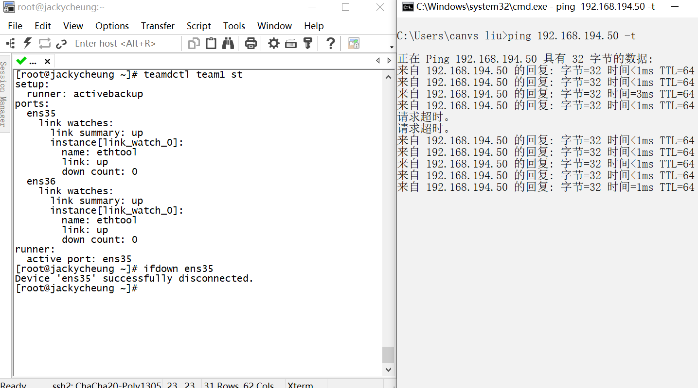
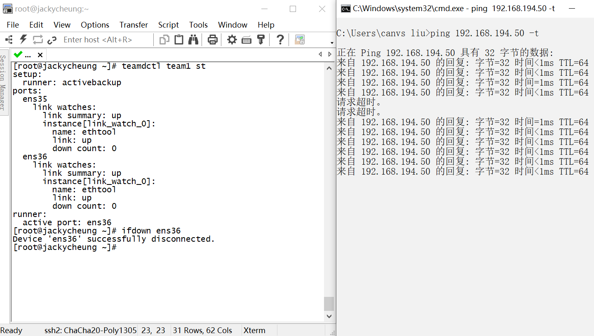
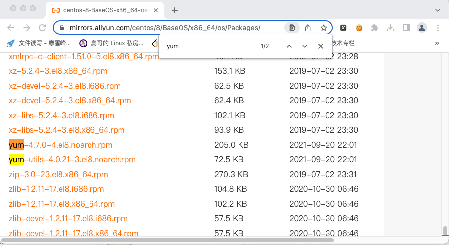
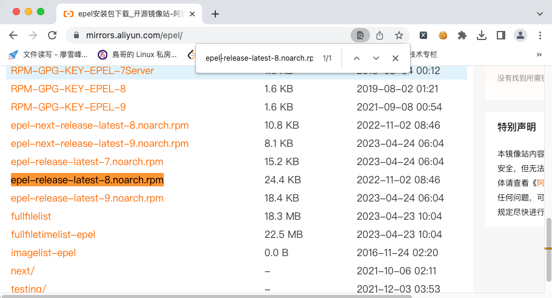
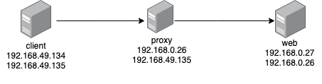
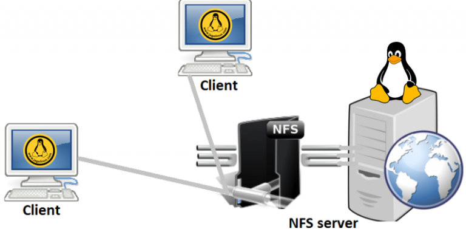

### Linux桌面

- X window软件
- KDE Plasma桌面
- GNOME桌面

| 桌面    | 描述                                                         |
| ------- | ------------------------------------------------------------ |
| Fluxbox | 一个没有面板的基本桌面，仅有一个可用来启动应用程序的弹出式菜单 |
| Xfce    | 与GNOME 2的桌面类似，但少了很多图形化元素以适应低内存环境    |
| JWM     | Joe的窗口管理器（Joe's Window Manager），非常适用于低内存小硬盘空间环境的超轻型桌面 |
| fvwm    | 支持诸如虚拟桌面和面板等高级桌面功能，但能够在低内存环境中运行 |
| fvwm95  | 衍生自fvwm，但看起来更像是Windows 95桌面                     |

### Linux发行版

核心Linux发行版包含有内核、一个或多个图形化桌面环境以及预编译好的大部分可用的Linux应用程序

**Linux核心发行版**

| 发行版             | 描述                                           |
| ------------------ | ---------------------------------------------- |
| Slackware          | 最早的Linux发行版中的一员，流行于Linux极客之间 |
| Red Hat Enterprise | 一个主要用于Internet服务器的商业发行版         |
| Gentoo             | 为高级Linux用户设计的发行版，仅包含Linux源代码 |
| openSUSE           | 兼顾商用和家用的发行版                         |
| Debian             | 流行于Linux专家和商用Linux产品中的发行版       |


### Linux基本概念

多用户的系统：允许同时有很多个用户登陆系统，使用系统资源

多任务的系统：允许同时执行多个任务

命令/选项/参数/文件名/目录名严格区分大小写

一切皆文件：硬件设备（内存、cpu、网卡、硬盘都是以文件形式存在的）
- 不管是文件还是目录都是以倒挂的树形结构，存在于系统的/目录下，/（根）是Linux的起点

- 对于Linux系统而言，目录还是文件都是没有扩展名一说
  - .sh：脚本文件
  - .log：日志文件
  - .conf：配置文件
  - .rpm：软件包
  - .tar：压缩包

### Linux系统分辨目录与文件的方法

- 蓝色表示目录
- 白色表示文件
- 浅蓝色表示链接文件
- 绿色表示可执行文件
- 红色表示压缩文件
- 黄色表示设备文件（硬盘、鼠标、cpu、网卡）
- 红色闪动文件表示链接文件不可用

### 命令终端

**命令行界面**（command line interface，CLI）。CLI只允许输入文本，而且只能显示文本和基本图形输出。

Linux系统启动时，会自动创建多个**虚拟控制台**。虚拟控制台是运行在Linux系统内存中的终端会话。

tty代表**电传打字机**（teletypewriter）

登录Linu虚拟控制台会看到shell CLI**提示符**

- ～：表示用户的家目录，其他用户不能随便访问
- /root：root超级管理员的家目录
- /home/用户名：普通用户的家目录

### 快捷键

- ctrl + l：清屏

- ctrl + u：清除当前命令

- ctrl + c:  取消当前命令

- tab：命令路径补全

- ctrl + a：光标移动行首

- ctrl + e：光标移动至行尾

- ctrl + w：删除一个单词

- ctrl + v+方向键：vim中选中特殊区域，配合x删除

- ctrl + s：暂停终端输出；终端会停止显示输出，但后台的进程仍在运行，这对于大量输出淹没屏幕非常有用

- ctrl + q：恢复被ctrl+s暂停的输出

### 命令一般格式

命令  [-选项...] [参数...]
- 选项：
  - 短选项：-l -a -d -h（单个字符），可以合并使用：-la -df
  - 长选项：--help（单词），长选项通常是不能合并使用的
- 参数：命令的执行对象，文件/目录/程序等
- 可以同时有多个选项和参数

### Linux系统文件类型

- -普通文件

- d 目录

- l 链接文件

- b 跨设备文件

- c 字符设备文件

- p 管道设备文件

- s 套接字

### Linux系统归属关系

- u 所有者：文件或目录的拥有者，拥有者的权限通常最大
- g 所有组：文件或目录的属于哪一个组，所属组的权限略微比所有者小
- o 其他人：既不是文件所有者，也不属于文件或目录组内成员，其他人的权限通常最小的权限

### ls命令

ls命令（英文：list）：用于查看目录下内容及目录文件详细属性信息

命令格式：l s [-选项...] [-参数...]

常用选项
- -a 显示目录下所有内容，包含隐藏的内容
- -l 以长格式显示目录下的内容及详细属性
- -h 以人性化显示目录下内容大小（KB、MB、GB）
- -d 仅显示目录本身而不显示目录下的内容
- -i 查看inode号
- -R 递归查看目录下所有的内容

~~~shell
# 权限后面1、5、1代表文件引用次数，只针对与做了硬连接的文件才有效
[root@localhost /]# ls -l
总用量 20
#l开头表示链接文件
lrwxrwxrwx.   1 root root    7 8月  12 2018 bin -> usr/bin			
#d开头表示目录
dr-xr-xr-x.   5 root root 4096 4月  25 13:48 boot						
#-开头表示文件
-rw-r--r--.   1 root root    0 4月  25 21:18 hello.txt					

#以人性化的显示占用空间
[root@localhost /]# ls -lh
总用量 20K
lrwxrwxrwx.   1 root root    7 8月  12 2018 bin -> usr/bin
dr-xr-xr-x.   5 root root 4.0K 4月  25 13:48 boot
drwxr-xr-x.  19 root root 3.1K 4月  25 21:06 dev
drwxr-xr-x.  79 root root 8.0K 4月  25 21:06 etc

#查看当前目录下所有文件包括隐藏文件
[root@localhost /]# ll -a
总用量 20
dr-xr-xr-x.  17 root root  241 4月  25 21:18 .
dr-xr-xr-x.  17 root root  241 4月  25 21:18 ..
lrwxrwxrwx.   1 root root    7 8月  12 2018 bin -> usr/bin
dr-xr-xr-x.   5 root root 4096 4月  25 13:48 boot
drwxr-xr-x.  19 root root 3080 4月  25 21:06 dev
drwxr-xr-x.  79 root root 8192 4月  25 21:06 etc
-rw-r--r--.   1 root root    0 4月  25 21:18 hello.txt

#查看文件inode号
[root@localhost /]# ll -i
总用量 20
     735 lrwxrwxrwx.   1 root root    7 8月  12 2018 bin -> usr/bin
     128 dr-xr-xr-x.   5 root root 4096 4月  25 13:48 boot
       3 drwxr-xr-x.  19 root root 3080 4月  25 21:06 dev
16777345 drwxr-xr-x.  79 root root 8192 4月  25 21:06 etc
  252494 -rw-r--r--.   1 root root    0 4月  25 21:18 hello.txt
     161 drwxr-xr-x.   2 root root    6 8月  12 2018 home
     739 lrwxrwxrwx.   1 root root    7 8月  12 2018 lib -> usr/lib 

#查看当前目录的详细信息
[root@localhost dev]# ll -d
drwxr-xr-x. 19 root root 3080 4月  25 21:06  
[root@jackycheung /]# ll -dh /etc/
drwxr-xr-x. 85 root root 8.0K Oct 29 17:08 /etc/
~~~



**r w - r-- r-- :所有者、所属组、其他人**

 **u     g   o**

~~~~shell
[root@localhost /]# ll
总用量 20
lrwxrwxrwx.   1 root root    7 8月  12 2018 bin -> usr/bin
dr-xr-xr-x.   5 root root 4096 4月  25 13:48 boot
drwxr-xr-x.  19 root root 3080 4月  25 21:06 dev
drwxr-xr-x.  79 root root 8192 4月  25 21:06 etc
-rw-r--r--.   1 root root    0 4月  25 21:18 hello.txt
drwxr-xr-x.   2 root root    6 8月  12 2018 home
lrwxrwxrwx.   1 root root    7 8月  12 2018 lib -> usr/lib
~~~~

### file命令

file命令是一个方便的小工具，能够探测文件的内部并判断文件类型

```shell
[root@localhost ~]# file /etc/passwd
/etc/passwd: ASCII text
[root@localhost ~]# echo hello world! > hello.txt
[root@localhost ~]# file hello.txt
hello.txt: ASCII text
[root@localhost ~]# file /tmp
/tmp: directory
```

### stat命令

Linux stat 命令用于显示 inode 内容。

命令格式：stat [option] ... file

常用选项：
- -f

~~~shell
[root@localhost /]# stat hello.txt 
  文件：hello.txt
  大小：0               块：0          IO 块：4096   普通空文件
设备：fd00h/64768d      Inode：252494      硬链接：1
权限：(0644/-rw-r--r--)  Uid：(    0/    root)   Gid：(    0/    root)
环境：unconfined_u:object_r:etc_runtime_t:s0
最近访问：2023-04-25 21:18:35.894161871 +0800
最近更改：2023-04-25 21:18:35.894161871 +0800
最近改动：2023-04-25 21:18:35.894161871 +0800
创建时间：-

[root@localhost /]# stat -f hello.txt 
  文件："hello.txt"
    ID：fd0000000000 文件名长度：255     类型：xfs
块大小：4096       基本块大小：4096
    块：总计：4452864    空闲：4066561    可用：4066561
Inodes: 总计：8910848    空闲：8875802
~~~

### mkdir命令

mkdir (make directory) 用于创建新的目录

命令格式：mkdir [-选项] 目录名

- 常用选项：
  - -p递归创建多个目录
- 注意事项：
  - 目录还是名字，除了以 "/" 以外的任意名称
  - 文件或目录的名字长度不能超过255个字符

```shell
# 创建study目录
[root@localhost ~]# mkdir study
[root@localhost ~]# ls
anaconda-ks.cfg  study
# 递归创建study/test1/t1目录
[root@localhost ~]# mkdir -p study/test1/t1
[root@localhost ~]# ls
anaconda-ks.cfg  study
[root@localhost ~]# ll -R study
study:
总用量 0
drwxr-xr-x. 3 root root 16 4月  27 00:21 test1

study/test1:
总用量 0
drwxr-xr-x. 2 root root 6 4月  27 00:21 t1

study/test1/t1:
总用量 0
```

### cd命令

cd（change directory）切换目录

命令格式：cd [-选项] [目录名]

常用快捷操作
- ～表示家目录
- .表示当前目录
- ..表示上一级目录
- -可在两路径之间来回切换

- 绝对路径：以/为起点，到达目标目录；/etc/yum
- 相对路径：以当前目录为起点，到达目标目录；yum/test/

```shell
# 相对路径进入到study/test1
[root@localhost ~]# cd study/test1
[root@localhost test1]# pwd
/root/study/test1
# 回到上一级目录
[root@localhost test1]# cd ..
# 回到家目录
[root@localhost study]# cd
# 绝对路径进入/root/study/test1目录
[root@localhost ~]# cd /root/study/test1
[root@localhost test1]# cd /root/study/test2
# -两路径之间切换
[root@localhost test2]# cd -
/root/study/test1
```

### pwd命令

pwd（print work directory）打印当前所在的绝对目录

命令格式：pwd [-选项]

### rmdir命令

rmdir（remove directory）删除空目录，只能一层一层删除目录

命令格式：rmdir [-选项] 目录名

```shell
# 删除目录
[root@localhost test1]# rmdir t1
# 只能一层一层删除目录
[root@localhost ~]# rmdir study/
rmdir: 删除 'study/' 失败: 目录非空
```

### touch命令

touch命令用于创建新的空白文件，有同名文件不会覆盖

命令格式：touch [-选项] 文件名

```shell
# 创建hello.py文件
[root@localhost ~]# touch hello.py
[root@localhost ~]# ls
anaconda-ks.cfg  hello.py  study
```

### cp命令

cp（copy file）用于复制文件或目录，cp命令在复制时也可以修改文件或目录的名字

命令格式：cp [-选项] 原文件或目标 目标目录

常用选项：
- -p 保留原文件属性不变（修改时间、归属关系、权限）
- -r 复制目录（包含该目录下所有子目录和文件）

```shell
# 将hello.py重命名复制到study/test1/下
[root@localhost ~]# cp hello.py study/test1/hello1.py
# 将hello.py保留原文件属性重命名复制到study/test1/下
[root@localhost ~]# cp -p hello.py study/test1/hello2.py
[root@localhost ~]# ll study/test1/
总用量 0
-rw-r--r--. 1 root root 0 4月  27 00:28 hello1.py
-rw-r--r--. 1 root root 0 4月  27 00:27 hello2.py

# 将study目录在复制到/root/study2/下重命名oo
[root@localhost ~]# cp -r study /root/study2/oo
[root@localhost ~]# ls /root/study2/oo
test1
# 将study目录复制到/root/study2/oo下
[root@localhost ~]# cp -r study /root/study2/oo
[root@localhost ~]# ls /root/study2/oo
study  test1
```

### mv命令

mv（move file）移动文件或目录到其他位置，也可以修改文件或目录用户名

命令格式：mv [-选项] 源文件.... 目标路径

```shell
# 将study整个目录移动重命名到/root/study3/下
[root@localhost ~]# mv study /root/study3/study_t
[root@localhost ~]# ll study3/
总用量 0
drwxr-xr-x. 3 root root 19 4月  27 00:21 study_t
[root@localhost ~]# ls
anaconda-ks.cfg  hello.py  study3
```

### cat命令

cat（concatenate）用于查看文本文件内容

命令格式：cat [- 选项] 文件名

常用选项
- -n 查看文件时以行号的形式显示文件内容

```shell
[root@localhost ~]# cat -n /etc/passwd
     1  root:x:0:0:root:/root:/bin/bash
     2  bin:x:1:1:bin:/bin:/sbin/nologin
     3  daemon:x:2:2:daemon:/sbin:/sbin/nologin
     4  adm:x:3:4:adm:/var/adm:/sbin/nologin
     5  lp:x:4:7:lp:/var/spool/lpd:/sbin/nologin
     6  sync:x:5:0:sync:/sbin:/bin/sync
     7  shutdown:x:6:0:shutdown:/sbin:/sbin/shutdown
     8  halt:x:7:0:halt:/sbin:/sbin/halt
     9  mail:x:8:12:mail:/var/spool/mail:/sbin/nologin
    10  operator:x:11:0:operator:/root:/sbin/nologin
    11  games:x:12:100:games:/usr/games:/sbin/nologin
    12  ftp:x:14:50:FTP User:/var/ftp:/sbin/nologin
    13  nobody:x:65534:65534:Kernel Overflow User:/:/sbin/nologin
    14  dbus:x:81:81:System message bus:/:/sbin/nologin
    15  systemd-coredump:x:999:997:systemd Core Dumper:/:/sbin/nologin
    16  systemd-resolve:x:193:193:systemd Resolver:/:/sbin/nologin
    17  tss:x:59:59:Account used by the trousers package to sandbox the tcsd daemon:/dev/null:/sbin/nologin
    18  polkitd:x:998:996:User for polkitd:/:/sbin/nologin
    19  unbound:x:997:995:Unbound DNS resolver:/etc/unbound:/sbin/nologin
    20  sssd:x:996:993:User for sssd:/:/sbin/nologin
    21  sshd:x:74:74:Privilege-separated SSH:/var/empty/sshd:/sbin/nologin
```

### less命令

less命令是对文件的输出进行分页显示的工具，常用于查看内容量较大的文件

命令格式：less [-选项] 文件

常用选项：
- -N 以行号显示文件内容

使用方法：
- 键盘上下键逐行查看
- pgdn：向下翻一页
- pdup：向上翻一页
- /字符串：搜索指定字符串
  - n：从上向下搜索
  - N：从下向上搜索
- G：直接跳转到文件最后一行
- gg：直接跳转到文件行首
- q：退出 

> “less is more”（少就是多）出自著名的现代主义建筑大师Ludwig Mies van der Rohe。

### head与tail命令

head：用于显示文件开头部分内容，默认显示文件开头10行内容
- 命令格式：head [- 选项] 参数
- 常用选项：
  - -n<行数>指定显示的行数

tail：用来显示文件末尾部分内容，默认显示文件末尾10行内容
- 命令格式：tail [- 选项] 参数
- 常用选项：
  - -n<行数>指定显示的行数 
  - -f动态显示

```shell
[root@localhost ~]# head  /etc/services 
# /etc/services:
# $Id: services,v 1.49 2017/08/18 12:43:23 ovasik Exp $
#
# Network services, Internet style
# IANA services version: last updated 2016-07-08
#
# Note that it is presently the policy of IANA to assign a single well-known
# port number for both TCP and UDP; hence, most entries here have two entries
# even if the protocol doesn't support UDP operations.
# Updated from RFC 1700, ``Assigned Numbers'' (October 1994).  Not all ports
[root@localhost ~]# head -4 /etc/services 
# /etc/services:
# $Id: services,v 1.49 2017/08/18 12:43:23 ovasik Exp $
#
# Network services, Internet style
[root@localhost ~]# tail /etc/services 
aigairserver    21221/tcp               # Services for Air Server
ka-kdp          31016/udp               # Kollective Agent Kollective Delivery
ka-sddp         31016/tcp               # Kollective Agent Secure Distributed Delivery
edi_service     34567/udp               # dhanalakshmi.org EDI Service
axio-disc       35100/tcp               # Axiomatic discovery protocol
axio-disc       35100/udp               # Axiomatic discovery protocol
pmwebapi        44323/tcp               # Performance Co-Pilot client HTTP API
cloudcheck-ping 45514/udp               # ASSIA CloudCheck WiFi Management keepalive
cloudcheck      45514/tcp               # ASSIA CloudCheck WiFi Management System
spremotetablet  46998/tcp               # Capture handwritten signatures
[root@localhost ~]# tail -5 /etc/services 
axio-disc       35100/udp               # Axiomatic discovery protocol
pmwebapi        44323/tcp               # Performance Co-Pilot client HTTP API
cloudcheck-ping 45514/udp               # ASSIA CloudCheck WiFi Management keepalive
cloudcheck      45514/tcp               # ASSIA CloudCheck WiFi Management System
spremotetablet  46998/tcp               # Capture handwritten signatures
[root@localhost ~]# tail -f hello.py 
helloworldls!
你好，世界！

[root@jackycheung ~]# head -5 cdrom.log 
-r--r--r-- 1 root root  1.8M 6月  23 2020 389-ds-base-1.3.10.2-6.el7.x86_64.rpm
-r--r--r-- 1 root root  714K 6月  23 2020 389-ds-base-libs-1.3.10.2-6.el7.x86_64.rpm
-r--r--r-- 1 root root  150K 3月  30 2017 abattis-cantarell-fonts-0.0.25-1.el7.noarch.rpm
-r--r--r-- 1 root root  539K 7月   2 2020 abrt-2.1.11-60.el7.x86_64.rpm
-r--r--r-- 1 root root  195K 7月   2 2020 abrt-addon-ccpp-2.1.11-60.el7.x86_64.rpm
[root@jackycheung ~]# tail -5 cdrom.log 
-r--r--r-- 1 root root   51K 7月   9 2018 zlib-devel-1.2.7-18.el7.i686.rpm
-r--r--r-- 1 root root   50K 7月   9 2018 zlib-devel-1.2.7-18.el7.x86_64.rpm
-r--r--r-- 1 root root  2.4M 3月   3 2020 zsh-5.0.2-34.el7_8.2.x86_64.rpm
-r--r--r-- 1 root root   84K 10月 29 2019 zziplib-0.13.62-12.el7.i686.rpm
-r--r--r-- 1 root root   83K 10月 29 2019 zziplib-0.13.62-12.el7.x86_64.rpm
[root@jackycheung ~]# tail -5f cdrom.log 
-r--r--r-- 1 root root   51K 7月   9 2018 zlib-devel-1.2.7-18.el7.i686.rpm
-r--r--r-- 1 root root   50K 7月   9 2018 zlib-devel-1.2.7-18.el7.x86_64.rpm
-r--r--r-- 1 root root  2.4M 3月   3 2020 zsh-5.0.2-34.el7_8.2.x86_64.rpm
-r--r--r-- 1 root root   84K 10月 29 2019 zziplib-0.13.62-12.el7.i686.rpm
-r--r--r-- 1 root root   83K 10月 29 2019 zziplib-0.13.62-12.el7.x86_64.rpm
^C
[root@jackycheung ~]# 
```

### rm命令

rm（remove）用于删除文件或目录

命令格式：rm [- 选项...] 文件或目录...

常用选项：
- -f 强制删除，不提示
- -r 删除目录
- *特殊字符：通配符，表示任意字符

```shell
[root@localhost ~]# rm hello.py 
rm：是否删除普通文件 'hello.py'？y
[root@localhost ~]# rm -r study3/
rm：是否进入目录'study3/'? y
rm：是否进入目录'study3/study_t'? y
rm：是否进入目录'study3/study_t/test1'? y
rm：是否删除普通空文件 'study3/study_t/test1/hello1.py'？y
rm：是否删除普通空文件 'study3/study_t/test1/hello2.py'？y
rm：是否删除目录 'study3/study_t/test1'？y
rm：是否删除目录 'study3/study_t'？y
rm：是否删除目录 'study3/'？y
[root@localhost ~]# ls
anaconda-ks.cfg
[root@localhost ~]# rm -rf study
[root@localhost ~]# ls
anaconda-ks.cfg
[root@localhost ~]# ls
anaconda-ks.cfg  t1  t2  t24  t4  ttst3
[root@localhost ~]# rm -rf t*
[root@localhost ~]# ls
anaconda-ks.cfg
[root@localhost tmp]# mkdir -p a/b/c/d/e
[root@localhost tmp]# ll
total 0
drwxr-xr-x. 3 root root 15 Aug 13 23:02 a
drwxr-xr-x. 3 root root 15 Aug 13 23:00 A
[root@localhost tmp]# rm -rf /tmp/a
[root@localhost tmp]# rm -rf /rmp/A/*
[root@localhost tmp]# ll
total 0
drwxr-xr-x. 3 root root 15 Aug 13 23:00 A
```

> rm -rf /tmp/ 会删除tmp目录本身
>
> rm -rf /tmp/* 删除tmp下的内容

### 软连接和硬连接

Linux中的连接文件类似于Windows的快捷方式

注意：创建链接时一定要写目录或文件的绝对路径，哪怕是在当前路径下，也要写绝对路径；使用链接文件可以实现同步更新

- 软连接
  - 特点：软连接可以跨分区，可以对目录进行链接，原文件删除后，链接文件不可用；软链接文件权限取决于原文件权限
  - 软连接命令格式：ln -s 原文件路径 目标路径
- 硬连接
  - 特点：硬连接不可跨分区，不可以对目录进行连接，原文件删除后，链接依旧可用；硬链接文件属性保持不变（inode、最近修改时间）
  - 硬连接命令格式：ln 原文件路径 目标路径
- 删除链接：在删除链接目录，使用rm -rf末尾不能加“/”，否则会删除原文件
  - unlink 链接文件名
  - rm 链接文件名
  - rm -f 链接文件名
  - rm -rf 链接目录

```shell
[root@localhost ~]# ll
总用量 8
-rw-------. 1 root root 1191 4月  25 13:47 anaconda-ks.cfg
-rw-r--r--. 1 root root    6 4月  27 14:50 hello.py
drwxr-xr-x. 2 root root    6 4月  27 14:49 study
# 创建软链接
[root@localhost ~]# ln -s /root/hello.py /root/study/
[root@localhost ~]# ll /root/study/
总用量 0
# 软链接文件权限取决于原文件权限
lrwxrwxrwx. 1 root root 14 4月  27 14:50 hello.py -> /root/hello.py
[root@localhost ~]# echo 你好世界！> hello.py 
[root@localhost ~]# cat /root/study/hello.py 
你好世界！
[root@localhost ~]# cat hello.py 
你好世界！
# 创建硬链接，文件属性保持不变
[root@localhost ~]# ln /root/hello.py /root/study/
[root@localhost ~]# ll study/
总用量 4
-rw-r--r--. 2 root root 27 4月  27 14:54 hello.py
[root@localhost ~]# echo hello >> hello.py 
[root@localhost ~]# cat study/hello.py
helloworld
你好世界！
hello
# 硬链接原文件删除后，链接依旧可用
[root@localhost ~]# rm -rf hello.py 
[root@localhost ~]# cat /root/study/hello.py 
helloworld
你好世界！
hello

# 创建软链接目录
[root@localhost ~]# ln -s /root/study/ /root/test/
[root@localhost ~]# ll test
总用量 0
lrwxrwxrwx. 1 root root 12 4月  27 15:59 study -> /root/study/
# 删除软链接目录
[root@localhost ~]# rm -rf test/study
[root@localhost ~]# ll
总用量 4
-rw-------. 1 root root 1191 4月  25 13:47 anaconda-ks.cfg
drwxr-xr-x. 2 root root   22 4月  27 15:48 study
drwxr-xr-x. 2 root root    6 4月  27 15:59 test

[root@jackycheung ~]# ln /root/passwd /root/testLN/
[root@jackycheung ~]# ll testLN/
total 4
-rw-r--r--. 2 root root 1193 Oct 29 00:14 passwd
[root@jackycheung ~]# unlink /root/testLN/passwd 
[root@jackycheung ~]# ll testLN/
total 0
```

### fdisk命令

Linux fdisk 是一个创建和维护分区表的程序，它兼容 DOS 类型的分区表、BSD 或者 SUN 类型的磁盘列表

命令格式：fdisk [- 必要参数] [选择参数]

- 必要参数：
  - -l 列出素所有分区表
  - -u 与 **-l** 搭配使用，显示分区数目

- 选择参数：

  - -s<分区编号> 指定分区

  - -v 版本信息

- 菜单操作说明

  - m ：显示菜单和帮助信息

  - a ：活动分区标记/引导分区

  - d ：删除分区

  - l ：显示分区类型

  - n ：新建分区

  - p ：显示分区信息

  - q ：退出不保存

  - t ：设置分区号

  - v ：进行分区检查

  - w ：保存修改

  - x ：扩展应用，高级功能

```shell
[root@localhost ~]# fdisk -l
Disk /dev/nvme0n1：20 GiB，21474836480 字节，41943040 个扇区
单元：扇区 / 1 * 512 = 512 字节
扇区大小(逻辑/物理)：512 字节 / 512 字节
I/O 大小(最小/最佳)：512 字节 / 512 字节
磁盘标签类型：dos
磁盘标识符：0x5d403be6

设备           启动    起点     末尾     扇区 大小 Id 类型
/dev/nvme0n1p1 *       2048  2099199  2097152   1G 83 Linux
/dev/nvme0n1p2      2099200 41943039 39843840  19G 8e Linux LVM


Disk /dev/mapper/rhel-root：17 GiB，18249416704 字节，35643392 个扇区
单元：扇区 / 1 * 512 = 512 字节
扇区大小(逻辑/物理)：512 字节 / 512 字节
I/O 大小(最小/最佳)：512 字节 / 512 字节


Disk /dev/mapper/rhel-swap：2 GiB，2147483648 字节，4194304 个扇区
单元：扇区 / 1 * 512 = 512 字节
扇区大小(逻辑/物理)：512 字节 / 512 字节
I/O 大小(最小/最佳)：512 字节 / 512 字节

```

### 内部命令与外部命令

什么是命令：用来实现某一种功能的指令和程序

命令的执行依赖于解释器（例如：/bin/bash）；**/etc/shells**文件存放系统可以用的shell

用户 <--> 解释器（shell） <--> 内核

Linux命令的分类
- 内部命令：shell程序自带的基本管理命令
- 外部命令：有独立的外部可执行程序文件命令
- type用于区别内部命令与外部命令
- which用于查找可执行程序文件位置

```shell
[root@localhost ~]# cat /etc/shells 
/bin/sh
/bin/bash
/usr/bin/sh
/usr/bin/bash
[root@localhost ~]# which ls
alias ls='ls --color=auto'
        /usr/bin/ls
```

### hash命令

在Linux系统存在一个hash表，系统初始时hash表为空，当外部命令执行时，默认会从PATH路径下寻找该命令，找到后会将这条命令的路径记录到hash表中，当再次使用该命令时，shell解释器首先会查看hash表，存在将执行，如果不存在，将会去**PATH**路径下寻找，利用hash缓存表可大大提高命令的调用速率。

- hash命令是bash的内置命令，用于显示hash缓存

- 命令格式：hash [-选项]
  -  –l：显示hash缓存，加参数-l既可以看到hash表命令的路径，也可以看到它的名字或别名
  - –p：path name 将命令全路径path起别名为name
  - –t：name 显示指定命令的完整路径
  - –d：name 清除name缓存
  - –r：清除缓存

```shell
[root@localhost ~]# echo $PATH
/usr/local/sbin:/usr/local/bin:/usr/sbin:/usr/bin:/root/bin
[root@localhost ~]# hash
命中    命令
   2    /usr/bin/cat
   3    /usr/bin/ls
[root@localhost ~]# hash -r
[root@localhost ~]# hash
hash: 哈希表为空
```

### help命令帮助手册

help命令用于查看**shell**内部命令的相关信息，包括使用方法、选项等...

命令格式：help [-选项] 命令

常用选项：
- -d 输出每个主题的简短描述
- -m 以伪man手册的格式显示使用方法
- -s 为每一个匹配PATTERN模式的主题仅显示一个用法

```shell
[root@jackycheung ~]# help -d cd
cd - Change the shell working directory.
[root@localhost ~]# help cd
cd: cd [-L|[-P [-e]] [-@]] [目录]
    改变 shell 工作目录。
    
    改变当前目录至 DIR 目录。默认的 DIR 目录是 shell 变量 HOME
    的值。
    
    变量 CDPATH 定义了含有 DIR 的目录的搜索路径，其中不同的目录名称由冒号 (:)分隔。
    一个空的目录名称表示当前目录。如果要切换到的 DIR 由斜杠 (/) 开头，则 CDPATH
    变量不会被使用。
    
    如果路径找不到，并且 shell 选项 `cdable_vars' 被设定，则参数词被假定为一个
    变量名。如果该变量有值，则它的值被当作 DIR 目录。
    
    选项：
        -L      强制跟随符号链接: 在处理 `..' 之后解析 DIR 中的符号链接。
        -P      使用物理目录结构而不跟随符号链接: 在处理 `..' 之前解析 DIR 中的符号链接。
        -e      如果使用了 -P 参数，但不能成功确定当前工作目录时，返回非零的返回值。
        -@      在支持拓展属性的系统上，将一个有这些属性的文件当作有文件属性的目录。
    
    默认情况下跟随符号链接，如同指定 `-L'。
    `..' 使用移除向前相邻目录名成员直到 DIR 开始或一个斜杠的方式处理。
    
    退出状态：
    如果目录改变，或在使用 -P 选项时 $PWD 修改成功时返回 0，否则非零。
[root@localhost ~]# cat --help
用法：cat [选项]... [文件]...
连接所有指定文件并将结果写到标准输出。

如果没有指定文件，或者文件为"-"，则从标准输入读取。

  -A, --show-all           equivalent to -vET
  -b, --number-nonblank    number nonempty output lines, overrides -n
  -e                       equivalent to -vE
  -E, --show-ends          display $ at end of each line
  -n, --number             number all output lines
  -s, --squeeze-blank      suppress repeated empty output lines
  -t                       与-vT 等价
  -T, --show-tabs          将跳格字符显示为^I
  -u                       (被忽略)
  -v, --show-nonprinting   使用^ 和M- 引用，除了LFD和 TAB 之外
      --help            显示此帮助信息并退出
      --version         显示版本信息并退出

示例：
  cat f - g  先输出f 的内容，然后输出标准输入的内容，最后输出g 的内容。
  cat        将标准输入的内容复制到标准输出。

GNU coreutils 在线帮助：<https://www.gnu.org/software/coreutils/>
请向 <http://translationproject.org/team/zh_CN.html> 报告 cat 的翻译错误
完整文档请见：<https://www.gnu.org/software/coreutils/cat>
或者在本地使用：info '(coreutils) cat invocation'
```

### man获取命令帮助手册

man命令用于查看系统命令的帮助信息，包括使用方法、选项、列子...，对比help，man的输出信息更加详细

命令格式：man [- 选项] 命令

常用快捷操作
- 键盘下键向下移一行
- 键盘上键向上移一行
- PgUp 向上翻一页
- PgDown 向下翻一页
- /关键字 搜索关键字
  - n：向下查询
  - N：向上查询
- q 退出

**Linux手册惯用段名**

|      段       |            描述            |
| :-----------: | :------------------------: |
|     Name      | 显示命令名和一段简短的描述 |
|   Synopsis    |          命令语法          |
| Configuration |        命令配置信息        |
|  Description  |      命令的一般性描述      |
|    Options    |        命令选项描述        |
|  Exit Status  |       命令的退出状态       |
| Return Value  |        命令的返回值        |
|    Errors     |       命令的错误消息       |
|  Environment  |     命令使用的环境变量     |
|     Files     |       命令用到的文件       |
|   Versions    |       命令的版本信息       |
| Conforming To |       遵循的命名标准       |
|     Notes     |      其他有帮助的资料      |
|     Bugs      |       提交bug的途径        |
|    Example    |        命令用法示例        |
|    Authors    |     命令开发人员的信息     |
|   Copyright   |    命令源代码的版权状况    |
|   See Also    |   与该命令类似的其他命令   |

### info获取命令的帮助信息

命令格式：info [- 选项] 命令

按键操作：
- 空格键：向下翻一页
- n：跳到下一个节点
- p：跳到上一个节点
- u：回到上一层节点
- 回车键：光标移动到下一层节点处，以回车进入
- b：跳到当前info page的第一个节点处
- e：跳到当前info page的最后一个节点处
- /：在info page种就行搜索
- q：退出info page

### Linux系统的运行级别

Linux系统有7种运行级别，不同的运行级别运行的程序和功能都不一样，而Linux系统默认是运行在一个标准的级别上，**系统运行级别文件/etc/inittab**文件

- 0：所有进程被终止，及其将有序的停止，关机时系统处于这个运行级别
- 1：单用户模式，（root用户进行系统维护），系统里运行的所有服务也都不会启动
- 2：多用户模式（网络文件系统NFS服务没有被启动）
- 3：完全多用户模式，（NFS网络文件系统）标准的运行级别
- 4：保留模式，系统未使用
- 5：登录后，进入带GUI的图形界面，标准的运行级别
- 6：系统正常关闭并重启

```shell
# 查看当前处于级别；N表示从那个级别切换过来的，3表示当前处于级别
[root@localhost ~]# runlevel
N 3
[root@localhost ~]# cat /etc/inittab 
# inittab is no longer used.
#
# ADDING CONFIGURATION HERE WILL HAVE NO EFFECT ON YOUR SYSTEM.
#
# Ctrl-Alt-Delete is handled by /usr/lib/systemd/system/ctrl-alt-del.target
#
# systemd uses 'targets' instead of runlevels. By default, there are two main targets:
#
# multi-user.target: analogous to runlevel 3
# graphical.target: analogous to runlevel 5
#
# To view current default target, run:
# systemctl get-default
#
# To set a default target, run:
# systemctl set-default TARGET.target
[root@localhost ~]# systemctl get-default		# 查看系统默认级别
multi-user.target
```

### /etc/motd

如果想让登录者取得一些讯息，想要大家都知道的讯息

```shell
[root@jackycheung ~]# cat /etc/motd
Hello everone,
Our server will be maintained at 2024/11/7 0:00 - 24:00.
Please don't login server at that time. ^_^

Last login: Thu Nov  7 14:58:27 2024 from 192.168.194.1
Hello everone,
Our server will be maintained at 2024/11/7 0:00 - 24:00.
Please don't login server at that time. ^_^
[root@jackycheung ~]#
```

### 关机与重启

Linux下常用的关机命令有
- init 0 立刻关机
- halt 立刻关机
- poweroff 立刻关机
- shutdown -h now 立刻关机
- shutdown -h 10  10分钟后自动关机

重启
- reboot 立刻重启
- shutdown -r now 立刻重启
- shutdown -r 10 10分钟后重启

### Linux系统目录介绍



Linux会将文件存储在名为**虚拟目录**（virtual directory）的单个目录结构中。虚拟目录会将计算机中所有存储设备的文件路径都纳入单个目录结构。

Linux虚拟目录结构只包含一个称为**根**（root）目录的基础目录。

- /（根）：系统所有数据都存放在根目录下
- /bin：存放系统启动和运行基本命令所需的二进制文件；常见文件：bash 、ls、cp、mv、rm、cat、echo、grep等。
- /boot：存放启动Linux所需的文件，包括内核文件和引导加载程序（如GRUB）的配置文件；常见文件：vmlinuz（内核文件）、initrd.img（初始RAM磁盘）、grub（GRUB引导加载程序的配置文件）。
- /dev：存放设备文件，这些文件代表系统中的硬件设备；常见文件：null、zero、tty、sda、sdb等
- /etc：存放系统配置文件，这些文件通常由管理员编辑。常见文件：passwd、group、hosts、resolve.conf、fstab、sysconfig等。
- /root：超级管理员（root）的家目录；常见文件：/root/.bashrc、/root/.profile等
- /home：存放普通用户的家目录；常见目录：/home/user1、/home/user2等
- /lib：存放系统启动和运行基本命令所需的共享库文件；常见文件：libc.so、libm.so、ld-linux.so等
- /opt：存放可选的应用程序包，通常由第三方软件使用；常见目录：/opt/google/chrome，/opt/java等
- /srv：存放服务数据，如web服务器的数据文件；常见目录：/srv/www、/srv/ftp等
- /tmp：存放临时文件，这些文件在系统重启时通常会被删除。
- /var：存放可变数据文件，如日志文件、邮件队列、数据库文件等；常见目录：/var/log 、/var/mail、 /var/spool、/var/tmp等。
- /mnt、/media：光盘和镜像等预设的挂载点
- /proc：Linux虚拟文件系统（procfs），提供有关系统内核和进程的信息，常见目录：/proc/1234（进程信息）、/proc/cpuinfo、/proc/meminfo等
- /lib64:存放函式库
- /run：存放系统运行时的数据，如：PID文件、套接字文件等；常见文件：/run/ssh、/run/systemd等
- /sbin：存放系统管理员使用的系统维护和管理命令；常见文件：ifconfig、iptables、fdisk、shutdown、reboot等。
- /sys：虚拟文件系统，提供有关设备和内核信息的详细数据；常见目录：/sys/class、/sys/devices、/sys/block等
- /usr：存放用户程序和文件，包括应用程序、库文件、文档等
  - /usr/bin：与/bin目录相同，存放用户可以使用的命令程序
  - /usr/lib：与/lib目录相同，存放系统中的程序运行所需要的共享库及内核模块
  - /usr/etc：用于存放安装软件时使用的配置文件
  - /usr/games：与游戏比较相关的数据放置处
  - /usr/include：c/c++等程序语言的档头（header）与包含档（include）放置处
  - /usr/lib64：与/lib64目录相同，存放函式库
  - /usr/libexec：不经常被使用的执行程序或脚本会放置在此目录中
  - /usr/local：额外安装的软件存放目录
  - /usr/sbin：该目录与/sbin目录相同，存放用户可执行的二进制程序文件
  - /usr/share：放置只读架构的杂项数据文件
  - /usr/src：一般软件源代码建议存放该目录下

### 查看内核信息

uname命令用于显示系统内核信息

命令格式：uname [-选项...]

常用选项：
- -s：显示内核名称
- -r：显示内核版本

```shell
[root@jackycheung ~]# uname
Linux
[root@jackycheung ~]# uname -r
3.10.0-1160.el7.x86_64
[root@jackycheung ~]# uname -s
Linux
[root@jackycheung ~]# 
```

### 查看CPU信息

/proc/cpuinfo文件用于存放系统CPU信息

lscpu用于显示CPU架构信息

命令格式：lscpu [-选项]

```shell
[root@canvs ~]# cat /proc/cpuinfo
processor       : 0
vendor_id       : GenuineIntel
cpu family      : 6
model           : 165
model name      : Intel(R) Core(TM) i5-10400 CPU @ 2.90GHz
stepping        : 3
microcode       : 0xe0
cpu MHz         : 2904.000
cache size      : 12288 KB
physical id     : 0
siblings        : 1
core id         : 0
cpu cores       : 1
apicid          : 0
initial apicid  : 0
fpu             : yes
fpu_exception   : yes
cpuid level     : 22
wp              : yes
flags           : fpu vme de pse tsc msr pae mce cx8 apic sep mtrr pge mca cmov pat pse36 clflush mmx fxsr sse sse2 ss syscall nx pdpe1gb rdtscp lm constant_tsc arch_perfmon nopl xtopology tsc_reliable nonstop_tsc cpuid pni pclmulqdq ssse3 fma cx16 pcid sse4_1 sse4_2 x2apic movbe popcnt tsc_deadline_timer aes xsave avx f16c rdrand hypervisor lahf_lm abm 3dnowprefetch invpcid_single ssbd ibrs ibpb stibp ibrs_enhanced fsgsbase tsc_adjust bmi1 avx2 smep bmi2 invpcid rdseed adx smap clflushopt xsaveopt xsavec xgetbv1 xsaves arat flush_l1d arch_capabilities
bugs            : spectre_v1 spectre_v2 spec_store_bypass
bogomips        : 5808.00
clflush size    : 64
cache_alignment : 64
address sizes   : 45 bits physical, 48 bits virtual
power management:
# processor　：系统中逻辑处理核心数的编号，从0开始排序。
# vendor_id　：CPU制造商
# cpu family　：CPU产品系列代号
# model　　　：CPU属于其系列中的哪一代的代号
# model name：CPU属于的名字及其编号、标称主频
# stepping　 ：CPU属于制作更新版本
# cpu MHz　 ：CPU的实际使用主频
# cache size ：CPU二级缓存大小
# physical id ：单个物理CPU的标号
# siblings ：单个物理CPU的逻辑CPU数。siblings=cpu cores [*2]。
# core id ：当前物理核在其所处CPU中的编号，这个编号不一定连续。
# cpu cores ：该逻辑核所处CPU的物理核数。比如此处cpu cores 是4个，那么对应core id 可能是 1、3、4、5。
# apicid ：用来区分不同逻辑核的编号，系统中每个逻辑核的此编号必然不同，此编号不一定连续
# fpu ：是否具有浮点运算单元（Floating Point Unit）
# fpu_exception ：是否支持浮点计算异常
# cpuid level ：执行cpuid指令前，eax寄存器中的值，根据不同的值cpuid指令会返回不同的内容
# wp ：表明当前CPU是否在内核态支持对用户空间的写保护（Write Protection）
# flags ：当前CPU支持的功能
# bogomips：在系统内核启动时粗略测算的CPU速度（Million Instructions Per Second
# clflush size ：每次刷新缓存的大小单位
# cache_alignment ：缓存地址对齐单位
# address sizes ：可访问地址空间位数
# power management ：对能源管理的支持
```

### 查看系统内存信息

/proc/meminfo文件用于存放系统内存信息

free用于查看内存使用情况

命令格式：free [-选项]

常用选项：-h。以KB、MB、GB方式显示大小

```shell
/ $ cat /proc/meminfo
MemTotal:         877368 kB  ：所有可用RAM大小（即物理内存减去一些预留位和内核的二进制代码大小）（HighTotal + LowTotal）,系统从加电开始到引导完成，BIOS等要保留一些内存，内核要保留一些内存，最后剩下可供系统支配的内存就是MemTotal。这个值在系统运行期间一般是固定不变的。
MemFree:           22516 kB  ：LowFree与HighFree的总和，被系统留着未使用的内存,MemFree是说的系统层面
MemAvailable:     470244 kB  ：应用程序可用内存数。系统中有些内存虽然已被使用但是可以回收的，比如cache/buffer、slab都有一部分可以回收，所以MemFree不能代表全部可用的内存，这部分可回收的内存加上MemFree才是系统可用的内存，即：MemAvailable≈MemFree+Buffers+Cached，它是内核使用特定的算法计算出来的，是一个估计,MemAvailable是说的应用程序层面
Buffers:            1772 kB  ：用来给文件做缓冲大小
Cached:           459224 kB  ：被高速缓冲存储器（cache memory）用的内存的大小（等于 diskcache minus SwapCache ）
SwapCached:           16 kB  ：被高速缓冲存储器（cache memory）用的交换空间的大小，已经被交换出来的内存，但仍然被存放在swapfile中。用来在需要的时候很快的被替换而不需要再次打开I/O端口
Active:           333148 kB  ：在活跃使用中的缓冲或高速缓冲存储器页面文件的大小，除非非常必要否则不会被移作他用. (Active(anon) + Active(file))
Inactive:         330384 kB  ：在不经常使用中的缓冲或高速缓冲存储器页面文件的大小，可能被用于其他途径. (Inactive(anon) + Inactive(file))
Active(anon):     104368 kB  ：活跃的与文件无关的内存（比如进程的堆栈，用malloc申请的内存）(anonymous pages),anonymous pages在发生换页时，是对交换区进行读/写操作
Inactive(anon):   104508 kB  ：非活跃的与文件无关的内存（比如进程的堆栈，用malloc申请的内存）
Active(file):     228780 kB  ：活跃的与文件关联的内存（比如程序文件、数据文件所对应的内存页）(file-backed pages) File-backed pages在发生换页(page-in或page-out)时，是从它对应的文件读入或写出
Inactive(file):   225876 kB  ：非活跃的与文件关联的内存（比如程序文件、数据文件所对应的内存页）
Unevictable:        6708 kB  ：
Mlocked:            1428 kB  ：
HighTotal:        261888 kB  ：高位内存总大小（Highmem是指所有内存高于860MB的物理内存,Highmem区域供用户程序使用，或用于页面缓存。该区域不是直接映射到内核空间。内核必须使用不同的手法使用该段内存）
HighFree:           5680 kB  ：未被使用的高位内存大小
LowTotal:         615480 kB  ：低位内存总大小,低位可以达到高位内存一样的作用，而且它还能够被内核用来记录一些自己的数据结构
LowFree:           16836 kB  ：未被使用的低位大小
SwapTotal:        614396 kB  ：交换空间的总大小
SwapFree:         611044 kB  ：未被使用交换空间的大小
Dirty:                40 kB  ：等待被写回到磁盘的内存大小
Writeback:             0 kB  ：正在被写回到磁盘的内存大小
AnonPages:        209224 kB  ：未映射页的内存大小
Mapped:           280668 kB  ：设备和文件等映射的大小
Shmem:              1084 kB  ：
Slab:              59840 kB  ：内核数据结构缓存的大小，可以减少申请和释放内存带来的消耗
SReclaimable:      34196 kB  ：可收回Slab的大小
SUnreclaim:        25644 kB  ：不可收回Slab的大小（SUnreclaim+SReclaimable＝Slab）
KernelStack:        7504 kB  ：常驻内存,每一个用户线程都会分配一个kernel stack(内核栈)
PageTables:        15508 kB  ：管理内存分页页面的索引表的大小
NFS_Unstable:          0 kB  ：不稳定页表的大小
Bounce:                0 kB  ：
WritebackTmp:          0 kB  ：
CommitLimit:     1053080 kB  ：根据超额分配比率（'vm.overcommit_ratio'），这是当前在系统上分配可用的内存总量，这个限制只是在模式2('vm.overcommit_memory')时启用。CommitLimit用以下公式计算：CommitLimit =（'vm.overcommit_ratio'*物理内存）+交换例如，在具有1G物理RAM和7G swap的系统上，当`vm.overcommit_ratio` = 30时 CommitLimit =7.3G
Committed_AS:   16368536 kB  ：目前在系统上分配的内存量。是所有进程申请的内存的总和，即时所有申请的内存没有被完全使用，例如一个进程申请了1G内存，仅仅使用了300M，但是这1G内存的申请已经被 "committed"给了VM虚拟机，进程可以在任何时间使用。如果限制在模式2('vm.overcommit_memory')时启用，分配超出CommitLimit内存将不被允许
VmallocTotal:     245760 kB  ：可以vmalloc虚拟内存大小
VmallocUsed:           0 kB  ：vmalloc已使用的虚拟内存大小
VmallocChunk:          0 kB  ：最大的连续未被使用的vmalloc区域
```

```shell
[root@canvs ~]# free -h
              total        used        free      shared  buff/cache   available
Mem:          1.8Gi       239Mi       1.3Gi       8.0Mi       251Mi       1.4Gi
Swap:         2.0Gi          0B       2.0Gi
#Mem 物理内存统计信息
total：				物理内存总量
used：					已使用的内存总量
free：					空闲内存总量
shared：				共享内存总量
buff/cache：		块设备与普通文件占用的缓存数量
available：		还可以被应用程序使用的物理内存大小
#Swap 内存交换空间，当物理内存不足时，可以使用硬盘空间充当内存使用
total：				交换分区内存总量
used：					正在使用的交换分区内存
free：					空闲交换分区内存
```

### 查看网卡信息

网卡配置文件：/etc/sysconfig/network-scripts/ifcfg-ens160

ifconfig用于显示和设置网卡的参数

命令格式：ifconfig [网卡名]

```shell
[root@localhost ~]# cat /etc/sysconfig/network-scripts/ifcfg-ens160 
TYPE="Ethernet"							#网卡类型=以太网
PROXY_METHOD="none"					#代理方式=关闭
BROWSER_ONLY="no"						#只是浏览器=否
BOOTPROTO="static"						#获取ip地址的方式=none固定ip，DHCP自动获取ip
DEFROUTE="yes"							#是否设置默认路由=是
IPV4_FAILURE_FATAL="no"			#是否开启ipv4致命检测=否（如果ipv4配置失败禁用设备）
IPV6INIT="yes"							
IPV6_AUTOCONF="yes"					
IPV6_DEFROUTE="yes"
IPV6_FAILURE_FATAL="no"
IPV6_ADDR_GEN_MODE="stable-privacy"
NAME="ens160"								#物理网卡设备名字
UUID="aa1bed39-d2ef-43a6-bf70-560fc2fef10a" #网卡uuid
DEVICE="ens160"							#网卡名字
ONBOOT="yes"								#开机或重启时是否启动网卡
IPADDR="192.168.49.101"			#ipv4地址
PREFIX="24"									#子网掩码
GATEWAY="192.168.49.1"			#网关地址
DNS1="8.8.8.8"							#dns服务器ip
DNS2="8.8.4.4"							#备用dns服务器ip
```

```shell
[root@localhost ~]# ifconfig
ens160: flags=4163<UP,BROADCAST,RUNNING,MULTICAST>  mtu 1500
        inet 192.168.49.135  netmask 255.255.255.0  broadcast 192.168.49.255
        inet6 fe80::a085:395a:93a0:e0ef  prefixlen 64  scopeid 0x20<link>
        ether 00:0c:29:ea:b2:d1  txqueuelen 1000  (Ethernet)
        RX packets 118  bytes 11932 (11.6 KiB)
        RX errors 0  dropped 0  overruns 0  frame 0
        TX packets 91  bytes 11671 (11.3 KiB)
        TX errors 0  dropped 0 overruns 0  carrier 0  collisions 0

lo: flags=73<UP,LOOPBACK,RUNNING>  mtu 65536
        inet 127.0.0.1  netmask 255.0.0.0
        inet6 ::1  prefixlen 128  scopeid 0x10<host>
        loop  txqueuelen 1000  (Local Loopback)
        RX packets 0  bytes 0 (0.0 B)
        RX errors 0  dropped 0  overruns 0  frame 0
        TX packets 0  bytes 0 (0.0 B)
        TX errors 0  dropped 0 overruns 0  carrier 0  collisions 0
#解释：
ens160												#网卡名称
flags=4163								 		 	#标志
UP													#网卡处于活跃状态
BROADCAST											#支持广播
RUNNING												#网线已接入
MULTICAST											#支持组播
mtu 1500											#最大传输单元（字节），表示网卡一次能传输的最大数据包
inet 192.168.49.135									#ipv4地址
netmask 255.255.255.0								#子网掩码
broadcast 192.168.49.255							#广播地址
inet6 fe80::a085:395a:93a0:e0ef						#ipv6地址
prefixlen 64   scopeid 0x20<link> 					#前缀64 作用域0x20
ether 00:0c:29:ea:b2:d1								#网卡mac地址
txqueuelen 1000  (Ethernet)							#网卡设置的传输队列长度
RX packets 118  bytes 11932 (11.6 KiB)				#接收正确的数据包数，接收正确的数据包数量与字节
RX errors 0  dropped 0  overruns 0  frame 0			#接收错误的数据包数、丢弃的数据包数、由于速度过快丢失的数据包、发生frame错误而丢失的数据包数
TX packets 91  bytes 11671 (11.3 KiB)				#输出正确的数据包，输出的数据量和字节
TX errors 0  dropped 0 overruns 0  carrier 0  collisions 0	#输出时产生错误的数据包数、丢弃的数据包数、由于速度过快而丢失的数据包数、发生carrier错误而丢弃的数据包数、冲突信息包的数
```

```shell
#查看指定网卡的信息
[root@localhost ~]# ifconfig ens160
ens160: flags=4163<UP,BROADCAST,RUNNING,MULTICAST>  mtu 1500
        inet 192.168.49.135  netmask 255.255.255.0  broadcast 192.168.49.255
        inet6 fe80::a085:395a:93a0:e0ef  prefixlen 64  scopeid 0x20<link>
        ether 00:0c:29:ea:b2:d1  txqueuelen 1000  (Ethernet)
        RX packets 223  bytes 55530 (54.2 KiB)
        RX errors 0  dropped 0  overruns 0  frame 0
        TX packets 193  bytes 24774 (24.1 KiB)
        TX errors 0  dropped 0 overruns 0  carrier 0  collisions 0
```

### 查看主机名修改主机名

/etc/hostname文件用于存放主机名

hostname命令用于显示和设置主机名

命令格式：hostname [新主机名]

hostnamectl set-hostname 主机名：永久设置主机名

```shell
[root@localhost ~]# cat /etc/hostname 
localhost.localdomain
[root@localhost ~]# hostname canvs
[root@localhost ~]# exit
注销
Last login: Thu Apr 27 23:17:39 2023 from 192.168.49.1
[root@canvs ~]# hostname
canvs
```

### vi/vim文本编辑器

vim是从vi发展出来的一个文本编辑器，vim具有程序编辑的能力，可以主动的以字体颜色辨别语法的正确性

vi/vim共分为三种模式：命令模式、输入模式、末行模式
- 命令模式：启动vi/vim，便进入了命令模式
- 输入模式：在命令模式下按a/i/o进入输入模式
- esc键退出输入模式，切换到命令模式
- 末行模式：在命令模式下按英文冒号 `:` 进入末行模式

命令格式：vim 文件名
- 若目标文件不存在，则新建文件并编辑
- 若目标文件存在，则打开文件并编辑
- 命令模式：

  - i 切换到输入模式，在当前光标所在字符前插入

  - a 切换到输入模式，在当前光标所在字符后插入

  - o 切换到输入模式，在当前光标所在行下插入新行

  - ：切换到末行模式，以在最底一行输入命令

  - x  在命令模式下删除当前光标所在单 位

  - dd 删除光标所在一整行，配合数字可删除指定范围内的行；也叫剪切

  - C   删除当前光标及光标后所有内容并进入输入模式

  - u   恢复上一次修改内容，一次恢复一个操作，可多次恢复，直到恢复本次操作初始状态为止

  - $   将光标移动至行尾

  - 0（零）将光标移动至行首

  - gg  跳转至文件第一行

  - G   跳转至文件最后一行

  - yy  复制当前行，配合数字可以同时复制多行

  - p    粘贴当前光标所在行下

  - /关键字  搜索文件内关键字，n从上向下快速定位关键字，N从下向上快速定位关键字

- 末行模式：
  - :w	 保存
  - :q      退出
  - :wq   保存并退出
  - :q!     强制不保存并退出
  - :wq!  强制保存并退出
  - :set nu  以行号形式显示文件内容
  - :set nonu  取消行号
  - :n       快速跳转到指定行号
  - :r       读入另一个文件的数据，文件内容添加到光标的下一行
  - :%s    替换文件内容，末尾g表示全文替换；命令用`,` ` / ` `#`分隔符

```shell
root:x:0:0:root:/root:/bin/bash
bin:x:1:1:bin:/bin:/sbin/nologin
daemon:x:2:2:daemon:/sbin:/sbin/nologin
adm:x:3:4:adm:/var/adm:/sbin/nologin
lp:x:4:7:lp:/var/spool/lpd:/sbin/nologin
sync:x:5:0:sync:/sbin:/bin/sync
shutdown:x:6:0:shutdown:/sbin:/sbin/shutdown
halt:x:7:0:halt:/sbin:/sbin/halt
mail:x:8:12:mail:/var/spool/mail:/sbin/nologin
operator:x:11:0:operator:/root:/sbin/nologin
games:x:12:100:games:/usr/games:/sbin/nologin
ftp:x:14:50:FTP User:/var/ftp:/sbin/nologin
nobody:x:99:99:Nobody:/:/sbin/nologin
systemd-network:x:192:192:systemd Network Management:/:/sbin/nologin
dbus:x:81:81:System message bus:/:/sbin/nologin
polkitd:x:999:998:User for polkitd:/:/sbin/nologin
tss:x:59:59:Account used by the trousers package to sandbox the tcsd daemon:/dev/null:/sbin/nologin     
sshd:x:74:74:Privilege-separated SSH:/var/empty/sshd:/sbin/nologin
postfix:x:89:89::/var/spool/postfix:/sbin/nologin
hello world
你好 世界
tomcat:x:53:53:Apache Tomcat:/usr/share/tomcat:/sbin/nologin
user:x:1000:1000::/home/user:/bin/bash
user1:x:1001:1001::/home/user1:/bin/bash
~
~
:%s,nologin,yeslogin,g

[root@jackycheung ~]# cat passwd 
root:x:0:0:root:/root:/bin/bash
bin:x:1:1:bin:/bin:/sbin/nologin
daemon:x:2:2:daemon:/sbin:/sbin/nologin
adm:x:3:4:adm:/var/adm:/sbin/nologin
lp:x:4:7:lp:/var/spool/lpd:/sbin/nologin
sync:x:5:0:sync:/sbin:/bin/sync
shutdown:x:6:0:shutdown:/sbin:/sbin/shutdown
halt:x:7:0:halt:/sbin:/sbin/halt
mail:x:8:12:mail:/var/spool/mail:/sbin/nologin
operator:x:11:0:operator:/root:/sbin/nologin
games:x:12:100:games:/usr/games:/sbin/nologin
ftp:x:14:50:FTP User:/var/ftp:/sbin/nologin
nobody:x:99:99:Nobody:/:/sbin/nologin
systemd-network:x:192:192:systemd Network Management:/:/sbin/nologin
dbus:x:81:81:System message bus:/:/sbin/nologin
polkitd:x:999:998:User for polkitd:/:/sbin/nologin
tss:x:59:59:Account used by the trousers package to sandbox the tcsd daemon:/dev/null:/sbin/nologin
sshd:x:74:74:Privilege-separated SSH:/var/empty/sshd:/sbin/nologin
postfix:x:89:89::/var/spool/postfix:/sbin/nologin
tomcat:x:53:53:Apache Tomcat:/usr/share/tomcat:/sbin/nologin
user:x:1000:1000::/home/user:/bin/bash
user1:x:1001:1001::/home/user1:/bin/bash
```

### 修改网卡IP地址

网卡配置文件：/etc/sysconfig/network-scripts/网卡名

systemctl restart network  #重启网络,Redhat8以上不支持

ifup 网卡名     #启动该网卡设备

ifdown 网卡名   #禁用网卡名

```shell
DEVICE=eth0
HWADDR=00:0C:29:87:58:5E
TYPE=Ethernet
UUID=d42dc586-7220-4266-b43b-fdfe0ca2eb21
ONBOOT=yes
NM_CONTROLLED=yes
BOOTPROTO=static
IPADDR=自己要设置的ip地址
NETMASK=子网掩码
GATEWAY=网关地址
DNS1=114.114.114.114
DNS2=202.102.224.68
```

### nmcli命令

nmcli是一个命令行工具，用于管理NetworkManager并报告网络状态。它能够配置网络接口、连接和设备。

NetworkManager可以用于以下类型的连接：Ethernet、VLANS、Bridges、Bonds、Teams、WI-FI、mobile boradband以及IP-over-InfiniBand。针对与这些网络类型，NetworkManager可以配置它们的网络别名、IP地址、DHCP、DNS、VPN连接以及其它的特殊参数。

nmcli常用命令

- nmcli connection up ens160：激活网卡
- nmcli connection down ens160：关闭网卡
- nmcli connection reload ens160：重载网卡
- nmcli general status：将NetworkManager的所有状态都打印出来
- journalctl -u NetworkManager：查看NetworkManager所有日志
- nmcli connection delete 网卡名：删除连接

#### nmcli connection show：显示所有连接

```shell
#显示所有连接
[root@jackycheung ~]# nmcli c show
NAME                UUID                                  TYPE      DEVICE 
ens33               25670750-d065-4b47-9133-42c5c0e7bab9  ethernet  ens33  
ens35               1777ed92-ff58-7956-b8b3-ed928f82e0c8  ethernet  ens35  
Wired connection 1  ea10203e-7aac-3dba-ad6c-01083f136d58  ethernet  ens36  
#显示所有连接
[root@jackycheung ~]# nmcli connection show
NAME                UUID                                  TYPE      DEVICE 
ens33               25670750-d065-4b47-9133-42c5c0e7bab9  ethernet  ens33  
ens35               1777ed92-ff58-7956-b8b3-ed928f82e0c8  ethernet  ens35  
Wired connection 1  ea10203e-7aac-3dba-ad6c-01083f136d58  ethernet  ens36    
#-a参数是仅显示活动的连接
[root@jackycheung ~]# nmcli connection show -a
NAME                UUID                                  TYPE      DEVICE
ens33               25670750-d065-4b47-9133-42c5c0e7bab9  ethernet  ens33
ens35               daef8ece-7865-4e26-9b5a-6d4b6f5bf63b  ethernet  ens35
Wired connection 1  ea10203e-7aac-3dba-ad6c-01083f136d58  ethernet  ens36
Wired connection 2  273aa031-5eb0-357f-834c-d63ff433cd34  ethernet  ens37
```

#### nmcli device status：显示设备状态

```shell
[root@jackycheung ~]# nmcli device status
DEVICE  TYPE      STATE      CONNECTION
ens33   ethernet  connected  ens33
ens35   ethernet  connected  ens35
ens36   ethernet  connected  Wired connection 1 
ens37   ethernet  connected  Wired connection 2 
lo      loopback  unmanaged  --
[root@jackycheung ~]# nmcli dev statuws
Error: argument 'statuws' not understood. Try passing --help instead.
[root@jackycheung ~]# nmcli dev status
DEVICE  TYPE      STATE      CONNECTION
ens33   ethernet  connected  ens33
ens35   ethernet  connected  ens35
ens36   ethernet  connected  Wired connection 1 
ens37   ethernet  connected  Wired connection 2 
lo      loopback  unmanaged  --
```

#### 添加新的网络连接

- nmcli connection add ethernet ifname eth0：创建一个动态ip的以太网连接

- nmcli connection add ifname ens35 autoconnect yes type ethernet ipv4.addresses ip地址 / 子网掩码 ipv4.gateway 网关 ：创建一个静态ip的以太网连接

- nmcli connection add type ethernet con-name ens35 ifname ens35 ipv4.method manual ipv4.address  192.168.194.31/24  ipv4.gateway 192.168.194.1

  - type ethernet ：网络类型为 以太网

  - con-name ens35：连接名称为ens35

  -  ifname ens35：是物理接口名称为ens35

  - ipv4.method manual ：使用手动配置IPv4地址
    - `manual`：表示您将手动输入IPv4地址、子网掩码等信息。
  
    - `auto`：表示通过 DHCP 自动获取 IPv4 地址。
    - `link-local`：仅使用无需配置的链路本地地址。
    - `disabled`：禁用 IPv4 叠层。
  
  - ipv4.address  "192.168.194.31/24"：设置IPv4地址为192.168.194.31，子网掩码为24
  
  - ipv4.gateway 192.168.194.1：设置网关为192.168.194.1

```shell
[root@jackycheung network-scripts]# nmcli connection add type ethernet con-
name ens35 ifname ens35 ipv4.method manual ipv4.address "192.168.194.31/24"
 gw4 192.168.194.1
Warning: There is another connection with the name 'ens35'. Reference the c
onnection by its uuid 'daef8ece-7865-4e26-9b5a-6d4b6f5bf63b'
Connection 'ens35' (daef8ece-7865-4e26-9b5a-6d4b6f5bf63b) successfully adde
d.
[root@jackycheung network-scripts]# ll ifcfg-*
-rw-r--r--. 1 root root 347 Oct 29 18:59 ifcfg-ens33
-rw-r--r--. 1 root root 334 Oct 29 23:23 ifcfg-ens35
-rw-r--r--. 1 root root 254 May 22  2020 ifcfg-lo
[root@jackycheung network-scripts]# cat ifcfg-ens35
TYPE=Ethernet
PROXY_METHOD=none
BROWSER_ONLY=no
BOOTPROTO=none
IPADDR=192.168.194.31
PREFIX=24
GATEWAY=192.168.194.1
DEFROUTE=yes
IPV4_FAILURE_FATAL=no
IPV6INIT=yes
IPV6_AUTOCONF=yes
IPV6_DEFROUTE=yes
IPV6_FAILURE_FATAL=no
IPV6_ADDR_GEN_MODE=stable-privacy
NAME=ens35
UUID=daef8ece-7865-4e26-9b5a-6d4b6f5bf63b
DEVICE=ens35
ONBOOT=yes
```

#### 重载网卡

nmcli connection reload ens35：重载ens35网卡

```shell
[root@jackycheung network-scripts]# nmcli connection reload ens35
[root@jackycheung network-scripts]# ifconfig ens35
ens35: flags=4163<UP,BROADCAST,RUNNING,MULTICAST>  mtu 1500
        inet 192.168.194.31  netmask 255.255.255.0  broadcast 192.168.194.2
55
        inet6 fe80::c2f4:e168:c3bc:265a  prefixlen 64  scopeid 0x20<link>  
        ether 00:0c:29:2f:f9:7d  txqueuelen 1000  (Ethernet)
        RX packets 401  bytes 25582 (24.9 KiB)
        RX errors 0  dropped 0  overruns 0  frame 0
        TX packets 30  bytes 2324 (2.2 KiB)
        TX errors 0  dropped 0 overruns 0  carrier 0  collisions 0

```

#### 修改网卡配置

- nmcli connection modify 网卡名 ipv4.addresses ip地址/子网掩码：修改指定网卡的ip地址和子网掩码

- nmcli connection modify 网卡名 ipv4.addresses ip地址/子网掩码 ipv4.gateway 网关：修改指定网卡的ip地址和子网掩码及网关

- nmcli connection modify 网卡名 ipv4.addresses ip地址/子网掩码 ipv4.gateway 网关 ipv4.dns dns地址：修改指定网卡的ip地址和子网掩码、网关及DNS

- nmcli connection modify 网卡名 +ipv4.addresses ip地址/子网掩码：添加第二个ip

- nmcli connection modify 网卡名 -ipv4.addresses ip地址/子网掩码：删除第二个ip

- nmcli connection modify 网卡名 +ipv4.dns dns地址 ：添加第二个DNS

- nmcli connection modify 网卡名 -ipv4.dns  dns地址：删除第二个DNS

- nmcli c m 网卡名 ipv4.method manual：修改为静态配置，默认是auto

- nmcli c m 网卡名 ipv6.method disabled：禁用IPv6

- nmcli c m 网卡名 connection.autoconnect yes：开机启动

- nmcli c m ipv4.method auto：从DHCP地址池动态获取ip地址，如果没有获取到ip会激活配置的静态地址

- nmcli c m ipv4.dns-search test.com：修改/etc/resolv.conf以在search指令中使用的这个域

- nmcli con modify 网卡名 con-name 新网卡名：修改网卡名字

```shell
#修改ip地址、子网掩码
[root@jackycheung ~]# nmcli connection modify ens35 ipv4.addresses 192.
168.194.33/24
[root@jackycheung ~]# nmcli connection up ens35
Connection successfully activated (D-Bus active path: /org/freedesktop/
NetworkManager/ActiveConnection/7)
[root@jackycheung ~]# ifconfig ens35
ens35: flags=4163<UP,BROADCAST,RUNNING,MULTICAST>  mtu 1500
        inet 192.168.194.33  netmask 255.255.255.0  broadcast 192.168.1
94.255
        inet6 fe80::c2f4:e168:c3bc:265a  prefixlen 64  scopeid 0x20<lin
k>
        ether 00:0c:29:2f:f9:7d  txqueuelen 1000  (Ethernet)
        RX packets 1139  bytes 71330 (69.6 KiB)
        RX errors 0  dropped 0  overruns 0  frame 0
        TX packets 56  bytes 4308 (4.2 KiB)
        TX errors 0  dropped 0 overruns 0  carrier 0  collisions 0     

#修改IP地址、字码掩码、网关
[root@jackycheung ~]# nmcli connection modify ens35 ipv4.addresses "192.168
.194.99/24" ipv4.gateway "192.168.194.1"
[root@jackycheung ~]# nmcli connection up ens35
Connection successfully activated (D-Bus active path: /org/freedesktop/Netw
orkManager/ActiveConnection/6)
[root@jackycheung ~]# ifconfig ens35
ens35: flags=4163<UP,BROADCAST,RUNNING,MULTICAST>  mtu 1500
        inet 192.168.194.99  netmask 255.255.255.0  broadcast 192.168.194.2
55
        inet6 fe80::c2f4:e168:c3bc:265a  prefixlen 64  scopeid 0x20<link>  
        ether 00:0c:29:2f:f9:7d  txqueuelen 1000  (Ethernet)
        RX packets 552  bytes 34670 (33.8 KiB)
        RX errors 0  dropped 0  overruns 0  frame 0
        TX packets 43  bytes 3316 (3.2 KiB)
        TX errors 0  dropped 0 overruns 0  carrier 0  collisions 0

#修改IP地址、子网掩码、网关、dns
[root@jackycheung ~]# nmcli connection modify ens35 ipv4.addresses 192.
168.194.50/24 ipv4.gateway 192.168.194.2 ipv4.dns 114.114.114.114
[root@jackycheung ~]# nmcli connection up ens35
Connection successfully activated (D-Bus active path: /org/freedesktop/
NetworkManager/ActiveConnection/8)
[root@jackycheung ~]# ifconfig ens35
ens35: flags=4163<UP,BROADCAST,RUNNING,MULTICAST>  mtu 1500
        inet 192.168.194.50  netmask 255.255.255.0  broadcast 192.168.1
94.255
        inet6 fe80::c2f4:e168:c3bc:265a  prefixlen 64  scopeid 0x20<lin
k>
        ether 00:0c:29:2f:f9:7d  txqueuelen 1000  (Ethernet)
        RX packets 1169  bytes 73130 (71.4 KiB)
        RX errors 0  dropped 0  overruns 0  frame 0
        TX packets 68  bytes 5238 (5.1 KiB)
        TX errors 0  dropped 0 overruns 0  carrier 0  collisions 0     
[root@jackycheung ~]# cat /etc/sysconfig/network-scripts/ifcfg-ens35   
TYPE=Ethernet
PROXY_METHOD=none
BROWSER_ONLY=no
BOOTPROTO=none
IPADDR=192.168.194.50
PREFIX=24
GATEWAY=192.168.194.2
DEFROUTE=yes
IPV4_FAILURE_FATAL=no
IPV6INIT=yes
IPV6_AUTOCONF=yes
IPV6_DEFROUTE=yes
IPV6_FAILURE_FATAL=no
IPV6_ADDR_GEN_MODE=stable-privacy        
NAME=ens35
UUID=daef8ece-7865-4e26-9b5a-6d4b6f5bf63b
DEVICE=ens35
ONBOOT=yes
DNS1=114.114.114.114

#添加第二个ip
[root@jackycheung ~]# nmcli connection modify ens35 +ipv4.addresses 10.1.10.20/23 
[root@jackycheung ~]# cat /etc/sysconfig/network-scripts/ifcfg-ens35
TYPE=Ethernet
PROXY_METHOD=none
BROWSER_ONLY=no
BOOTPROTO=none
IPADDR=192.168.194.50
PREFIX=24
GATEWAY=192.168.194.2
DEFROUTE=yes
IPV4_FAILURE_FATAL=no
IPV6INIT=yes
IPV6_AUTOCONF=yes
IPV6_DEFROUTE=yes
IPV6_FAILURE_FATAL=no
IPV6_ADDR_GEN_MODE=stable-privacy
NAME=ens35
UUID=daef8ece-7865-4e26-9b5a-6d4b6f5bf63b
DEVICE=ens35
ONBOOT=yes
DNS1=114.114.114.114
IPADDR1=10.1.10.20
PREFIX1=23

#删除第二个ip
[root@jackycheung ~]# nmcli connection modify ens35 -ipv4.addresses 10.1.10.20/23 
[root@jackycheung ~]# cat /etc/sysconfig/network-scripts/ifcfg-ens35
TYPE=Ethernet
PROXY_METHOD=none
BROWSER_ONLY=no
BOOTPROTO=none
IPADDR=192.168.194.50
PREFIX=24
GATEWAY=192.168.194.2
DEFROUTE=yes
IPV4_FAILURE_FATAL=no
IPV6INIT=yes
IPV6_AUTOCONF=yes
IPV6_DEFROUTE=yes
IPV6_FAILURE_FATAL=no
IPV6_ADDR_GEN_MODE=stable-privacy        
NAME=ens35
UUID=daef8ece-7865-4e26-9b5a-6d4b6f5bf63b
DEVICE=ens35
ONBOOT=yes
DNS1=114.114.114.114

#添加第二个dns
[root@jackycheung ~]# nmcli connection modify ens35 +ipv4.dns 8.8.8.8
[root@jackycheung ~]# cat /etc/sysconfig/network-scripts/ifcfg-ens35
TYPE=Ethernet
PROXY_METHOD=none
BROWSER_ONLY=no
BOOTPROTO=none
IPADDR=192.168.194.50
PREFIX=24
GATEWAY=192.168.194.2
DEFROUTE=yes
IPV4_FAILURE_FATAL=no
IPV6INIT=yes
IPV6_AUTOCONF=yes
IPV6_DEFROUTE=yes
IPV6_FAILURE_FATAL=no
IPV6_ADDR_GEN_MODE=stable-privacy        
NAME=ens35
UUID=daef8ece-7865-4e26-9b5a-6d4b6f5bf63b
DEVICE=ens35
ONBOOT=yes
DNS1=114.114.114.114
DNS2=8.8.8.8

#删除第二个DNS
[root@jackycheung ~]# nmcli connection modify ens35 -ipv4.dns 8.8.8.8
[root@jackycheung ~]# cat /etc/sysconfig/network-scripts/ifcfg-ens35
TYPE=Ethernet
PROXY_METHOD=none
BROWSER_ONLY=no
BOOTPROTO=none
IPADDR=192.168.194.50
PREFIX=24
GATEWAY=192.168.194.2
DEFROUTE=yes
IPV4_FAILURE_FATAL=no
IPV6INIT=yes
IPV6_AUTOCONF=yes
IPV6_DEFROUTE=yes
IPV6_FAILURE_FATAL=no
IPV6_ADDR_GEN_MODE=stable-privacy        
NAME=ens35
UUID=daef8ece-7865-4e26-9b5a-6d4b6f5bf63b
DEVICE=ens35
ONBOOT=yes
DNS1=114.114.114.114
```

### 双网卡链路聚合bond

Linux网卡绑定mode共有七种：

- bond0：（balance-rr）Round-robin policy（平衡抡循环策略）
  - 特点：传输数据包顺序是依次传输（即：第1个包走eth0，下一个包就走eth1....一直循环下去，直到最后一个传输完毕），此模式提供负载平衡和容错能力；但是我们知道如果一个连接或者会话的数据包从不同的接口发出的话，中途再经过不同的链路，在客户端很有可能出现数据包无序到达的问题，而无序到达的数据包需要重新要求被发送，这样网络的吞吐量就会下降。
- bond1：（active-backup）Active-backup policy（主-备策略）
  - 特点：只有一个设备处于活动状态，当一个宕掉另一个马上由备份转为主设备。mac地址是外部可见的，从外面看来，bond的MAC地址是唯一的，以避免switch发生混乱。此模式只提供了容错能力；由此可见此算法的有点是可以提供高网络连接的可用性，但是它的资源利用率较低，只有一个接口处于工作状态，在有N个网络接口的情况下，资源利用率为1/N
- bond2：（balance-xor）XOR policy（平衡策略）
  - 特点：基于指定的传输HASH策略传输数据包。缺省的策略是：（源MAC地址XOR目标MAC地址）%slave数量。其他的传输策略可以通过xmit_hash_policy选项指定，此模式提供负载平衡和容错能力
- bond3：broadcast（广播策略）
  - 特点：在每个slave接口上传输每个数据包，此模式提供了容错能力
- bond4：（802.3ad）IEEE 802.3ad Dynamic link aggregation（IEEE 802.3ad动态链接聚合）
  - 特点：创建一个聚合组，它们共享同样的速率和双工设定。根据802.3ad规范将多个slave工作在同一个激活的聚合体下。外出流量的slave选举是基于传输hash策略，该策略可以通过xmit_hash_policy选项从缺省的XOR策略改变到其他策略。注意的是并不是所有的传输策略都是802.3ad适应的。
  - 必要条件：
    - ethtool支持获取每个slave的速率和双工设定
    - switch支持IEEE802.3ad Dynamic link aggregation
    - 大多数switch需要经过特定配置才能支持802.3ad模式
- bond5：（balance-tlb）Adaptive transmit load balancing（适配器传输负载均衡）
  - 特点：不需要任何特别的switch支持的通道bonding。在灭个slave上根据当前的负载（根据速度计算）分配外出流量。如果正在接受数据的slave出现故障了，另一个slave接管失败slave的MAC地址
  - 该模式必要条件：ethtool支持获取每个slave的速率
- bond6：（balance-alb）Adaptive load balancing（适配器适应性负载均衡）
  - 特点：
    - 该模式包含了balance-tlb模式，同时加上针对IPV4流量的接收负载均衡（receive load balance，rlb），而且不需要任何switch的支持。接受负载均衡是通过ARP协商实现的。bonding驱动截获本机发送的ARP应答，并把源硬件地址改写成为bond中某个slave的唯一硬件地址，从而使得不同的对端使用不同硬件的地址进行通信。
    - 来自服务器端的接收流量也会被均衡。当本机发送ARP请求时，bonding驱动把对端的IP信息从ARP包中复制并保存下来。当ARP应答从对端到达时，bonding驱动把它的硬件地址提取出来，并发起一个ARP应答给bond中的某个slave。使用ARP协商进行负载均衡的一个问题是：每次广播ARP请求时都会使用bond的硬件地址，因此对端学习到这个硬件地址后，接收流量将会全部流向当前的slave。这个问题可以通过给所有的对端发送更新（ARP应答）来解决，应答中包含他们独一无二的硬件地址，从而导致流量重新分布。当新的slave加入到bond中时。或者某个未激活的slave重新激活时。接收流量也要重新分布。接收的负载被顺序地分布（round robin）在bond中最高速的slave上
    - 当某个链路被重新接上，或者一个新的slave加入到bond中，接收流量在所有当前激活的slave全部重新分配，通过使用指定的MAC地址给每个client发起ARP应答。

常用的有三种：

- bond0：平衡负载模式，有自动备援，但需要“Switch”支援及设定
- bond1：自动备援模式，其中一条线若断线，其他线路将会自动备援
- bond6：平衡负载模式，有自动备援，不必“Switch”支援及设定

```shell
[root@jackycheung ~]# nmcli con show
NAME                UUID                                  TYPE      DEVICE
ens33               25670750-d065-4b47-9133-42c5c0e7bab9  ethernet  ens33
Wired connection 1  43578612-2966-4b8a-ab86-f86ff1cec79d  ethernet  ens35
Wired connection 2  f51bf1c8-c21e-4cad-9c2a-0f5f4cbd6ffa  ethernet  ens36

[root@192.168.118.11 ~]#nmcli con delete 'Wired connection 1' 'Wired connection 2'
Connection 'Wired connection 1' (43578612-2966-4b8a-ab86-f86ff1cec79d) successfully deleted.
Connection 'Wired connection 2' (f51bf1c8-c21e-4cad-9c2a-0f5f4cbd6ffa) successfully deleted.
 
[root@jackycheung ~]# nmcli con add ifname ens35 con-name ens35 type ethernet
Connection 'ens35' (43578612-2966-4b8a-ab86-f86ff1cec79d) successfully added.
[root@jackycheung ~]# nmcli con up ens35
Connection successfully activated (D-Bus active path: /org/freedesktop/NetworkManager/ActiveConnection/5)
[root@jackycheung ~]# nmcli con add type ethernet ifname ens36 con-name ens36 
Connection 'ens36' (f51bf1c8-c21e-4cad-9c2a-0f5f4cbd6ffa) successfully added.
[root@jackycheung ~]# nmcli con up ens36
Connection successfully activated (D-Bus active path: /org/freedesktop/NetworkManager/ActiveConnection/5)
[root@jackycheung ~]# nmcli con show
NAME   UUID                                  TYPE      DEVICE 
ens33  34baea3a-2868-4551-a30b-12721318e31f  ethernet  ens33  
ens35  43578612-2966-4b8a-ab86-f86ff1cec79d  ethernet  ens35  
ens36  f51bf1c8-c21e-4cad-9c2a-0f5f4cbd6ffa  ethernet  ens36  
[root@jackycheung ~]# ll /etc/sysconfig/network-scripts/ifcfg-ens3*
-rw-r--r--. 1 root root 334 Oct 31 17:09 /etc/sysconfig/network-scripts/ifcfg-ens33
-rw-r--r--. 1 root root 280 Oct 31 18:53 /etc/sysconfig/network-scripts/ifcfg-ens35
-rw-r--r--. 1 root root 280 Oct 31 18:55 /etc/sysconfig/network-scripts/ifcfg-ens36
```

#### 手动配置，使用bond6

```shell
[root@jackycheung ~]# nmcli con show
NAME   UUID                                  TYPE      DEVICE 
ens35  43578612-2966-4b8a-ab86-f86ff1cec79d  ethernet  ens35  
ens33  34baea3a-2868-4551-a30b-12721318e31f  ethernet  ens33  
ens36  f51bf1c8-c21e-4cad-9c2a-0f5f4cbd6ffa  ethernet  ens36  
[root@jackycheung ~]# cd /etc/sysconfig/network-scripts/
[root@jackycheung network-scripts]# vim ifcfg-ens35
[root@jackycheung network-scripts]# vim ifcfg-ens36
[root@jackycheung network-scripts]# cat ifcfg-ens35
TYPE=Ethernet
PROXY_METHOD=none
BROWSER_ONLY=no
BOOTPROTO=none
DEFROUTE=yes
IPV4_FAILURE_FATAL=no
NAME=ens35
UUID=43578612-2966-4b8a-ab86-f86ff1cec79d
DEVICE=ens35
ONBOOT=yes
MASTER=bond6		#bond名
SLAVE=yes

[root@jackycheung network-scripts]# cat ifcfg-ens36
TYPE=Ethernet
PROXY_METHOD=none
BROWSER_ONLY=no
BOOTPROTO=none
DEFROUTE=yes
IPV4_FAILURE_FATAL=no
NAME=ens36
UUID=f51bf1c8-c21e-4cad-9c2a-0f5f4cbd6ffa
DEVICE=ens36
ONBOOT=yes
MASTER=bond6	#bond名
SLAVE=yes

[root@jackycheung network-scripts]# vim ifcfg-bond6
[root@jackycheung network-scripts]# cat ifcfg-bond6 
TYPE=Bond
BOOTPROTO=none
DEVICE=bond6	#bond名
ONBOOT=yes
IPADDR=192.168.194.30
NETMASK=255.255.255.0
GATEWAY=192.168.194.1
DNS1=114.114.114.114
#mode=模式号，来进行切换不同的模式。如果是虚拟机环境fail_over_mac=1是必须带上，否则vmware会出警告信息，在进行切换时，是无法进行切换的。
BONDING_OPTS='miimon=100 mode=6 fail_over_mac=1'


[root@jackycheung network-scripts]# systemctl restart network
[root@jackycheung network-scripts]# systemctl restart NetworkManager
[root@jackycheung network-scripts]# cat /proc/net/bonding/bond6     
Ethernet Channel Bonding Driver: v3.7.1 (April 27, 2011)

Bonding Mode: adaptive load balancing
Primary Slave: None
Currently Active Slave: ens36
MII Status: up
MII Polling Interval (ms): 100
Up Delay (ms): 0
Down Delay (ms): 0

Slave Interface: ens35
MII Status: up
Speed: 1000 Mbps
Duplex: full
Link Failure Count: 0
Permanent HW addr: 00:0c:29:2f:f9:7d
Slave queue ID: 0

Slave Interface: ens36
MII Status: up
Speed: 1000 Mbps
Duplex: full
Link Failure Count: 0
Permanent HW addr: 00:0c:29:2f:f9:87
Slave queue ID: 0

[root@jackycheung network-scripts]# ethtool bond6                   
Settings for bond6:
        Supported ports: [ ]
        Supported link modes:   Not reported
        Supported pause frame use: No
        Supports auto-negotiation: No
        Supported FEC modes: Not reported
        Advertised link modes:  Not reported
        Advertised pause frame use: No
        Advertised auto-negotiation: No
        Advertised FEC modes: Not reported
        Speed: 2000Mb/s
        Duplex: Full
        Port: Other
        PHYAD: 0
        Transceiver: internal
        Auto-negotiation: off
        Link detected: yes
```

通过nmcli con down 网卡名 模拟故障切换

```shell
[root@jackycheung network-scripts]# nmcli con show
NAME        UUID                                  TYPE      DEVICE 
ens33       34baea3a-2868-4551-a30b-12721318e31f  ethernet  ens33  
Bond bond6  f756ae28-d0c4-86c5-a33f-ca9158bab64d  bond      bond6  
ens35       43578612-2966-4b8a-ab86-f86ff1cec79d  ethernet  ens35  
ens36       f51bf1c8-c21e-4cad-9c2a-0f5f4cbd6ffa  ethernet  ens36  
[root@jackycheung network-scripts]# nmcli device status
DEVICE  TYPE      STATE      CONNECTION 
ens33   ethernet  connected  ens33      
bond6   bond      connected  Bond bond6 
ens35   ethernet  connected  ens35      
ens36   ethernet  connected  ens36      
lo      loopback  unmanaged  --         

[root@jackycheung network-scripts]# nmcli con down ens35
Connection 'ens35' successfully deactivated (D-Bus active path: /org/freedesktop/NetworkManager/ActiveConnection/3)
[root@jackycheung network-scripts]# cat /proc/net/bonding/bond6
Ethernet Channel Bonding Driver: v3.7.1 (April 27, 2011)

Bonding Mode: adaptive load balancing
Primary Slave: None
Currently Active Slave: ens36
MII Status: up
MII Polling Interval (ms): 100
Up Delay (ms): 0
Down Delay (ms): 0

Slave Interface: ens36
MII Status: up
Speed: 1000 Mbps
Duplex: full
Link Failure Count: 1
Permanent HW addr: 00:0c:29:2f:f9:87
Slave queue ID: 0
[root@jackycheung network-scripts]# nmcli device status
DEVICE  TYPE      STATE         CONNECTION 
ens33   ethernet  connected     ens33      
bond6   bond      connected     Bond bond6 
ens36   ethernet  connected     ens36      
ens35   ethernet  disconnected  --         
lo      loopback  unmanaged     --      

```



```shell
[root@jackycheung network-scripts]# nmcli con down ens36
Connection 'ens36' successfully deactivated (D-Bus active path: /org/freedesktop/NetworkManager/ActiveConnection/4)
[root@jackycheung network-scripts]# cat /proc/net/bonding/bond6 
Ethernet Channel Bonding Driver: v3.7.1 (April 27, 2011)

Bonding Mode: adaptive load balancing
Primary Slave: None
Currently Active Slave: ens35
MII Status: up
MII Polling Interval (ms): 100
Up Delay (ms): 0
Down Delay (ms): 0

Slave Interface: ens35
MII Status: up
Speed: 1000 Mbps
Duplex: full
Link Failure Count: 0
Permanent HW addr: 00:0c:29:2f:f9:7d
Slave queue ID: 0
[root@jackycheung network-scripts]# nmcli device status
DEVICE  TYPE      STATE         CONNECTION 
ens33   ethernet  connected     ens33      
bond6   bond      connected     Bond bond6 
ens35   ethernet  connected     ens35      
ens36   ethernet  disconnected  --         
lo      loopback  unmanaged     --         
[root@jackycheung network-scripts]# nmcli con up ens36    
Connection successfully activated (D-Bus active path: /org/freedesktop/NetworkManager/ActiveConnection/6)
[root@jackycheung network-scripts]# nmcli device status
DEVICE  TYPE      STATE      CONNECTION 
ens33   ethernet  connected  ens33      
bond6   bond      connected  Bond bond6 
ens35   ethernet  connected  ens35      
ens36   ethernet  connected  ens36      
lo      loopback  unmanaged  --       
```



#### 同通过nmcli配置bond1

```shell
[root@jackycheung network-scripts]# nmcli device status
DEVICE  TYPE      STATE         CONNECTION 
ens33   ethernet  connected     ens33      
ens35   ethernet  disconnected  --         
ens36   ethernet  disconnected  --         
lo      loopback  unmanaged     --         


[root@jackycheung network-scripts]# nmcli con add type bond ifname bond1 con-name bond1 mode 1 ipv4.method manual ipv4.addresses 192.168.194.40/24 ipv4.gateway 192.168.194.1 ipv4.dns 114.114.114.114
Connection 'bond1' (aaaa5bbb-ea48-41d9-9421-767db54c5655) successfully added.

[root@jackycheung network-scripts]# nmcli con add type bond-slave ifname ens35 con-name bond1-ens35 master bond1
Connection 'bond1-ens35' (6f8d9366-85c6-4cc1-8489-532682b6cbe2) successfully added.
[root@jackycheung network-scripts]# nmcli con add type bond-slave ifname ens36 con-name bond1-ens36 master bond1  
Connection 'bond1-ens36' (3ee28ada-0233-4e36-944b-b4fd8b8ca415) successfully added.

[root@jackycheung network-scripts]# nmcli con show
NAME         UUID                                  TYPE      DEVICE 
ens33        34baea3a-2868-4551-a30b-12721318e31f  ethernet  ens33  
bond1        aaaa5bbb-ea48-41d9-9421-767db54c5655  bond      bond1  
bond1-ens35  6f8d9366-85c6-4cc1-8489-532682b6cbe2  ethernet  ens35  
bond1-ens36  3ee28ada-0233-4e36-944b-b4fd8b8ca415  ethernet  ens36  
[root@jackycheung network-scripts]# ll ifcfg-*
-rw-r--r--. 1 root root 402 Oct 31 22:37 ifcfg-bond1
-rw-r--r--. 1 root root 120 Oct 31 22:39 ifcfg-bond1-ens35
-rw-r--r--. 1 root root 120 Oct 31 22:39 ifcfg-bond1-ens36
-rw-r--r--. 1 root root 334 Oct 31 17:09 ifcfg-ens33
-rw-r--r--. 1 root root 254 May 22  2020 ifcfg-lo

#虚拟机环境fail_over_mac=1是必须带上，否则vmware会出警告信息，在进行切换时，是无法进行切换的。
[root@jackycheung network-scripts]# echo 'BONDING_OPTS="miimon=100 mode=1 fail_over_mac=1"' >> ifcfg-bond1
[root@jackycheung network-scripts]# cat ifcfg-bond1
TYPE=Bond
BONDING_MASTER=yes
PROXY_METHOD=none
BROWSER_ONLY=no
BOOTPROTO=none
IPADDR=192.168.194.40
PREFIX=24
GATEWAY=192.168.194.1
DNS1=114.114.114.114
DEFROUTE=yes
IPV4_FAILURE_FATAL=no
IPV6INIT=yes
IPV6_AUTOCONF=yes
IPV6_DEFROUTE=yes
IPV6_FAILURE_FATAL=no
IPV6_ADDR_GEN_MODE=stable-privacy
NAME=bond1
UUID=aaaa5bbb-ea48-41d9-9421-767db54c5655
DEVICE=bond1
ONBOOT=yes
BONDING_OPTS="miimon=100 mode=1 fail_over_mac=1"

[root@jackycheung network-scripts]# systemctl restart network
[root@jackycheung network-scripts]# cat /proc/net/bonding/bond1 
Ethernet Channel Bonding Driver: v3.7.1 (April 27, 2011)

Bonding Mode: fault-tolerance (active-backup) (fail_over_mac active)
Primary Slave: None
Currently Active Slave: ens35
MII Status: up
MII Polling Interval (ms): 100
Up Delay (ms): 0
Down Delay (ms): 0

Slave Interface: ens35
MII Status: up
Speed: 1000 Mbps
Duplex: full
Link Failure Count: 0
Permanent HW addr: 00:0c:29:2f:f9:7d
Slave queue ID: 0

Slave Interface: ens36
MII Status: up
Speed: 1000 Mbps
Duplex: full
Link Failure Count: 0
Permanent HW addr: 00:0c:29:2f:f9:87
Slave queue ID: 0
[root@jackycheung network-scripts]# ethtool bond1
Settings for bond1:
        Supported ports: [ ]
        Supported link modes:   Not reported
        Supported pause frame use: No
        Supports auto-negotiation: No
        Supported FEC modes: Not reported
        Advertised link modes:  Not reported
        Advertised pause frame use: No
        Advertised auto-negotiation: No
        Advertised FEC modes: Not reported
        Speed: 1000Mb/s
        Duplex: Full
        Port: Other
        PHYAD: 0
        Transceiver: internal
        Auto-negotiation: off
        Link detected: yes
```

### 双网卡链路聚合team

Teaming技术就是把同一台服务器上的多个物理网卡通过软件绑定称一个虚拟网卡；

可以通过Teaming技术做链路聚合，实现不同网卡的负载均衡和冗余

Team常用工作模式：

- roundrobin：以轮循的模式传输所有端口的包
- activebakup：主备模式这是一个故障迁移程序，监控连接更改选择活动的端口进行传输
- loadbalance：监控流量并使用哈希函数以尝试在选择传输端口的时候达到完美均衡
- broadcast：广播容错，设备通过所有端口传输数据包

bonding和Teaming区别：

- 一般在RHEL5/RHEL6中使用的是Bonding，而RHEL7提供了一项新的实现技术Teaming，用来实现链路聚合的功能。
- 网卡的链路聚合一般常用的有bond和team两种模式，bond模式最多可以添加两块网卡，team模式最多可以添加八块网卡。

| Feature                                                      | Bonding | Team     |
| ------------------------------------------------------------ | ------- | -------- |
| broadcast TX policy                                          | Yes     | Yes      |
| round-robin TX policy                                        | Yes     | Yes      |
| active-backup TX policy                                      | Yes     | Yes      |
| LACP (802.3ad) support                                       | Yes     | Yes      |
| hash-based TX policy                                         | Yes     | Yes      |
| TX load-balancing support (TLB)                              | Yes     | Yes      |
| VLAN support                                                 | Yes     | Yes      |
| LACP hash port select                                        | Yes     | Yes      |
| Ethtool link monitoring                                      | Yes     | Yes      |
| ARP link monitoring                                          | Yes     | Yes      |
| ports up/down delays                                         | Yes     | Yes      |
| configurable via Network Manager (gui,  tui, and cli)        | Yes     | Yes      |
| multiple device stacking                                     | Yes     | Yes      |
| highly customizable hash function setup                      | No      | Yes      |
| D-Bus interface                                              | No      | Yes      |
| ØMQ interface                                                | No      | Yes      |
| port priorities and stickiness (“primary”  option enhancement) | No      | Yes      |
| separate per-port link monitoring setup                      | No      | Yes      |
| logic in user-space                                          | No      | Yes      |
| modular design                                               | No      | Yes      |
| NS/NA (IPV6) link monitoring                                 | No      | Yes      |
| load-balancing for LACP support                              | No      | Yes      |
| lockless TX/RX path                                          | No      | Yes      |
| user-space runtime control                                   | Limited | Full     |
| multiple link monitoring setup                               | Limited | Yes      |
| extensibility                                                | Hard    | Easy     |
| performance overhead                                         | Low     | Very Low |
| RX load-balancing support (ALB)                              | Yes     | Planned  |
| RX load-balancing support (ALB) in bridge  or OVS            | No      | Planned  |

#### nmcli 配置team

```shell
[root@jackycheung network-scripts]# nmcli con show
NAME   UUID                                  TYPE      DEVICE 
ens33  34baea3a-2868-4551-a30b-12721318e31f  ethernet  ens33  
[root@jackycheung network-scripts]# nmcli device status
DEVICE  TYPE      STATE         CONNECTION 
ens33   ethernet  connected     ens33      
ens35   ethernet  disconnected  --         
ens36   ethernet  disconnected  --         
lo      loopback  unmanaged     --    

#在虚拟机环境下一定注意："hwaddr_policy":"by_active" 这个参数意义和 fail_over_mac =1 是一致的，在虚拟机环境中必须添加上，否则网卡高可用失败。
[root@jackycheung network-scripts]# nmcli con add type team ifname team1 con-name team1 config '{"runner":{"name":"activebackup", "hwaddr_policy":"by_active"}}' \ipv4.method manual ipv4.address 192.168.194.50/24 ipv4.gateway 192.168.194.1 ipv4.dns 114.114.114.114
Connection 'team1' (925891ab-82ad-4225-8d0c-ce2c2ca34402) successfully added.
[root@jackycheung network-scripts]# nmcli con show
NAME   UUID                                  TYPE      DEVICE 
ens33  34baea3a-2868-4551-a30b-12721318e31f  ethernet  ens33  
team1  925891ab-82ad-4225-8d0c-ce2c2ca34402  team      team1  

[root@jackycheung network-scripts]# nmcli con add type team-slave ifname ens35 con-name team1-ens35 master team1
Connection 'team1-ens35' (89f8798d-9cab-4c03-9de2-e8d83dcd8e24) successfully added.
[root@jackycheung network-scripts]# nmcli con add type team-slave ifname ens36 con-name team1-ens36 master team1  
Connection 'team1-ens36' (1cecfc0d-3c4b-4fb5-9fc5-e9354a3e297b) successfully added.
[root@jackycheung network-scripts]# nmcli con show
NAME         UUID                                  TYPE      DEVICE 
ens33        34baea3a-2868-4551-a30b-12721318e31f  ethernet  ens33  
team1        925891ab-82ad-4225-8d0c-ce2c2ca34402  team      team1  
team1-ens35  89f8798d-9cab-4c03-9de2-e8d83dcd8e24  ethernet  ens35  
team1-ens36  1cecfc0d-3c4b-4fb5-9fc5-e9354a3e297b  ethernet  ens36  
[root@jackycheung ~]# ll /etc/sysconfig/network-scripts/ifcfg-*
-rw-r--r--. 1 root root 334 Oct 31 17:09 /etc/sysconfig/network-scripts/ifcfg-ens33
-rw-r--r--. 1 root root 254 May 22  2020 /etc/sysconfig/network-scripts/ifcfg-lo
-rw-r--r--. 1 root root 445 Oct 31 23:05 /etc/sysconfig/network-scripts/ifcfg-team1
-rw-r--r--. 1 root root 121 Oct 31 23:10 /etc/sysconfig/network-scripts/ifcfg-team1-ens35
-rw-r--r--. 1 root root 121 Oct 31 23:10 /etc/sysconfig/network-scripts/ifcfg-team1-ens36

[root@jackycheung ~]# cat /etc/sysconfig/network-scripts/ifcfg-team1
TEAM_CONFIG="{\"runner\":{\"name\":\"activebackup\", \"hwaddr_policy\":\"by_active\"}}"
PROXY_METHOD=none
BROWSER_ONLY=no
BOOTPROTO=none
IPADDR=192.168.194.50
PREFIX=24
GATEWAY=192.168.194.1
DNS1=114.114.114.114
DEFROUTE=yes
IPV4_FAILURE_FATAL=no
IPV6INIT=yes
IPV6_AUTOCONF=yes
IPV6_DEFROUTE=yes
IPV6_FAILURE_FATAL=no
IPV6_ADDR_GEN_MODE=stable-privacy
NAME=team1
UUID=925891ab-82ad-4225-8d0c-ce2c2ca34402
DEVICE=team1
ONBOOT=yes
DEVICETYPE=Team  
[root@jackycheung ~]# cat /etc/sysconfig/network-scripts/ifcfg-team1-ens35
NAME=team1-ens35
UUID=89f8798d-9cab-4c03-9de2-e8d83dcd8e24
DEVICE=ens35
ONBOOT=yes
TEAM_MASTER=team1
DEVICETYPE=TeamPort
[root@jackycheung ~]# cat /etc/sysconfig/network-scripts/ifcfg-team1-ens36
NAME=team1-ens36
UUID=1cecfc0d-3c4b-4fb5-9fc5-e9354a3e297b
DEVICE=ens36
ONBOOT=yes
TEAM_MASTER=team1
DEVICETYPE=TeamPort
```

通过 ifdown 网卡名 模拟故障切换

```shell
[root@jackycheung ~]# teamdctl team1 st
setup:
  runner: activebackup
ports:
  ens35
    link watches:
      link summary: up
      instance[link_watch_0]:
        name: ethtool
        link: up
        down count: 0
  ens36
    link watches:
      link summary: up
      instance[link_watch_0]:
        name: ethtool
        link: up
        down count: 0
runner:
  active port: ens35
[root@jackycheung ~]# ifdown ens35
Device 'ens35' successfully disconnected.
[root@jackycheung ~]# teamdctl team1 st
setup:
  runner: activebackup
ports:
  ens36
    link watches:
      link summary: up
      instance[link_watch_0]:
        name: ethtool
        link: up
        down count: 0
runner:
  active port: ens36

```



```shell
[root@jackycheung ~]# ifup ens35
Connection successfully activated (D-Bus active path: /org/freedesktop/NetworkManager/ActiveConnection/21)
[root@jackycheung ~]# teamdctl team1 st
setup:
  runner: activebackup
ports:
  ens35
    link watches:
      link summary: up
      instance[link_watch_0]:
        name: ethtool
        link: up
        down count: 0
  ens36
    link watches:
      link summary: up
      instance[link_watch_0]:
        name: ethtool
        link: up
        down count: 0
runner:
  active port: ens36
[root@jackycheung ~]# ifdown ens36
Device 'ens36' successfully disconnected.
[root@jackycheung ~]# teamdctl team1 st
setup:
  runner: activebackup
ports:
  ens35
    link watches:
      link summary: up
      instance[link_watch_0]:
        name: ethtool
        link: up
        down count: 0
runner:
  active port: ens35
```



### host命令

host用于将一个域名解析到一个IP地址

```shell
[root@jackycheung ~]# yum install bind-utils -y
[root@Canvs ~]# host www.baidu.com
www.baidu.com has address 39.156.66.18
www.baidu.com has address 39.156.66.14
www.baidu.com is an alias for www.a.shifen.com.
www.baidu.com is an alias for www.a.shifen.com.
```

### nslookup命令

nslookup用于查询域名解析是否正常，在网络故障时用来诊断网络问题

```shell
[root@Canvs ~]# nslookup www.baidu.com
Server:         192.168.49.2
Address:        192.168.49.2#53

Non-authoritative answer:
Name:   www.baidu.com
Address: 39.156.66.14
Name:   www.baidu.com
Address: 39.156.66.18
www.baidu.com   canonical name = www.a.shifen.com.
```

### alias别名管理

alias命令用于设置命令别名，用户可以使用alias自定义命令别名来简化命令的复杂度，不能与系统命令重名

命令格式：alias  [别名]=[命令]     
- 注意事项：等号前后不能有空格，前后命令中有空格需要用 **" "或' '**  区分

- unalias 别名    取消别名

```shell
[root@Canvs ~]# alias
alias cp='cp -i'
alias egrep='egrep --color=auto'
alias fgrep='fgrep --color=auto'
alias grep='grep --color=auto'
alias l.='ls -d .* --color=auto'
alias ll='ls -l --color=auto'
alias ls='ls --color=auto'
alias mv='mv -i'
alias rm='rm -i'
alias which='(alias; declare -f) | /usr/bin/which --tty-only --read-alias --read-functions --show-tilde --show-dot'
alias xzegrep='xzegrep --color=auto'
alias xzfgrep='xzfgrep --color=auto'
alias xzgrep='xzgrep --color=auto'
alias zegrep='zegrep --color=auto'
alias zfgrep='zfgrep --color=auto'
alias zgrep='zgrep --color=auto'
```

### history管理历史命令

history命令用于显示历史记录和执行过的命令，登录shell时会读取 **~./bash_history** 历史文件中记录下的命令，当退出或登出shell时，会自动保存到历史命令文件，该命令单独使用时，仅显示历史命令

命令格式：history [-选项] [参数]

常用选项：
- -a 追加本次新执行的命令至历史命令文件中
- -d 删除历史命令中指定的命令
- -c 清空历史命令列表
- -r 从历史文件中重新读取历史记录
- -w 立即将当前shell会话中的命令历史记录写入到历史文件中。即使在不同的终端会话中，也可以立即看到最新的历史命令

快捷操作：
- !#  调用历史命令中第N条命令
- !string  调用历史命令中以string开头的命令
- !!  重复执行上一条命令

```shell
[root@jackycheung ~]# history
.............
 1201  free -h
 1202  cat /proc/meminfo 
 1203  cat /etc/hostname 
 1204  hostnamectl set-hostname jackycheung
 1205  ls
 1206  vim passwd 
 1207  host www.baidu.com
 1208  yum install bind-utils -y
 1209  host www.baidu.com
 1210  ping www.baidu.com
 1211  host www.baidu.com
 1212  ping 110.242.68.3
 1213  history
 1214  history -d 1213
 1215  history 
 1216  histor
 1217  history ls
 1218  ls
 1219  lscpu
 1220  history 
[root@jackycheung ~]# history -d 1219
[root@jackycheung ~]# !1201
free -h
              total        used        free      shared  buff/cache   available
Mem:           3.7G        255M        3.2G         11M        268M        3.2G
Swap:          2.0G          0B        2.0G
[root@jackycheung ~]# !!
free -h
              total        used        free      shared  buff/cache   available
Mem:           3.7G        255M        3.2G         11M        268M        3.2G
Swap:          2.0G          0B        2.0G
```

### date和clock命令

date用于显示或设置系统日期与时间

命令格式：date [-选项] [+格式符]    查看系统日期时间

常用选项：
- -s 设置日期时间
- 格式符：
  - +%Y 年份
  - +%B 月份
  - +%d  日
  - +%H 时
  - +%M 分
  - +%S  秒
  - +%F 年-月-日
  - +%X 时：分：秒

clock用于显示硬件时间
- hwclock -w ：将硬件时间设置成与系统时间相同
- hwclock -s ：将系统时间设置成与硬件时间相同

```shell
[root@Canvs ~]# date
2023年 04月 29日 星期六 13:10:14 CST
[root@Canvs ~]# hwclock -s
[root@Canvs ~]# clock
2023-04-29 13:10:43.024903+08:00
# 查看日历
[root@Canvs ~]# cal
      四月 2023     
日 一 二 三 四 五 六
                   1
 2  3  4  5  6  7  8
 9 10 11 12 13 14 15
16 17 18 19 20 21 22
23 24 25 26 27 28 29
30                  
```

### timedatectl

timedatectl是一个用于查询和更改系统时间和日期设置的命令行工具。它不仅允许你设置系统时间，还可以管理时区、NTP（网络时间协议）同步等。

```shell
#查看当前时间和日期设置
[root@jackycheung ~]# timedatectl 
      Local time: 一 2024-11-04 17:01:41 CST
  Universal time: 一 2024-11-04 09:01:41 UTC
        RTC time: 一 2024-11-04 09:01:41
       Time zone: Asia/Shanghai (CST, +0800)
     NTP enabled: no
NTP synchronized: no
 RTC in local TZ: no
      DST active: n/a
#开启ntp同步
[root@jackycheung ~]# timedatectl set-ntp true
[root@jackycheung ~]# timedatectl 
      Local time: 一 2024-11-04 17:02:31 CST
  Universal time: 一 2024-11-04 09:02:31 UTC
        RTC time: 一 2024-11-04 09:02:31
       Time zone: Asia/Shanghai (CST, +0800)
     NTP enabled: yes
NTP synchronized: no
 RTC in local TZ: no
      DST active: n/a
#禁用ntp同步
[root@jackycheung ~]# timedatectl set-ntp false 
#设置系统时间
[root@jackycheung ~]# timedatectl set-time "2024-11-4 14:20:00"
[root@jackycheung ~]# timedatectl 
      Local time: 一 2024-11-04 14:20:05 CST
  Universal time: 一 2024-11-04 06:20:05 UTC
        RTC time: 一 2024-11-04 06:20:06
       Time zone: Asia/Shanghai (CST, +0800)
     NTP enabled: no
NTP synchronized: no
 RTC in local TZ: no
      DST active: n/a
#列出可用时区
[root@jackycheung ~]# timedatectl list-timezones
#设置时区为上海
[root@jackycheung ~]# timedatectl set-timezone Africa/Lome
[root@jackycheung ~]# timedatectl
      Local time: 一 2024-11-04 06:25:08 GMT
  Universal time: 一 2024-11-04 06:25:08 UTC
        RTC time: 一 2024-11-04 06:25:09
       Time zone: Africa/Lome (GMT, +0000)
     NTP enabled: no
NTP synchronized: no
 RTC in local TZ: no
      DST active: n/a
[root@jackycheung ~]# timedatectl set-timezone Asia/Shanghai
[root@jackycheung ~]# timedatectl set-time "2024-11-4 17:15:00"
#将硬件时间写入硬件时钟
[root@jackycheung ~]# hwclock -w
#将硬件时间写入硬件时钟
[root@jackycheung ~]# timedatectl set-local-rtc 1
```

### 管道符 pipe

管道符 `|` :将命令的输出结果交给另外一条命令作为参数继续处理 

`|`仅能处理经由前面一个指令传来的正确信息，也就是standard output的信息，对于stdandard error并没有直接处理的能力

在每个管线后面接的第一个数据必定是指令。而且这个指令必须要能够接受standard input的数据才行；比如：less、more、head、tail等都是可以接受的standard input的管线命令。例如ls、cp、mv等并不会接受来自standard input的数据。

- 管线命令仅会处理standard output，对于standard error ouput会予以忽略
- 管线命令必须要能接受来自前一个指令的数据成为standard input继续处理才行

```shell
# 以行号显示文件前10行后5行的内容
[root@Canvs ~]# cat -n anaconda-ks.cfg | head -10 | tail -5
     6  # Use graphical install
     7  graphical
     8  repo --name="AppStream" --baseurl=file:///run/install/repo/AppStream
     9  # Use CDROM installation media
    10  cdrom
#查看/etc下有多少文件
[root@jackycheung ~]# ll -h /etc/ | less

[root@jackycheung ~]# last | cut -d ' ' -f 1  
root
root
root
root
root
root
reboot
root
reboot
root
reboot
root
root
reboot
root
reboot
root
root
root
root
root
root
root
reboot
```

### wc命令

wc用于统计文件的字节数、行数，并将统计结果输出到屏幕

命令格式：wc [-选项] 文件名

常用选项：
- -c 统计字节数
- -l 统计行数

```shell
[root@Canvs ~]# wc anaconda-ks.cfg 
  44  116 1191 anaconda-ks.cfg
  行数 单词 字节
```

### 重定向操作

将前面命令的输出结果，写入到其他的文本文件中

表示符号:
- \>:重定向输出覆盖，只收集正确的输出结果
- \>>: 重定向输出追加
- \<: 输入重定向覆盖
- \<<: 输入重定向追加
- 2>:  只收集错误的输出结果
- &> : 正确错误都收集

```shell
[root@jackycheung ~]# cat > test
hello
world!  
#ctrl+d：退出
[root@jackycheung ~]# cat test 
hello
world!

```

### echo命令

echo是一种最常用的与广泛使用的内置于Linux的bash和C shell的命令，通常用在脚本语言和批处理文件中来在标准输出或者文件中显示一行文本或者字符串。

命令格式：echo [-选项] [参数]

```shell
[root@localhost ~]# echo helloworld > hello.py 
[root@localhost ~]# cat study/hello.py 
helloworld
[root@localhost ~]# echo 你好世界！>> hello.py 
[root@localhost ~]# cat study/hello.py 
helloworld
你好世界！
# 输出系统环境变量
[root@Canvs ~]# echo $PATH
/usr/local/sbin:/usr/local/bin:/usr/sbin:/usr/bin:/root/bin
```

### sleep命令

sleep命令用于将目前动作延迟一段时间

命令格式：sleep 时间

常用选项：
- s 秒
- m 分钟
- h 小时
- d 日

```shell
[root@Canvs ~]# sleep 3s
```

### 用户账号管理

用户账号可用于登录系统，可以实现访问控制

用户模版目录：/etc/skel/

### useradd创建用户

useradd 命令用于创建新的用户

命令格式：useradd [-选项] 用户名

常用选项：
- -u 指定用户UID
- -d 指定用户家目录
- -c 用户描述信息
- -g 指定用户基本组
- -G 指定用户附加组
- -s 指定用户的shell

```shell
[root@Canvs ~]# useradd user1
#/sbin/nologin：禁止用户登录系统
[root@Canvs ~]# useradd -s /sbin/nologin user2
```

### id命令

id命令用于查看系统用户和用户所在组的信息

命令格式：id [-选项] [用户名]

```shell
[root@Canvs ~]# id user1
uid=1000(user1) gid=1000(user1) 组=1000(user1)
```

### /etc/passwd用户信息文件

用于存放用户的基本信息文件

**用户名：密码占位符：UID：基本组GID：用户描述信息：用户家目录：解释器程序**

- UID：0 					超级用户

- UID：1-499			系统伪用户，不能登录系统并且没有家目录

- UID：500-65535	普通用户

```shell
[root@Canvs ~]# cat /etc/passwd
root:x:0:0:root:/root:/bin/bash
bin:x:1:1:bin:/bin:/sbin/nologin
user1:x:1000:1000::/home/user1:/bin/bash
```

### /etc/default/useradd文件

- 用于存放用户默认值信息

```shell
[root@Canvs ~]# cat /etc/default/useradd 
# useradd defaults file
GROUP=100				#用户默认组
HOME=/home			#用户家目录
INACTIVE=-1			#密码过期宽限天数（/etc/shadow文件第7个字段）
EXPIRE=					#密码失效日期（/etc/shadow文件第8个字段）
SHELL=/bin/bash	#默认使用的shell
SKEL=/etc/skel	#模版目录
CREATE_MAIL_SPOOL=yes	#是否建立邮箱
```

### /var/spool/mail/ 用户邮件目录

```shell
[root@Canvs ~]# ll /var/spool/mail/
总用量 0
-rw-rw----. 1 user1 mail 0 4月  29 14:44 user1
```

### passwd设置用户密码

passwd命令用于设置用户密码

命令格式：passwd [-选项]  [用户名]

密码规范：长度不能少于8个字符，复杂度（数字、字母区分大小写、特殊字符）

常用选项：
- -S 查看密码信息
- -l 锁定用户密码
- -u 解锁用户密码
- -d 删除密码
- --stdin 通过管道方式设置用户密码
  - 非交互设置用户密码
  - 命令格式：echo "密码" ｜ passwd --stdin 用户名

### /etc/shadow用户密码文件

用户的密码信息存放在/etc/shadow文件中，该文件默认任何人都没有任何权限（不包括root）

```shell
[root@Canvs ~]# cat /etc/shadow
root:$6$9xY0y.9t47/FUzTu$MBHC3Dwq/7J3Rip19b7mtfEwGRb3JT.reJwIYMeBQZlqUM.6x4D5RmQnBMaphU81Z47eFvGioCoN8Sw.6TYYF.::0:99999:7:::
bin:*:17784:0:99999:7:::
user1:$6$gztIjp4aFADpp9jg$X9KrRa0oMlbaAi/3V03fveX2iu7gsYo52saXuK.H7kq5HUkDNRG/jwHEc1ETj49bWyoofLVX.LgRoXoSQNN7i.:19476:0:99999:7:::
user2:!!:19476:0:99999:7:::

#第一字段：用户名
#第二字段：密码加密字符串，加密算法SHA52散列加密算法，如果密码位是 "*" 或 "!!" 表示密码已过期
#第三字段：密码最后一次修改时间，日期从1970年1月1日起，每过一天时间戳加1
#第四字段：密码修改期限，如果改字段为0表示随时可以修改密码，如果为10，表示10天内不可修改密码
#第五字段：密码有效期
#第六字段：密码到期前警告时间
#第七字段：密码过期后的宽限天数
#第八字段：账号失效时间，日期从1970年1月1日起
#第九字段：保留
```

### su命令

su命令用于切换当前用户身份到其他身份

命令格式：su [-选项] [用户名]

```shell
[user3@Canvs ~]$ su root
Password: 
[root@Canvs user3]# 
[root@Canvs ~]# su user3
[user3@Canvs root]$ 
```

### usermod修改用户属性

usermod命令用于修改已存在用户的基本信息

命令格式：usermod [-选项] 用户名

常用选项：
- -u 修改用户UID
- -d 修改用户家目录
- -g 修改用户进本组
- -G 添加用户附加组
- -s 修改用户shell

```shell
[root@Canvs ~]# usermod -g 1000 user3
[root@Canvs ~]# usermod -u 1580 user3
[root@Canvs ~]# id user3
uid=1580(user3) gid=1000(user1) 组=1000(user1),1001(user2)
```

### userdel删除用户

userdel用于删除给定的用户以及与用户相关的文件，该命令不加选项仅删除用户账号，不删除用户相关文件

命令格式：userdel [-选项] 用户名

常用选项：
- -r 删除用户同时，删除与用户相关的所有文件

```shell
[root@Canvs ~]# userdel -r user1
```

### groupadd添加新组

groupadd用于创建一个新的工作组，新组的信息将被添加到/etc/group文件中

命令格式：groupadd [- 选项] 组名

常用选项：
- -g GID	      #指定组的id

```shell
[root@Canvs ~]# groupadd study
```

### /etc/group组信息文件

组信息存放在/etc/group文件中

```shell
[root@Canvs ~]# cat /etc/group
root:x:0:
bin:x:1:
user1:x:1000:
user2:x:1001:
# 组名：组密码占位符：GID：组内附加用户
```

### /etc/gshadow组密码文件

组密码信息存放在/etc/gshadow文件中

```shell
[root@Canvs ~]# cat /etc/gshadow
root:::
bin:::
user1:!::
user2:!::
# 组名：组密码：组内管理员：组内附加用户
```

### groupmod修改组属性

groupmod用于修改指定工作组属性

命令格式：groupmod [-选项] 组名

常用选项：
- -g GID     #修改组的GID
- -n 新组名   #修改组名

### gpasswd组内管理员命令

gpasswd是Linux工作组文件/etc/group和/etc/gshadow管理工具，用于将用户添加到组或从组内删除

命令格式：gpasswd [-选项] 用户名 组名

常用选项：
- -a #将用户添加到工作组
- -d #将用户工作组中删除

```shell
[root@Canvs ~]# gpasswd -a tom study
正在将用户“tom”加入到“study”组中
[root@Canvs ~]# gpasswd -a jack study
正在将用户“jack”加入到“study”组中
[root@Canvs ~]# gpasswd -a lisa study
正在将用户“lisa”加入到“study”组中
[root@Canvs ~]# cat /etc/group
study:x:1003:tom,jack,lisa
[root@Canvs ~]# gpasswd -d tom study
正在将用户“tom”从“study”组中删除
```

### groupdel删除组

groupdel 用于删除指定工作组

命令格式：groupdel 组名

```shell
[root@Canvs ~]# groupdel study
```

### chmod权限管理

chmod（change mode）设置用户对文件的权限

常用命令：chmod [-选项] 归属关系+-=权限类别文件...

常用选项：
- -R   递归修改，包含目录下所有字文件与字目录

归属关系：u 所有者、g 所属组、o 其他人

权限操作：
- \+ 添加权限
- \- 去除权限
- = 重新定义权限

数字权限表示：
- 4 - r	可读
- 2 - w   可写
- 1 - x    可执行
- 0         没有权限

```shell
[root@Canvs ~]# ll
总用量 4
----------. 1 root root    0 4月  29 20:15 hello.py
[root@Canvs ~]# chmod u+rwx,g+rx,o+rx hello.py 
[root@Canvs ~]# ll -d
dr-xr-x---. 2 root root 167 4月  29 20:15 .
[root@Canvs ~]# chmod u-x,g-x,o-x hello.py 
[root@Canvs ~]# ll
总用量 4
-rw-r--r--. 1 root root    0 4月  29 20:15 hello.py
[root@Canvs ~]# chmod u=rwx,g=rx,o=rx hello.py 
[root@Canvs ~]# ll
总用量 4
-rwxr-xr-x. 1 root root    0 4月  29 20:15 hello.py
[root@Canvs ~]# chmod 777 hello.py 
[root@Canvs ~]# chmod 000 hello.py 
[root@Canvs ~]# ll
总用量 4
----------. 1 root root    0 4月  29 20:15 hello.py
```

### umask预设权限

umask用于显示或设置创建文件的权限掩码

命令格式：umask [-p] [-S] [模式]

常用选项：
- -p         如果省略 MODE 模式，以可重用为输入的格式输入
- -S         以符号形式输出，否则以八进制数格式输出

```shell
[root@jackycheung ~]# umask
0022
```

### chown归属关系管理

chown（change owner）用于设置文件的所有者和所属组关系

命令格式：
- chown [-选项] 所有者:所属组 文件  #同时修改所有者和所属组身份
- chown [-选项] 所有者 文件   #只修改所有者身份
- chown [-选项] :所属组 文件 #只修改所属组身份

常用选项：
- -R 递归修改

```shell
[root@Canvs ~]# touch /test/hello.txt
[root@Canvs ~]# chmod -R 770 /test/
[root@Canvs ~]# ll /test/
总用量 0
-rwx-rwx-----. 1 root endless 0 4月  29 21:17 hello.txt
[root@Canvs ~]# chown -R :endless /test/
[endless@Canvs test]$ ll
total 4
-rwxrwx---. 1 root endless 16 Apr 29 21:21 hello.txt
[endless@Canvs test]$ echo 你好世界！>> hello.txt 
[root@Canvs ~]# cat /test/hello.txt 
你好世界！
```

### SetUID特殊权限

SetUID（SUID）：对于一个可执行的文件用了SUID权限后，普通用户在执行该文件后，临时拥有了所有者的身份，该权限只在程序执行过程中有效，程序执行完毕后用户恢复原有身份

SetUID权限会附加在所有者的x权限位上，所有者的x权限标识会变成s，如果该文件没有x权限那么权限位会变成S

设置SetUID命令格式：chmod u+s 文件名

```shell
[endless@Canvs test]$ which passwd
/usr/bin/passwd
[endless@Canvs test]$ ll -d /usr/bin/passwd 
-rwsr-xr-x. 1 root root 34512 Aug 13  2018 /usr/bin/passwd
# 给cat添加SUID权限
[root@Canvs ~]# chmod u+s /usr/bin/cat
[root@Canvs ~]# ll -d /usr/bin/cat
-rwsr-xr-x. 1 root root 51856 1月  11 2019 /usr/bin/cat
# 给cat删除SUID权限
[root@Canvs ~]# chmod u-s /usr/bin/cat
[root@Canvs ~]# ll -d /usr/bin/cat
-rwxr-xr-x. 1 root root 51856 1月  11 2019 /usr/bin/cat
```

### SetGID特殊权限

SetGID（SGID）：当对一个可执行的二进制文件设置了SGID后，普通用户在执行该文件时临时拥有其所属组的权限，该权限只在程序执行过程中有效，程序执行完毕后用户恢复原有组身份

当对一个目录设置了SGID权限后，普通用户在该目录下创建的文件的所属组，均与该目录所属组相同

SetGID权限会附加在所属组的x权限位上，所属组的x权限标识会变成s

设置SetGID命令格式：chmod g+s 文件名

```shell
[root@Canvs ~]# which locate
/usr/bin/locate
[root@Canvs ~]# ll -d /usr/bin/locate
-rwx--s--x. 1 root slocate 48552 5月  11 2019 /usr/bin/locate

[endless@Canvs test]$ ll -d /usr/bin/locate
-rwx--s--x. 1 root slocate 48552 May 11  2019 /usr/bin/locate
```

### Sticky BIT特殊权限

Sticky BIT（SBIT）：该权限只针对于目录有效，当普通用户对一个目录拥有w和x权限时，普通用户可以在此目录下拥有增删改的权限，因为普通用户对目录拥有w权限时，是可以删除此目录下的所有文件

如果对一个目录设置了SBIT权限，除root可以删除所有文件以外，普通用户就算对该目录拥有w权限，也只能删除自己建立的文件，不能删除其他用户建立的文件

SBIT权限会附加在其他人的x权限位上，其他人的x权限标识会变成t

设置SBIT命令格式：chmod o+t 目录名

**root**

```shell
[root@Canvs /]# chmod 777 test/
[root@Canvs /]# 
[root@Canvs /]# ll -d /test/
drwxrwxrwx. 2 root root 6 4月  29 21:49 /test/
[root@Canvs /]# chmod o+t test/
[root@Canvs /]# ll -d /test/
drwxrwxrwt. 2 root root 25 4月  29 21:50 /test/
[root@Canvs /]# ll /test/
总用量 0
-rw-rw-r--. 1 endless endless 0 4月  29 21:50 endless.txt
-rw-rw-r--. 1 jack    jack    0 4月  29 21:51 jack.txt
```

**endless**

```shell
[endless@Canvs test]$ touch endless.txt
[endless@Canvs test]$ ls
endless.txt  jack.txt
[endless@Canvs test]$ rm -rf jack.txt 
rm: cannot remove 'jack.txt': Operation not permitted
```

**jack**

```shell
[jack@Canvs test]$ touch jack.txt
[jack@Canvs test]$ ls
endless.txt  jack.txt
[jack@Canvs test]$ rm -rf endless.txt 
rm: cannot remove 'endless.txt': Operation not permitted
```

### FACL访问控制列表

FACL（Filesystemctl Access Control List）文件访问控制列表：利用文件扩展属性保存额外的访问控制权限，单独为每一个用户量身定制一个权限

命令格式：setfacl 选项 u:用户名:权限 文件

常用选项：
- -m 设置权限
- -x 删除指定用户权限
- -b 删除所有用户权限

**root**

```shell
[root@Canvs /]# groupadd dev
[root@Canvs /]# gpasswd -a endless dev
正在将用户“endless”加入到“dev”组中
[root@Canvs /]# mkdir /dev_test
[root@Canvs /]# chown :dev /dev_test/
[root@Canvs /]# ll dev_test/
总用量 0
[root@Canvs /]# ll -d dev_test/
drwxrwx---. 2 root dev 6 4月  29 22:27 dev_test/
[root@Canvs /]# getfacl /dev_test/
getfacl: Removing leading '/' from absolute path names
# file: dev_test/
# owner: root
# group: dev
user::rwx
group::rwx
other::---
# 为jack用户设置FACL权限rx
[root@Canvs /]# setfacl -m u:jack:rx /dev_test/
[root@Canvs /]# getfacl /dev_test/
getfacl: Removing leading '/' from absolute path names
# file: dev_test/
# owner: root
# group: dev
user::rwx
user:jack:r-x
group::rwx
mask::rwx
other::---
# 删除FACL权限
[root@Canvs /]# setfacl -x u:jack /dev_test
[root@Canvs /]# getfacl
Usage: getfacl [-aceEsRLPtpndvh] file ...
Try `getfacl --help' for more information.
[root@Canvs /]# getfacl /dev_test/
getfacl: Removing leading '/' from absolute path names
# file: dev_test/
# owner: root
# group: dev
user::rwx
group::rwx
mask::rwx
other::---
```

**endless**

```shell
[endless@Canvs dev_test]$ id endless
uid=1003(endless) gid=1003(endless) groups=1003(endless),1004(dev)
[endless@Canvs dev_test]$ touch endless.sh
[endless@Canvs dev_test]$ ls
endless.sh
```

**jack**

```shell
[jack@Canvs ~]$ cd /dev_test/
-bash: cd: /dev_test/: 权限不够
# root用户设置了FACL权限后
[jack@Canvs ~]$ ll -d /dev_test/
drwxrwx---+ 2 root dev 24 Apr 29 22:29 /dev_test/
[jack@Canvs dev_test]$ touch jack.txt
touch: cannot touch 'jack.txt': Permission denied
# root用户删除了FACL权限
[jack@Canvs ~]$ cd /dev_test/
-bash: cd: /dev_test/: 权限不够
```

### 常用特殊符号的使用

Linux系统下通配符起了很大的作用，对于不正确的文件名称可以使用一下特殊字符表示

- \* 通常的特殊符号，在文件名上，用来代表任意多个字符

- ? 常用的特殊字符，在文件名上，用来代表任意单个字符

- [0-9] 在文件名上，用来代表多个字符或连续范围中的一个，若无则忽略

- {a,b,cd,abcd} 在文件名上，用来代表多组不同的字符串，全匹配

```shell
[root@Canvs /]# ls /etc/*.conf
/etc/dracut.conf  /etc/libaudit.conf   /etc/resolv.conf     /etc/updatedb.conf
/etc/fuse.conf    /etc/libuser.conf    /etc/rsyslog.conf    /etc/vconsole.conf
/etc/host.conf    /etc/locale.conf     /etc/sestatus.conf   /etc/xattr.conf
/etc/idmapd.conf  /etc/logrotate.conf  /etc/sudo.conf       /etc/yum.conf
/etc/kdump.conf   /etc/man_db.conf     /etc/sudo-ldap.conf
/etc/krb5.conf    /etc/mke2fs.conf     /etc/sysctl.conf
/etc/ld.so.conf   /etc/nsswitch.conf   /etc/tcsd.conf
[root@Canvs /]# ls /dev/tty?
/dev/tty0  /dev/tty2  /dev/tty4  /dev/tty6  /dev/tty8
/dev/tty1  /dev/tty3  /dev/tty5  /dev/tty7  /dev/tty9
[root@Canvs /]# ls /dev/tty[0-9]
/dev/tty0  /dev/tty2  /dev/tty4  /dev/tty6  /dev/tty8
/dev/tty1  /dev/tty3  /dev/tty5  /dev/tty7  /dev/tty9
[root@Canvs /]# ls /dev/tty{1..20}
/dev/tty1   /dev/tty12  /dev/tty15  /dev/tty18  /dev/tty20  /dev/tty5  /dev/tty8
/dev/tty10  /dev/tty13  /dev/tty16  /dev/tty19  /dev/tty3   /dev/tty6  /dev/tty9
/dev/tty11  /dev/tty14  /dev/tty17  /dev/tty2   /dev/tty4   /dev/tty7
[root@Canvs /]# ls /dev/tty{1,15,2,20,8}
/dev/tty1  /dev/tty15  /dev/tty2  /dev/tty20  /dev/tty8
```

### grep文件内容过滤


grep 用于查找文件中符合条件的字符串，它能利用正则表达式搜索文件中的字符串，并把匹配到的字符串的行打印出来

命令格式：grep [-选项]  "查找条件" 目标文件

- 常用选项：
  - -n  以行号形式输出
  - -i   忽略字符串大小写
  - -v  显示不包含匹配的行
- 常用正则表达式符号
  - ^字符串    显示以该字符串开头的行
  - $字符串    显示以该字符串结尾的行
  - ^$             显示空行

```shell
# 显示行号包含root的内容
[root@Canvs /]# grep -n root /etc/passw?
1:root:x:0:0:root:/root:/bin/bash
10:operator:x:11:0:operator:/root:/sbin/nologin
# 显示行号查找以root开头的内容
[root@Canvs /]# grep -n ^root /etc/passwd
1:root:x:0:0:root:/root:/bin/bash
# 显示行号查找以bash结尾的内容
[root@Canvs /]# grep -n bash$ /etc/passwd
1:root:x:0:0:root:/root:/bin/bash
22:jack:x:1001:1001::/home/jack:/bin/bash
23:lisa:x:1002:1002::/home/lisa:/bin/bash
24:endless:x:1003:1003::/home/endless:/bin/bash
# 显示行号过滤注释、空行的内容
[root@Canvs /]# grep -v '^#' /etc/login.defs | grep -v '^$' -n
2:MAIL_DIR      /var/spool/mail
4:PASS_MAX_DAYS 99999
5:PASS_MIN_DAYS 0
6:PASS_MIN_LEN  5
7:PASS_WARN_AGE 7
9:UID_MIN                  1000
10:UID_MAX                 60000
11:SYS_UID_MIN               201
12:SYS_UID_MAX               999
14:GID_MIN                  1000
15:GID_MAX                 60000
16:SYS_GID_MIN               201
17:SYS_GID_MAX               999
20:CREATE_HOME  yes
22:UMASK           077
24:USERGROUPS_ENAB yes
26:ENCRYPT_METHOD SHA512
```

### find文件/目录查找命令

find命令根据预设的条件递归查找文件或目录所在位置

命令格式：find 查找路径 查找条件1 查找条件2 .. [-exec处理命令{}\;]
- -exec 可接额外的命令来处理查询结果
- {}代表find查找到的内容被放置{}中
- \;代表额外处理命令结束

常用查询条件
-  -type类型 （f文件 d目录 l链接文件）
- -name "文件名"
- -iname 按文件名查找忽略大小写
-  -size文件大小（k、M、G + 大于 -小于）
   -  -a 并且两个条件同时满足
   -  -o 两个条件满足任意一个即可
-  -user 用户名
-  -mtime 按日期查找（+代表多少天之前 -代表多少天之内 0代表24小时之内）

```shell
# 查询/etc/下所有文件
[root@Canvs ~]# find /etc/ -type f
# 查询/etc/下以tab结尾的所有文件
[root@Canvs ~]# find /etc/ -name "*tab" -type f
/etc/fstab
/etc/crypttab
/etc/inittab
/etc/anacrontab
/etc/crontab
# 查询/etc/下忽略大小的FsTaB文件
[root@Canvs ~]# find /etc/ -iname "FsTaB" -type f
/etc/fstab
[root@Canvs ~]# find /etc/ -size +5M -type f
/etc/selinux/targeted/policy/policy.31
/etc/udev/hwdb.bin
[root@Canvs ~]# ll -h /etc/udev/hwdb.bin  /etc/selinux/targeted/policy/policy.31
-rw-r--r--. 1 root root 8.1M 2月  22 2019 /etc/selinux/targeted/policy/policy.31
-r--r--r--. 1 root root 8.8M 4月  25 13:48 /etc/udev/hwdb.bin
# 查询/etc/下大于1M小于10M的文件
[root@Canvs ~]# find /etc/ -size +1M -a -size -10M -type f
/etc/selinux/targeted/policy/policy.31
/etc/udev/hwdb.bin
# 查询/下用户为endless的所有文件；proc/下存放内存中的文件，时有时无，所以报错
[root@Canvs ~]# find / -user endless -type f
find: ‘/proc/1764/task/1764/fdinfo/7’: 没有那个文件或目录
find: ‘/proc/1764/fdinfo/6’: 没有那个文件或目录
/var/spool/mail/endless
/home/endless/.bash_logout
/home/endless/.bash_profile
/home/endless/.bashrc
/home/endless/.bash_history
# 查找/var/log/下
[root@Canvs ~]# find /var/log/ -mtime +30 -type f
/var/log/README
[root@Canvs ~]# ll -h /var/log/README 
-rw-r--r--. 1 root root 1.1K 2月  26 2019 /var/log/README
# 查找/var/log/下3天前修改的文件拷贝到/tmp/test
[root@Canvs ~]# find /var/log/ -mtime +3 -type f -exec cp {} /tmp/test/ \;
```

### 压缩与解压缩

Linux独有压缩格式及命令工具：
- gzip  .gz
- bzip2   .bz2
- xz   .xz

命令格式：
- gzip [-选项..] 文件名
  - 常用选项：-d 解压缩
- bzip2 [-选项..] 文件名
  - 常用选项：-d 解压缩
- xz  [-选项..] 文件名
  - 常用选项：-d 解压缩

查看压缩文件内容
- zcat [-选项..] 文件名
- bzcat [-选项..] 文件名
- xzcat [-选项..] 文件名

```shell
[root@Canvs ~]# ll -h services 
-rw-r--r--. 1 root root 677K 4月  30 15:26 services
# gzip压缩文件
[root@Canvs ~]# gzip services 
[root@Canvs ~]# ll -h services.gz 
-rw-r--r--. 1 root root 140K 4月  30 15:26 services.gz
# 查看压缩文件内容
[root@Canvs ~]# zcat services.gz 
# gzip解压缩
[root@Canvs ~]# gzip -d services.gz 
[root@Canvs ~]# bzip2 services 
[root@Canvs ~]# ll -h services.bz2 
-rw-r--r--. 1 root root 127K 4月  30 15:26 services.bz2
[root@Canvs ~]# bzcat services.bz2 
[root@Canvs ~]# bzip2 -d services.bz2 
[root@Canvs ~]# xz services 
[root@Canvs ~]# ll -h services.xz 
-rw-r--r--. 1 root root 104K 4月  30 15:26 services.xz
[root@Canvs ~]# xzcat services.xz 
```

### tar打包工具

tar命令用于在Linux下对文件/目录打包，使用tar程序打出来的包称为tar包，tar包文件通常都以.tar结尾

tar命令格式：tar 选项 压缩包名 被压缩文件

常用选项：
- -c 创建打包文件
- -f 指定打包后的文件名称，放在所有选项最后
- -z 调用gzip压缩工具 -J调用xz压缩工具 -j调用bzip2压缩工具
- -t 列出打包文件内容
- -x 释放打包文件
- -C 指定解压路径
- -v 显示详细信息

```shell
# tar打包/etc/crontab /etc/passwd /home/
[root@Canvs ~]# tar -zvcf /root/xxoo.tar.gz /etc/crontab /etc/passwd /home/
tar: 从成员名中删除开头的“/”
/etc/crontab
tar: 从硬连接目标中删除开头的“/”
/etc/passwd
/home/
home/
home/jack/
home/jack/.bash_logout
home/jack/.bash_profile
home/jack/.bashrc
home/jack/.bash_history
[root@Canvs ~]# ll -h xxoo.tar.gz 
-rw-r--r--. 1 root root 1.8K 4月  30 15:38 xxoo.tar.gz
# 查看打包文件内容
[root@Canvs ~]# tar -tf xxoo.tar.gz 
etc/crontab
etc/passwd
home/
home/jack/
home/jack/.bash_logout
home/jack/.bash_profile
home/jack/.bashrc
home/jack/.bash_history
# 解压缩文件
[root@Canvs ~]# tar -xvf xxoo.tar.gz -C /root/test/
etc/crontab
etc/passwd
home/
home/jack/
home/jack/.bash_logout
home/jack/.bash_profile
home/jack/.bashrc
home/jack/.bash_history
```

### 磁盘的组成

- 圆形的盘片（主要记录数据的部分）
- 机械手臂，与在机械手臂上的磁头（可读写盘片上的数据）
- 主轴马达，可以转动盘片，让机械手臂的磁头在盘片上读写数据。

数据存储与读取的重点在于盘片：

- 扇区（Sector）为最小的物理存储单位，且依据磁盘设计的不同，目前主要有512Bytes与4K两种格式；
- 将扇区组成一个圆，那就是柱面（Cylinder）
- 早期的分区主要以柱面为最小单位，现在得分区通常使用扇区为最小分区单位（每个扇区都有其号码，就好像座位一样；
- 磁盘分区表主要有两种格式，一种是限制较多的MBR分区表，一种是较新且限制较少的GPT分区表。
- MBR分区表中，第一个扇区最重要，里面有：主要开机区（Master boot record，MBR）及分区表（partition table），其中MBR占有446Bytes，而partition table则占有64Bytes。
- GPT分区表除了分区数量扩充较多之外，支持的磁盘容量也可以超过2TB

磁盘的文件名部分，基本上，所有实体磁盘的文件名都已经被仿真成 /dev/sd[a-p]的格式，第一颗磁盘文件名为 /dev/sda。而分区的文件名若以第一颗磁盘为例，则为 /dev/sda[1-128]。虚拟机的磁盘通常为 /dev/vd[a-p]的格式。若有使用到软件磁盘阵列， /dev/md[0-128]的磁盘文件名。使用LVM时，文件名则为 /dev/VGNAME/LVNAME等格式。

- /dev/sd[a-p\][1-128]：为实体磁盘的磁盘文件名
- /dev/vd[a-d\][1-128]：为虚拟磁盘的磁盘文件名

### 磁盘类型介绍

- IDE接口类型：主要用于个人家用计算机
- SCSI接口类型： 主要用于服务器，数据传输速度快，支持热插拔
- STAT接口类型：主要用于个人计算机
- NVME接口类型：固态硬盘接口

### Linux常用分区格式

- MBR分区格式：比较古老的分区格式，分为主分区与扩展分区，最大支持2.2T以内磁盘容量
- GPT分区格式：可划分128个主分区，最大支持18EB磁盘容量（1EB=1024PB，1PB=1024TB）

| 分区方式 | 位数 | 分区表大小 | 支持分区个数                      | 单个分区支持大小 |
| -------- | ---- | ---------- | --------------------------------- | ---------------- |
| MBR      | 32   | 64         | 主分区4个（3个主分区+1个扩展分区) | 2.2TB            |
| GPT      | 64   | 128        | 128个主分区                       | 18EB             |

### 文件系统类型详解

文件管理系统，赋予分区文件系统分区才可以正常使用

- CentOS6：分区默认使用文件系统类型ext3
- CentOS6：分区默认使用文件系统类型ext4
  - ext4日志记录功能，意外宕机，通过日志记录吧没有保存的数据，在系统在此重启时快速恢复
  - 单个文件系统最大支持1EB的分区容量，单个文件最大可以存储16TB数据
- CentOS7：分区默认使用文件系统类型xfs
  - xfs开启了日志记录的功能，数据 恢复的时候比ext4文件系统快
  - 单个文件系统最大支持8EB分区容量，单个文件最大可以存储500TB的数据
  - 单个文件每秒读写数据的速度可以达到4G
- swap文件系统：交换分区，硬盘空间充当内存使用

- LVM与软件磁盘阵列（software raid）技术可以将一个分区格式化为多个文件系统（例如LVM），也能够将多个分区合成一个文件系统（LVM，RAID）

文件系统运行与操作系统的文件数据有关。较新的操作系统的文件数据除了文件实际内容外，通常含有非常多的属性，例如Linux操作系统的文件权限（rwx）与文件属性（拥有者、群组、时间参数等）。文件系统通常会将这两部分的数据分别存放在不同的区块，权限与属性放置到inode中，至于实际数据则放置到data block区块中，还有一个超级区块（superblock）会记录整个文件系统的整体信息，包括inode与block的总量、使用量、剩余量等。

- superblock：记录file system的整体信息，包括inode/block的总量、使用量、剩余量，以及文件系统的格式与相关的信息等；
- inode：记录文件的属性，一个文件占用一个inode，同时记录此文件的数据所在的block号码；
- block：实际记录文件的内容，若文件 太大时，会占用多个block。

### 挂载

在Linux系统中用户无法直接使用硬件设备，硬件设备在系统中都是以只读的方式存在的，必须挂载

挂载就是给我门用户提供一个可以使用设备的一个接口

挂载注意事项：
- 挂载点必须是一个目录，理论上还得是一个空目录

### lsblk命令

用于列出所有可用块设备的信息，而且还能显示他们之间的依赖关系，但是它不会列出RAM盘的信息

命令格式：lsblk [-选项...] [设备名]

常用选项：
- \-d     仅显示磁盘本身，不会列出磁盘的分区数据
- \-f      列出磁盘分区使用的文件类型

```shell
# 列出当前系统所有磁盘与磁盘内的分区信息
[root@localhost ~]# lsblk
NAME          MAJ:MIN RM  SIZE RO TYPE MOUNTPOINT
sr0            11:0    1  6.6G  0 rom  
nvme0n1       259:0    0   20G  0 disk 
├─nvme0n1p1   259:1    0    1G  0 part /boot
└─nvme0n1p2   259:2    0   19G  0 part 
  ├─rhel-root 253:0    0   17G  0 lvm  /
  └─rhel-swap 253:1    0    2G  0 lvm  [SWAP]
# NAME ：设备名称
# MAJ:MIN ：主设备号:次设备号，内核通过主次设备号识别磁盘
# RM ：是否为可卸载设备，1可卸载，0不可卸载
# SIZE ：设备的容量大小
# RO ：表示设备是否为只读，0非只读设备，1只读设备
# TYPE ：表示设备类型（disk为磁盘，part为分区，lvm逻辑卷，rom只读）
# MOUNTPOINT ：设备挂在点（SWAP没有挂载点）

[root@Canvs ~]# lsblk -f
NAME          FSTYPE    LABEL                    UUID                                   MOUNTPOINT
sr0           iso9660   RHEL-8-0-0-BaseOS-x86_64 2019-04-04-08-40-23-00                 
nvme0n1                                                                                 
├─nvme0n1p1   xfs                                06438da3-eaa0-459b-9091-6fee1e244aca   /boot
└─nvme0n1p2   LVM2_memb                          wX3tOu-WDtb-B4e9-BnqU-hwbB-7Aj9-Q3UF11 
  ├─rhel-root xfs                                366b9f06-3974-4bb9-b8b1-bce6b9789df7   /
  └─rhel-swap swap                               85c063b0-cedb-413e-a2fd-5c066c8075ed   [SWAP]
```

### df查看分区使用情况

df命令用于查看文件系统使用情况

命令格式：df [选项...] [参数...]

常用选项：
- -h 以人类易读方式显示文件系统容量
- T 显示文件系统类型

```shell
[root@Canvs ~]# df -Th
文件系统              类型      容量  已用  可用 已用% 挂载点
devtmpfs              devtmpfs  889M     0  889M    0% /dev
tmpfs                 tmpfs     904M     0  904M    0% /dev/shm
tmpfs                 tmpfs     904M  8.6M  895M    1% /run
tmpfs                 tmpfs     904M     0  904M    0% /sys/fs/cgroup
/dev/mapper/rhel-root xfs        17G  1.5G   16G    9% /
/dev/nvme0n1p1        xfs      1014M  163M  852M   17% /boot
tmpfs                 tmpfs     181M     0  181M    0% /run/user/0
```

### du统计文件/目录大小

du命令用于统计磁盘下目录或文件大小

命令格式：du [选项...] [参数...]

常用选项：
- -h 以kb、MB、GB显示文件大小
- -s 只统计每个参数的总数

```shell
[root@Canvs ~]# du -h /root/
8.0K    /root/test/etc
16K     /root/test/home/jack
12K     /root/test/home/lisa
16K     /root/test/home/endless
44K     /root/test/home
52K     /root/test
792K    /root/
[root@Canvs ~]# du -sh /root
792K    /root
```

### /dev/目录下文件

```shell
[root@Canvs ~]# ls /dev/
hd[a-t]:IDE设备
sd[a-z]:SCSI设备
fd[0-7]:软盘驱动设备
md[0-32]:软raid设备
loop[0-7]:本地回环设备
lp[0-3]:打印机设备
mem:内存设备
null:空设备，称为黑洞，任何写入数据都将被丢弃
zero:零资源设备，任何写入的数据都将被丢弃
full:满设备，任何写入的数据都将失败
tty[0-63]:虚拟终端设备
random:随机数设备
urandom:随机数设备
port:存取I/O端口
```

### blkid查看设备属性

- blkid命令显示块设备属性信息（设备名称、设备UUID、文件系统类型）
- 命令格式：blkid [选项...] [参数...]

```shell
[root@Canvs ~]# blkid
/dev/nvme0n1: PTUUID="5d403be6" PTTYPE="dos"
/dev/nvme0n1p1: UUID="06438da3-eaa0-459b-9091-6fee1e244aca" TYPE="xfs" PARTUUID="5d403be6-01"
/dev/nvme0n1p2: UUID="wX3tOu-WDtb-B4e9-BnqU-hwbB-7Aj9-Q3UF11" TYPE="LVM2_member" PARTUUID="5d403be6-02"
/dev/sr0: UUID="2019-04-04-08-40-23-00" LABEL="RHEL-8-0-0-BaseOS-x86_64" TYPE="iso9660" PTUUID="0da1aba4" PTTYPE="dos"
/dev/mapper/rhel-root: UUID="366b9f06-3974-4bb9-b8b1-bce6b9789df7" TYPE="xfs"
/dev/mapper/rhel-swap: UUID="85c063b0-cedb-413e-a2fd-5c066c8075ed" TYPE="swap"
```

### 分区过程

添加新硬盘-分区-格式化文件系统-挂载使用

扇区是磁盘存储数据的最小单元，默认一个扇区可以存储512字节的数据

### MBR分区格式

fdisk命令用于查看磁盘使用情况和磁盘分区（MBR分区格式）

命令格式：fdisk [选项...] [设备路径]

常用选项：-l 列出磁盘分区表类型与分区信息

```shell
[root@Canvs ~]# fdisk -l /dev/nvme0n1
m		#获取命令帮助
p		#显示磁盘分区表
n		#新增加一个分区
q		#不保存分区退出
d		#删除一个分区
w		#保存一个分区
a		#设置克引导标记
b		#编辑bsd磁盘标签
c		#设置DOS操作系统兼容标记
l		#显示已知的文件系统类型，82为swap交换分区，83为linux分区
o		#建立空白DOS分区表
s		#新建空白SUN磁盘标签
t		#改变分区的系统ID
u		#改变显示记录单位
v		#验证分区表
x		#附加功能
```

```shell
# 开始分区
[root@Canvs ~]# fdisk /dev/nvme0n2 

欢迎使用 fdisk (util-linux 2.32.1)。
更改将停留在内存中，直到您决定将更改写入磁盘。
使用写入命令前请三思。

设备不包含可识别的分区表。
创建了一个磁盘标识符为 0xc02acda3 的新 DOS 磁盘标签。
# 新建分区
命令(输入 m 获取帮助)：n  
分区类型
   p   主分区 (0个主分区，0个扩展分区，4空闲)
   e   扩展分区 (逻辑分区容器)
选择 (默认 p)：p
分区号 (1-4, 默认  1): 
第一个扇区 (2048-52428799, 默认 2048): 
上个扇区，+sectors 或 +size{K,M,G,T,P} (2048-52428799, 默认 52428799): +10G  

创建了一个新分区 1，类型为“Linux”，大小为 10 GiB。

命令(输入 m 获取帮助)：p
Disk /dev/nvme0n2：25 GiB，26843545600 字节，52428800 个扇区
单元：扇区 / 1 * 512 = 512 字节
扇区大小(逻辑/物理)：512 字节 / 512 字节
I/O 大小(最小/最佳)：512 字节 / 512 字节
磁盘标签类型：dos
磁盘标识符：0xc02acda3

设备           启动  起点     末尾     扇区 大小 Id 类型
/dev/nvme0n2p1       2048 20973567 20971520  10G 83 Linux
命令(输入 m 获取帮助)：w
分区表已调整。
将调用 ioctl() 来重新读分区表。
正在同步磁盘。

[root@Canvs ~]# lsblk
NAME          MAJ:MIN RM  SIZE RO TYPE MOUNTPOINT
sr0            11:0    1  6.6G  0 rom  
nvme0n1       259:0    0   20G  0 disk 
├─nvme0n1p1   259:1    0    1G  0 part /boot
└─nvme0n1p2   259:2    0   19G  0 part 
  ├─rhel-root 253:0    0   17G  0 lvm  /
  └─rhel-swap 253:1    0    2G  0 lvm  [SWAP]
nvme0n2       259:3    0   25G  0 disk 
└─nvme0n2p1   259:5    0   10G  0 part 
```

### mkfs格式化文件系统

mkfs命令用于在分区上建立文件系统

常用文件系统类型
- ext4
- xfs

命令格式：
- mkfs.xfs 分区设备路径   #格式化为xfs类型文件系统
- mkfs.ext4 分区设备路径  #格式化ext4类型文件系统

```shell
[root@Canvs ~]# mkfs.xfs /dev/nvme0n2p1 
meta-data=/dev/nvme0n2p1         isize=512    agcount=4, agsize=655360 blks
         =                       sectsz=512   attr=2, projid32bit=1
         =                       crc=1        finobt=1, sparse=1, rmapbt=0
         =                       reflink=1
data     =                       bsize=4096   blocks=2621440, imaxpct=25
         =                       sunit=0      swidth=0 blks
naming   =version 2              bsize=4096   ascii-ci=0, ftype=1
log      =internal log           bsize=4096   blocks=2560, version=2
         =                       sectsz=512   sunit=0 blks, lazy-count=1
realtime =none                   extsz=4096   blocks=0, rtextents=0
```

### mount挂载

mount文件系统挂载命令

命令格式：mount 设备路径   挂载点目录

常用选项：
- -a： 依照配置文件/etc/fstab的数据将所有未挂载的磁盘都挂载起来
- -o： 该选项后变可跟挂载时额外参数

remount命令：重新挂载文件系统，在文件系统出错时重新挂载文件系统时非常重要

```shell
[root@Canvs ~]# mount /dev/nvme0n2p1 /test
[root@Canvs ~]# df -Th
文件系统              类型      容量  已用  可用 已用% 挂载点
devtmpfs              devtmpfs  889M     0  889M    0% /dev
tmpfs                 tmpfs     904M     0  904M    0% /dev/shm
tmpfs                 tmpfs     904M  8.6M  895M    1% /run
tmpfs                 tmpfs     904M     0  904M    0% /sys/fs/cgroup
/dev/mapper/rhel-root xfs        17G  1.5G   16G    9% /
/dev/nvme0n1p1        xfs      1014M  163M  852M   17% /boot
tmpfs                 tmpfs     181M     0  181M    0% /run/user/0
/dev/nvme0n2p1        xfs        10G  104M  9.9G    2% /test
```

### umount卸载

umonut命令用于卸载文件系统

命令格式：umount 挂载点目录

```shell
[root@Canvs ~]# umount /test
[root@Canvs ~]# df -Th
文件系统              类型      容量  已用  可用 已用% 挂载点
devtmpfs              devtmpfs  889M     0  889M    0% /dev
tmpfs                 tmpfs     904M     0  904M    0% /dev/shm
tmpfs                 tmpfs     904M  8.6M  895M    1% /run
tmpfs                 tmpfs     904M     0  904M    0% /sys/fs/cgroup
/dev/mapper/rhel-root xfs        17G  1.5G   16G    9% /
/dev/nvme0n1p1        xfs      1014M  163M  852M   17% /boot
tmpfs                 tmpfs     181M     0  181M    0% /run/user/0
```

### /etc/fstab开机自动挂载

/etc/fstab用于存放文件系统信息，当系统启动时，系统会自动读取文件内容将指定的文件系统挂载到指定的目录

文件内容详解

```shell
/dev/mapper/rhel-root   /                       xfs     defaults        0 0
UUID=06438da3-eaa0-459b-9091-6fee1e244aca /boot                   xfs     defaults        0 0
/dev/mapper/rhel-swap   swap                    swap    defaults        0 0

# 解释：该文件内容为6个字段
第一个字段：要挂载的设备路径
第二个字段：挂载点目录
第三个字段：设备文件系统类型
第四个字段：挂载参数
第五个字段：是否对文件系统进行备份，0不备份，1为备份
第六个字段：是否检查文件系统顺序，允许的数字是0，1，2；0表示不检查1的优先权限最高
# 挂载参数：
sync，async：此文件系统是否使用同步写入（sync）或异步（async）的内存机制，默认为异步（async）
atime，noatime：更新访问时间/不更新访问时间，访问分区时，是否更新文件的访问时间，默认为更新
ro，rw：挂载文件只为读取（ro）或读写（rw），默认rw
auto，noauto：自动挂载/手动挂载，执行mount -a时，是否自动挂载/etc/fstab文件内容，默认为自动（auto）
dev，nodev：是否允许此文件系统上，可建立装置文件，默认为允许（dev）
suid，nosuid：是否允许文件系统上含有SUID与SGID特殊权限，默认为允许（SUID）
exec，noexec：是否允许文件系统上拥有可执行文件，默认为允许（exec）
user，nouser：是否允许普通用户执行挂载操作，默认为不允许（nouser），只有root用户可以挂载分区
defaults默认值：代表async，rw，auto，dev，suid，exec，nouser七个选项
```

```shell
[root@Canvs ~]# vim /etc/fstab 
/dev/mapper/rhel-root   /                       xfs     defaults        0 0
UUID=06438da3-eaa0-459b-9091-6fee1e244aca /boot                   xfs     defaults        0 0
/dev/mapper/rhel-swap   swap                    swap    defaults        0 0
/dev/nvme0n2p1 /test xfs defaults 0 0
[root@Canvs ~]# mount -a
[root@Canvs ~]# df -hT
文件系统              类型      容量  已用  可用 已用% 挂载点
devtmpfs              devtmpfs  889M     0  889M    0% /dev
tmpfs                 tmpfs     904M     0  904M    0% /dev/shm
tmpfs                 tmpfs     904M  8.6M  895M    1% /run
tmpfs                 tmpfs     904M     0  904M    0% /sys/fs/cgroup
/dev/mapper/rhel-root xfs        17G  1.5G   16G    9% /
/dev/nvme0n2p1        xfs        10G  104M  9.9G    2% /test
/dev/nvme0n1p1        xfs      1014M  163M  852M   17% /boot
tmpfs                 tmpfs     181M     0  181M    0% /run/user/0
```

### GPT分区格式

gdisk命令用于查看磁盘使用情况和磁盘分区（GPT分区格式）

命令格式：gdisk [选项...] [设备路径]

常用选项：-l 列出磁盘分区表类型与分区信息

```shell

p		# 显示磁盘分区表
n		# 新增加一个分区
q		# 不保存分区退出
d		# 删除一个分区
w		# 保存分区退出
```

```shell
[root@Canvs ~]# lsblk /dev/nvme0n3
NAME          MAJ:MIN RM  SIZE RO TYPE MOUNTPOINT
nvme0n3       259:5    0   20G  0 disk 
[root@Canvs ~]# gdisk /dev/nvme0n3
GPT fdisk (gdisk) version 1.0.3

Partition table scan:
  MBR: not present
  BSD: not present
  APM: not present
  GPT: not present

Creating new GPT entries.

Command (? for help): p
Disk /dev/nvme0n3: 41943040 sectors, 20.0 GiB
Model: VMware Virtual NVMe Disk
Sector size (logical/physical): 512/512 bytes
Disk identifier (GUID): 911BC8C0-9816-4815-A212-4AAFC8B3323A
Partition table holds up to 128 entries
Main partition table begins at sector 2 and ends at sector 33
First usable sector is 34, last usable sector is 41943006
Partitions will be aligned on 2048-sector boundaries
Total free space is 41942973 sectors (20.0 GiB)

Number  Start (sector)    End (sector)  Size       Code  Name

Command (? for help): n
Partition number (1-128, default 1): 
First sector (34-41943006, default = 2048) or {+-}size{KMGTP}: 
Last sector (2048-41943006, default = 41943006) or {+-}size{KMGTP}: +10G
Current type is 'Linux filesystem'
Hex code or GUID (L to show codes, Enter = 8300): 
Changed type of partition to 'Linux filesystem'

Command (? for help): p
Disk /dev/nvme0n3: 41943040 sectors, 20.0 GiB
Model: VMware Virtual NVMe Disk
Sector size (logical/physical): 512/512 bytes
Disk identifier (GUID): 911BC8C0-9816-4815-A212-4AAFC8B3323A
Partition table holds up to 128 entries
Main partition table begins at sector 2 and ends at sector 33
First usable sector is 34, last usable sector is 41943006
Partitions will be aligned on 2048-sector boundaries
Total free space is 20971453 sectors (10.0 GiB)

Number  Start (sector)    End (sector)  Size       Code  Name
   1            2048        20973567   10.0 GiB    8300  Linux filesystem

Command (? for help): n
Partition number (2-128, default 2): 
First sector (34-41943006, default = 20973568) or {+-}size{KMGTP}: 
Last sector (20973568-41943006, default = 41943006) or {+-}size{KMGTP}: 
Current type is 'Linux filesystem'
Hex code or GUID (L to show codes, Enter = 8300): 
Changed type of partition to 'Linux filesystem'

Command (? for help): p
Disk /dev/nvme0n3: 41943040 sectors, 20.0 GiB
Model: VMware Virtual NVMe Disk
Sector size (logical/physical): 512/512 bytes
Disk identifier (GUID): 911BC8C0-9816-4815-A212-4AAFC8B3323A
Partition table holds up to 128 entries
Main partition table begins at sector 2 and ends at sector 33
First usable sector is 34, last usable sector is 41943006
Partitions will be aligned on 2048-sector boundaries
Total free space is 2014 sectors (1007.0 KiB)

Number  Start (sector)    End (sector)  Size       Code  Name
   1            2048        20973567   10.0 GiB    8300  Linux filesystem
   2        20973568        41943006   10.0 GiB    8300  Linux filesystem

Command (? for help): w

Final checks complete. About to write GPT data. THIS WILL OVERWRITE EXISTING
PARTITIONS!!

Do you want to proceed? (Y/N): y
OK; writing new GUID partition table (GPT) to /dev/nvme0n3.
The operation has completed successfully.			# 创建GPT分区成功

[root@Canvs ~]# lsblk -l /dev/nvme0n3
NAME      MAJ:MIN RM SIZE RO TYPE MOUNTPOINT
nvme0n3   259:5    0  20G  0 disk 
nvme0n3p1 259:7    0  10G  0 part 
nvme0n3p2 259:8    0  10G  0 part 
```

### LVM逻辑卷

逻辑卷：LVM（Logical Volume Manager）逻辑卷管理系统

- LVM是建立在硬盘和分区之上的一个逻辑层，来提高磁盘分区管理的灵活性

- 逻辑卷可以实现将底层的物理分区整合成一个大的虚拟硬盘
- 逻辑卷技术是通过Linux系统内核dm（device mapper）设备映射组件


### LVM逻辑卷相关概念

- 物理卷 Physical Volume(PV) 将实际的磁盘分区（partition）系统识别码（system ID）修改为8e后，再通过pvcreate指令转化为LVM最底层的物理卷，作为后续空间管理的基础
- 卷组 Volume Group(VG）将数个PV进行整合，即变成VG，在32位的操作系统中，LV的大小与PE的大小有关；在64位操作系统中，LV几乎没有容量限制
- 物理区块 Physical Extent(PE) ，他是LVM中的最小单元。PE类似于文件系统中的block
- 逻辑卷 Logical Volume(LV) ，由VG划分而来，LV的大小与PE的大小及PE的数量有关，size（LV） = count（PE）* size（PE）

| 功能         | 物理卷管理**Physical Volume(PV)** | 卷组管理**Volume Group(VG）** | 逻辑卷管理**Logical Volume(LV)** |
| ------------ | :-------------------------------: | :---------------------------: | :------------------------------: |
| scan 扫描    |              pvscan               |            vgscan             |              lvscan              |
| create 创建  |             pvcreate              |           vgcreate            |             lvcreate             |
| display 显示 |             pvdisplay             |           vgdisplay           |            lvdisplay             |
| remove 删除  |             pvremove              |           vgremove            |             lvremove             |
| extend 扩展  |                                   |           vgextend            |             lvextend             |

### LVM的优缺点

优点：
- 可以在系统运行的状态下动态扩展文件系统的大小
- 文件系统可以跨越多个磁盘，文件系统大小不受磁盘大小的限制
- LVM的存储空间可以通过新增磁盘的方式扩容

缺点：
- 从卷组中移除一个磁盘的时候必须要使用reducevg命令
- 当卷组中有一个磁盘损坏了，整个卷组都会受到影响（由于一份数据看你会同时存储在不同的磁盘中）
- 在磁盘创建过程中增加了额外的步骤，所以数据存贮性能会受到影响

### vgcreate创建卷组

创建卷组思路：将创建好的物理卷组成卷组（或者直接创建卷组）

命令格式：vgcreate 卷组名 设备路径1 设备路径2....

```shell
# 创建dataVG卷组
[root@Canvs ~]# vgcreate dataVG /dev/nvme0n2p2 /dev/nvme0n3p1
  Physical volume "/dev/nvme0n2p2" successfully created.
  Physical volume "/dev/nvme0n3p1" successfully created.
  Volume group "dataVG" successfully created
# 详细显示卷组信息
[root@Canvs ~]# vgdisplay /dev/dataVG
  --- Volume group ---
  VG Name               dataVG			# 卷组名
  System ID             
  Format                lvm2				# 卷组格式
  Metadata Areas        2
  Metadata Sequence No  1
  VG Access             read/write
  VG Status             resizable
  MAX LV                0
  Cur LV                0
  Open LV               0
  Max PV                0
  Cur PV                2
  Act PV                2
  VG Size               19.99 GiB		#卷组大小
  PE Size               4.00 MiB
  Total PE              5118
  Alloc PE / Size       0 / 0   
  Free  PE / Size       5118 / 19.99 GiB
  VG UUID               oRmiXk-WGtF-q2EK-WrMY-GK0s-KTle-P9GjVU  #卷组uuid
# 显示卷组简洁信息
[root@Canvs ~]# vgs dataVG
  VG     #PV #LV #SN Attr   VSize  VFree 
  dataVG   2   0   0 wz--n- 19.99g 19.99g
```

### lvcreate创建逻辑卷

命令格式：lvcreate [-选项...] 卷组

常用选项：
- -L 指定逻辑卷的大小
- -n 指定逻辑卷名

```shell
# 创建逻辑卷并添加卷组
[root@Canvs ~]# lvcreate -L 19G -n dataLV dataVG
  Logical volume "dataLV" created.
# 显示逻辑卷信息
[root@Canvs ~]# lvs /dev/dataVG/dataLV 
  LV     VG     Attr       LSize  Pool Origin Data%  Meta%  Move Log Cpy%Sync Convert
  dataLV dataVG -wi-a----- 19.00g      
# 查看卷组信息
[root@Canvs ~]# vgs dataVG
  VG     #PV #LV #SN Attr   VSize  VFree   
  dataVG   2   1   0 wz--n- 19.99g 1016.00m
[root@Canvs ~]# lsblk -l /dev/dataVG/dataLV 
NAME          MAJ:MIN RM SIZE RO TYPE MOUNTPOINT
dataVG-dataLV 253:2    0  19G  0 lvm  
```

### LVM格式化文件系统

mkfs.xfs 设备路径

mkfs.ext4 设备路径

```shell
[root@Canvs ~]# mkfs.xfs /dev/dataVG/dataLV 
meta-data=/dev/dataVG/dataLV     isize=512    agcount=4, agsize=1245184 blks
         =                       sectsz=512   attr=2, projid32bit=1
         =                       crc=1        finobt=1, sparse=1, rmapbt=0
         =                       reflink=1
data     =                       bsize=4096   blocks=4980736, imaxpct=25
         =                       sunit=0      swidth=0 blks
naming   =version 2              bsize=4096   ascii-ci=0, ftype=1
log      =internal log           bsize=4096   blocks=2560, version=2
         =                       sectsz=512   sunit=0 blks, lazy-count=1
realtime =none                   extsz=4096   blocks=0, rtextents=0
[root@Canvs ~]# blkid /dev/dataVG/dataLV 
/dev/dataVG/dataLV: UUID="d40cc212-2ebe-4e72-a544-0b0f1e9b4949" TYPE="xfs"
```

### LVM挂载

- mount 设备路径
- /etc/fstab 添加设备

```shell
[root@Canvs /]# mount /dev/dataVG/dataLV /data
[root@Canvs /]# df -Th /data
文件系统                  类型  容量  已用  可用 已用% 挂载点
/dev/mapper/dataVG-dataLV xfs    19G  168M   19G    1% /data
```

### vgextend扩展卷组

卷组的空间来源于物理分区，当卷组没有足够空间提供给逻辑卷时，须扩容卷组

命令格式：vgextend  卷组名 设备名...

```shell
# 将磁盘添加到卷组
[root@Canvs /]# vgextend dataVG /dev/nvme0n3p2
  Physical volume "/dev/nvme0n3p2" successfully created.
  Volume group "dataVG" successfully extended
[root@Canvs /]# vgs
  VG     #PV #LV #SN Attr   VSize   VFree  
  dataVG   3   1   0 wz--n- <29.99g <10.99g
  rhel     1   2   0 wz--n- <19.00g      0 
```

### lvextend扩展逻辑卷

命令格式：lvextend  [-选项...] 逻辑卷路径

常用参数：
- -L 指定逻辑卷的大小
  - +10G   #表示添加10G大小「K，M，G」

```shell
[root@Canvs /]# lvextend -L +10G /dev/dataVG/dataLV 
  Size of logical volume dataVG/dataLV changed from 19.00 GiB (4864 extents) to 29.00 GiB (7424 extents).
  Logical volume dataVG/dataLV successfully resized.
[root@Canvs /]# lvs
  LV     VG     Attr       LSize   Pool Origin Data%  Meta%  Move Log Cpy%Sync Convert
  dataLV dataVG -wi-ao----  29.00g                                                    
  root   rhel   -wi-ao---- <17.00g                                                    
  swap   rhel   -wi-ao----   2.00g        
```

### xfs_growfs扩展文件系统

当逻辑卷扩大以后，也需要多逻辑卷的文件系统进行扩展，刷新文件系统容量

命令格式：xfs_growfs 挂载点
- xfs_growfs   # 用于刷新XFS设备
- resize2fs      # 用于刷新EXT3/EXT4设备

```shell
[root@Canvs /]# xfs_growfs /data/
meta-data=/dev/mapper/dataVG-dataLV isize=512    agcount=4, agsize=1245184 blks
         =                       sectsz=512   attr=2, projid32bit=1
         =                       crc=1        finobt=1, sparse=1, rmapbt=0
         =                       reflink=1
data     =                       bsize=4096   blocks=4980736, imaxpct=25
         =                       sunit=0      swidth=0 blks
naming   =version 2              bsize=4096   ascii-ci=0, ftype=1
log      =internal log           bsize=4096   blocks=2560, version=2
         =                       sectsz=512   sunit=0 blks, lazy-count=1
realtime =none                   extsz=4096   blocks=0, rtextents=0
data blocks changed from 4980736 to 7602176
[root@Canvs /]# df -Th
文件系统                  类型      容量  已用  可用 已用% 挂载点
devtmpfs                  devtmpfs  889M     0  889M    0% /dev
tmpfs                     tmpfs     904M     0  904M    0% /dev/shm
tmpfs                     tmpfs     904M  8.6M  895M    1% /run
tmpfs                     tmpfs     904M     0  904M    0% /sys/fs/cgroup
/dev/mapper/rhel-root     xfs        17G  1.5G   16G    9% /
/dev/nvme0n2p1            xfs        10G  104M  9.9G    2% /test
/dev/nvme0n1p1            xfs      1014M  163M  852M   17% /boot
tmpfs                     tmpfs     181M     0  181M    0% /run/user/0
/dev/mapper/dataVG-dataLV xfs        29G  240M   29G    1% /data
```

### lvremove删除逻辑卷组

逻辑卷的删除不允许联机操作，需要先卸载，在执行删除

在执行删除操作时，首先删除LV逻辑卷，在删除VG卷组，最后删除PV物理卷

删除命令：lvremove 

```shell
# 查看逻辑卷的信息
[root@Canvs ~]# lsblk -l /dev/dataVG/dataLV 
NAME          MAJ:MIN RM SIZE RO TYPE MOUNTPOINT
dataVG-dataLV 253:2    0  29G  0 lvm  /data
[root@Canvs ~]# df -Th /data
文件系统                  类型  容量  已用  可用 已用% 挂载点
/dev/mapper/dataVG-dataLV xfs    29G  240M   29G    1% /data
# 卸载逻辑卷挂载
[root@Canvs ~]# umount /data
[root@Canvs ~]# lsblk -l /dev/dataVG/dataLV 
NAME          MAJ:MIN RM SIZE RO TYPE MOUNTPOINT
dataVG-dataLV 253:2    0  29G  0 lvm  
# 删除逻辑卷
[root@Canvs ~]# lvremove /dev/dataVG/dataLV 
Do you really want to remove active logical volume dataVG/dataLV? [y/n]: y
  Logical volume "dataLV" successfully removed
[root@Canvs ~]# lvs
  LV   VG   Attr       LSize   Pool Origin Data%  Meta%  Move Log Cpy%Sync Convert
  root rhel -wi-ao---- <17.00g                                                    
  swap rhel -wi-ao----   2.00g                                                    
[root@Canvs ~]# vgs
  VG     #PV #LV #SN Attr   VSize   VFree  
  dataVG   3   0   0 wz--n- <29.99g <29.99g
  rhel     1   2   0 wz--n- <19.00g      0 
# 删除卷组
[root@Canvs ~]# vgremove /dev/dataVG
  Volume group "dataVG" successfully removed
  
[root@Canvs ~]# vgs
  VG     #PV #LV #SN Attr   VSize   VFree  
  dataVG   3   0   0 wz--n- <29.99g <29.99g
  rhel     1   2   0 wz--n- <19.00g      0 
[root@Canvs ~]# vgremove /dev/dataVG
  Volume group "dataVG" successfully removed
[root@Canvs ~]# vgs
  VG   #PV #LV #SN Attr   VSize   VFree
  rhel   1   2   0 wz--n- <19.00g    0 
[root@Canvs ~]# lsblk -l
NAME      MAJ:MIN RM  SIZE RO TYPE MOUNTPOINT
sr0        11:0    1  6.6G  0 rom  
rhel-root 253:0    0   17G  0 lvm  /
rhel-swap 253:1    0    2G  0 lvm  [SWAP]
nvme0n1   259:0    0   20G  0 disk 
nvme0n1p1 259:1    0    1G  0 part /boot
nvme0n1p2 259:2    0   19G  0 part 
nvme0n2   259:3    0   25G  0 disk 
nvme0n2p1 259:4    0   10G  0 part /test
nvme0n2p2 259:5    0   10G  0 part 
nvme0n3   259:6    0   20G  0 disk 
nvme0n3p1 259:7    0   10G  0 part 
nvme0n3p2 259:8    0   10G  0 part 
```

### 根分区扩容

1、查看/分区卷组和逻辑卷信息

```shell
[root@Canvs ~]# df -Th /
文件系统              类型  容量  已用  可用 已用% 挂载点
/dev/mapper/rhel-root xfs    17G  1.5G   16G    9% /
[root@Canvs ~]# lvs
  LV   VG   Attr       LSize   Pool Origin Data%  Meta%  Move Log Cpy%Sync Convert
  root rhel -wi-ao---- <17.00g                                                    
  swap rhel -wi-ao----   2.00g              
[root@Canvs ~]# vgs
  VG   #PV #LV #SN Attr   VSize   VFree
  rhel   1   2   0 wz--n- <19.00g    0 
```

2、扩容/分区卷组

```shell
[root@Canvs ~]# vgextend rhel /dev/nvme0n2p2 
  Volume group "rhel" successfully extended
[root@Canvs ~]# vgs
  VG   #PV #LV #SN Attr   VSize  VFree  
  rhel   2   2   0 wz--n- 28.99g <10.00g
```

3、扩容/分区逻辑卷

```shell
[root@Canvs ~]# lvextend -L +9G /dev/rhel/root 
  Size of logical volume rhel/root changed from <17.00 GiB (4351 extents) to <26.00 GiB (6655 extents).
  Logical volume rhel/root successfully resized.
[root@Canvs ~]# lvs
  LV   VG   Attr       LSize   Pool Origin Data%  Meta%  Move Log Cpy%Sync Convert
  root rhel -wi-ao---- <26.00g                                                    
  swap rhel -wi-ao----   2.00g              
```

4、扩容文件系统

```shell
[root@Canvs ~]# xfs_growfs /
meta-data=/dev/mapper/rhel-root  isize=512    agcount=4, agsize=1113856 blks
         =                       sectsz=512   attr=2, projid32bit=1
         =                       crc=1        finobt=1, sparse=1, rmapbt=0
         =                       reflink=1
data     =                       bsize=4096   blocks=4455424, imaxpct=25
         =                       sunit=0      swidth=0 blks
naming   =version 2              bsize=4096   ascii-ci=0, ftype=1
log      =internal log           bsize=4096   blocks=2560, version=2
         =                       sectsz=512   sunit=0 blks, lazy-count=1
realtime =none                   extsz=4096   blocks=0, rtextents=0
data blocks changed from 4455424 to 6814720
[root@Canvs ~]# df -Th /
文件系统              类型  容量  已用  可用 已用% 挂载点
/dev/mapper/rhel-root xfs    26G  1.6G   25G    7% /
```

### lvreduce逻辑卷的缩减

- 命令lvreduce
- 不允许联机缩减
- 先缩减文件系统空间，在缩减逻辑卷的空间

### RAID磁盘阵列

- RAID独立磁盘冗余阵列，简称为【磁盘阵列】
- RAID可通过技术（软件/硬件）将多个独立的磁盘整合成一个巨大容量大逻辑磁盘使用
- RAID可以提高数据I/O（读写）速度，和冗余数据的功能

### RAID常见方案：

RAID0
- RAID0是一种非常简单的方式，它将多块磁盘组合在一起形成一个大容量的存储。当我们要写数据的时候，会将数据分为N份，以独立的方式实现N块磁盘的读写，那么这N份数据会同时并发的写到磁盘中，因此执行性能非常的高。RAID0 的读写性能理论上是单块磁盘的N倍（仅限理论，因为实际中磁盘的寻址时间也是性能占用的大头）


RAID1
- RAID1 是磁盘阵列中单位成本最高的一种方式。因为它的原理是在往磁盘写数据的时候，将同一份数据无差别的写两份到磁盘，分别写到工作磁盘和镜像磁盘，那么它的实际空间使用率只有50%了，两块磁盘当做一块用，这是一种比较昂贵的方案。


RAID3

- RAID3的方式是：将数据按照RAID0的形式，分成多份同时写入多块磁盘，但是还会另外再留出一块磁盘用于写「奇偶校验码」。例如总共有N块磁盘，那么就会让其中额度N-1块用来并发的写数据，第N块磁盘用记录校验码数据。一旦某一块磁盘坏掉了，就可以利用其它的N-1块磁盘去恢复数据。
- 由于第N块磁盘是校验码磁盘，因此有任何数据的写入都会要去更新这块磁盘，导致这块磁盘的读写是最频繁的，也就非常的容易损坏。

RAID5

- RAID5是目前用的最多的一种方式。因为 RAID5 是一种将 存储性能、数据安全、存储成本 兼顾的一种方案。RAID5的方式可以说是对RAID3进行了改进。

- RAID5模式中，不再需要用单独的磁盘写校验码了。它把校验码信息分布到各个磁盘上。例如，总共有N块磁盘，那么会将要写入的数据分成N份，并发的写入到N块磁盘中，同时还将数据的校验码信息也写入到这N块磁盘中（数据与对应的校验码信息必须得分开存储在不同的磁盘上）。一旦某一块磁盘损坏了，就可以用剩下的数据和对应的奇偶校验码信息去恢复损坏的数据。
- RAID5校验位算法原理：P = D1 xor D2 xor D3 … xor Dn （D1,D2,D3 … Dn为数据块，P为校验，xor为异或运算）
- RAID5的方式，最少需要三块磁盘来组建磁盘阵列，允许最多同时坏一块磁盘。如果有两块磁盘同时损坏了，那数据就无法恢复了。


RAID6
- RAID6除了每块磁盘上都有同级数据XOR校验区以外，还有针对每个数据块的XOR校验区，这样的话，相当于每个数据块有两个校验保护措施，因此数据的冗余性更高了。可以在有两块磁盘同时损坏的情况下，也能保障数据可恢复。

RAID10
- RAID10其实就是RAID1与RAID0的一个合体。
- RAID10兼备了RAID1和RAID0的有优点。首先基于RAID1模式将磁盘分为2份，当要写入数据的时候，将所有的数据在两份磁盘上同时写入，相当于写了双份数据，起到了数据保障的作用。且在每一份磁盘上又会基于RAID0技术讲数据分为N份并发的读写，这样也保障了数据的效率。


**RAID0、RAID1、RAID5、RAID6、RAID10 的几个特征：**

|     特性     |   RAID0    |        RAID1         |         RAID5          |                        RAID6                         |               RAID10               |
| :----------: | :--------: | :------------------: | :--------------------: | :--------------------------------------------------: | :--------------------------------: |
| 最小驱动器数 |     2      |          2           |           3            |                          4                           |                 4                  |
|    容错率    |            |       单驱动器       |        单驱动器        |                      两个驱动器                      |    每个子阵列最多有1块硬盘故障     |
|    读性能    |     高     |         媒介         |           低           |                          底                          |                 底                 |
|    写性能    |     高     |         媒介         |           低           |                          底                          |                媒介                |
|    利用率    |    100%    |         50%          |       67% - 94%        |                      50% - 88%                       |                50%                 |
|   典型应用   | 高端工作站 | 操作系统，事务数据库 | 数据仓库，网络服务归档 | 数据归档、备份到磁盘、高可用性解决方案、大容量服务器 | 快速数据库，文件服务器，应用服务器 |

### 实现RAID方式

- 软RAID，通过软件技术实现RAID功能
- 硬RAID，通过RAID磁盘阵列卡

- 硬RAID比软RAID更加安全稳定，RAID卡带有缓存功能可实现数据自恢复。

> [**华为2288H-V5服务器做raid的详细步骤**](https://blog.csdn.net/qq_50263172/article/details/114539789)

### 进程管理

程序：用计算机语言编写的命令序列集合，用来实现特定的目标或解决的问题

- 进程：正在运行中的程序叫进程，进程是有生命周期的，进程有自己的独立内存空间，每启动一个进程，系统就会为它分配内存空间并分配一个PID号，每一个进程都会对应一个父进程，而父进程就可以复制多个子进程，每种进程都有两种方式存在，前台与后台，一般进程都是以后台方式运行

- 线程：线程也被称为轻量级进程，被包含在进程中，是进程的一个子集，是进程中的实际运作单位，一个进程中可以并发多个线程，每条线程并行执行不同的任务，每个线程都是独立的，线程之间共享进程的内存空间，在多线程的程序中，由于线程很**轻**，故线程的切换非常迅速且开销小（在同一进程中）

### 查看进程树

pstree以树状结构显示进程信息，包括进程之间的关系

- 命令格式：pstree [选项...] [参数....]

- 常用选项：
  - -p  显示进程PID
  - -a  显示完整的命令行
  - -u  列出每个进程所属账号名称

- ps aux：unix格式静态查看系统进程，查看系统所有进程信息
  - a 显示当前终端所有进程
  - u 以用户格式输出
  - x 当前用户在所有终端下的进程

- ps -ef：Linux格式静态查看系统进程，查看系统所有进程信息
  - -e  显示系统所有进程
  - -l  以长格式输出信息
  - -f  显示最完整的进程信息

```shell
#以树状结构显示进程信息
[root@Canvs ~]# pstree -p
systemd(1)─┬─NetworkManager(1020)─┬─{NetworkManager}(1027)
           │                      └─{NetworkManager}(1030)
           ├─VGAuthService(949)
           ├─agetty(1054)
           ├─auditd(923)───{auditd}(924)
           ├─crond(1047)
           ├─dbus-daemon(947)───{dbus-daemon}(953)
           ├─firewalld(976)───{firewalld}(1460)
           ├─polkitd(951)─┬─{polkitd}(957)
           │              ├─{polkitd}(958)
           │              ├─{polkitd}(959)
           │              ├─{polkitd}(960)
           │              ├─{polkitd}(961)
           │              ├─{polkitd}(962)
           │              ├─{polkitd}(963)
           │              └─{polkitd}(973)
           ├─rhsmcertd(1038)
           ├─rngd(945)───{rngd}(956)
           ├─rsyslogd(1473)─┬─{rsyslogd}(1750)
           │                └─{rsyslogd}(1752)
           ├─sshd(1035)───sshd(1707)───sshd(1722)───bash(1723)───pstree(2296)
           ├─sssd(946)─┬─sssd_be(968)
           │           └─sssd_nss(972)
           ├─systemd(1712)───(sd-pam)(1716)
           ├─systemd-journal(774)
           ├─systemd-logind(1003)
           ├─systemd-udevd(807)
           ├─tuned(1034)─┬─{tuned}(1295)
           │             ├─{tuned}(1299)
           │             └─{tuned}(1332)
           └─vmtoolsd(950)───{vmtoolsd}(977)

# 查看Linux进程信息
[root@Canvs ~]# ps aux
USER        PID %CPU %MEM    VSZ   RSS TTY      STAT START   TIME COMMAND
root          1  0.4  0.7 178376 13240 ?        Ss   14:47   0:00 /usr/lib/systemd/systemd --switc
# 每个子段解释：
user：进程属于那个用户
PID：进程PID号
%CPU：进程占用CPU资源百分比
%MEM：进程占用物理内存百分比
VSZ：进程使用掉的虚拟内存量（单位：kb）
RSS：进程占用固定内存量（单位：kb）
TTY：进程在那个终端运行，如果内核直接掉用则显示"?"，tty1-tty6表示本机终端登录的用户进程，，pts/0-255则表示原创终端登录用户的进程
STAT：进程状态：R（Running）运行，S（Sleep）休眠，s包含子进程，T（stop）停止，Z（Zombie）僵尸，+后台进程
START：进程启动时间
TIME：占用CPU运算时间
COMMAND：产生进程的命令

#查看Linux进程信息
[root@Canvs ~]# ps -ef
UID         PID   PPID  C STIME TTY          TIME CMD
root          1      0  0 15:30 ?        00:00:01 /usr/lib/systemd/systemd --switched-root --syste
#PPID是当前进程的父进程
```

### top查看系统健康状态

top命令用于查看系统运行性能及状态信息

- 命令格式：top [选项...]
- 常用选项：-d  指定刷新秒数，默认为3秒刷新一次
- 交互界面显示指令：
  - 键盘上下键翻行
  - h  获取交互模式帮助
  - P  按照CPU使用资源排序
  - M 按照内存使用资源排序
  - q 退出
- 查找僵尸进程与其父进程
  - 命令：ps -A -o stat,ppid,pid,cmd | grep "^Zz"
  - 命令解释：
    - -A 列出所有进程
    - -o 自定义输出字段，设定显示字段为 stat（状态）、ppid（父进程id）、pid（进程id）、cmd（命令）这四个参数，因为状态为Z或者z的进程成为僵尸进程
  - 杀死僵尸进程
    - kill -9 + 父进程号

```shell
[root@Canvs ~]# top
top - 15:30:32 up 13 min,  1 user,  load average: 0.11, 0.03, 0.01
Tasks: 227 total,   3 running, 224 sleeping,   0 stopped,   0 zombie
%Cpu(s):  0.0 us,  0.0 sy,  0.0 ni,100.0 id,  0.0 wa,  0.0 hi,  0.0 si,  0.0 st
MiB Mem :   1806.1 total,   1355.3 free,    240.4 used,    210.3 buff/cache
MiB Swap:   2048.0 total,   2048.0 free,      0.0 used.   1410.6 avail Mem 
   PID USER      PR  NI    VIRT    RES    SHR S  %CPU  %MEM     TIME+ COMMAND                    1 root      20   0   96452  13184   8528 S   0.0   0.7   0:00.86 systemd        

#第一行top字段
15:30:32：当前系统时间
up 13 min,：系统运行时间（up 10 day，12:13 代表系统运行10天12小时13分钟）
1 user：当前系统登录终端数量
load average: 0.11, 0.03, 0.01：CPU 1分钟、5分钟、15分钟之前平均负载量，根据CPU核数判断系统CPU负载量1核CPU若高于1代表负载过高，2核CPU若高于2代表负载过高。
#第二行Tasks字段
227 total,：当前系统中进程的总数量
3 running,：正在运行的进程数量
224 sleeping,：正在睡眠的进程数量
0 stopped，：正在停止的进程数量
 0 zombie：僵尸进程数量，僵尸进程是当自己吃比父进程先结束，而父进程又没有回收子进程，释放子进程占用的资源，此时子进程与其父进程成为一个僵尸进程。
#第三行%CPU字段
0.0 us,：用户占用的CPU百分比
0.0 sy,：系统占用的CPU百分比
0.0 ni,：改变通过优先级的用户进程占用的CPU百分比
100.0 id,：空闲的CPU百分比
0.0 wa,：等待输入/输出的进程的占用CPU百分比
0.0 hi,：硬中断请求服务占用的CPU百分比
0.0 si,：软中断请求服务占用的CPU百分比
0.0 st：虚拟时间百分比，当有虚拟机时，虚拟CPU等待实际CPU的时间百分比
#第四行kib MEM字段
1806.1 total：物理内存总量单位KB
1355.3 free,：空闲内存总量单位KB
240.4 used：已使用的内存总量单位KB
210.3 buff/cache：块设备与普通文件占用的缓存数量
#第五行MiB Swap字段
2048.0 total：交换空间总量单位KB
2048.0 free：交换空间空闲总量单位KB
0.0 used：已使用的交换空间总量单位KB
1410.6 avail Mem ：可用于进程下一次分配的物理内存数量
#第六行字段
PID：进程PID号
USER：进程所有者的用户名
PR：进程优先级执行顺序，越小越优先被执行
NI：负值表示高级优先级，正值表示低优先级，越小优先级越高
VIRT：进程使用的虚拟内存总量，单位KB
RES：进程使用的物理内存大小，单位KB
SHR：共享内存大小，单位KB
S：进程状态，D=不可中断的睡眠状态 R=运行 T=跟踪/停止 Z=僵尸进程
%CPU：进程使用的CPU百分比
%MEM：进程使用的物理内存百分比
TIME+=：进程使用的CPU时间总计，单位1/100秒
COMMAND：命令名/命令行
```

### pgrep检索进程

pgrep通过匹配其程序名，找到匹配的进程

- 命令格式：pgrep [选项...] [参数...]
- 常用选项：
  - -l  输出进程名与PID
  - -U 检索指定用户进程
  - -t  检索指定终端进程
  - -x 精准匹配完整进程名

```shell
# 插看用户endless所有进程
[root@Canvs ~]# pgrep -lU endless
2377 systemd
2382 (sd-pam)
2388 sshd
2389 bash
2437 vim
#查看vim所有进程id
[root@Canvs ~]# pgrep -x vim
2437
```

### 进程的前后台调度

- &   #将进程放入后台运行
- jobs -l  #查看后台进程列表
- fg 进程编号  # 将后台进程恢复至前台运行
- ctrl + z   #挂起当前进程并放入后台
- bg 进程编号   #激活后台被挂起进程

```shell
[root@Canvs ~]# sleep 3m &
[1] 2923
[root@Canvs ~]# jobs -l
[1]+  2923 运行中               sleep 3m &
[root@Canvs ~]# sleep 4m
^Z
[2]+  已停止               sleep 4m
[root@Canvs ~]# bg 2
[2]+ sleep 4m &
[root@Canvs ~]# jobs -l
[1]-  2923 运行中               sleep 3m &
[2]+  2924 运行中               sleep 4m &
```

### kill杀死进程

ctrl+c组合键结束前台运行的进程

- kill [选项...] PID
  - 常用选项：-l  列出可用进程信号
  - 常用信号：-1重启进程，-9强制杀死进程，-15正常杀死进程（默认信号无需指定）
- Killall -9 进程名：强制杀死进程
- killall -9 -u 用户名：强制杀死该用户所有进程
- pkill -9 进程名：强制杀死进程
  - 常用选项：-t 终端号   踢出终端用户

```shell
[root@Canvs ~]# sleep 2m
^C
[root@Canvs ~]# kill -l
 1) SIGHUP       2) SIGINT       3) SIGQUIT      4) SIGILL       5) SIGTRAP
 6) SIGABRT      7) SIGBUS       8) SIGFPE       9) SIGKILL     10) SIGUSR1
11) SIGSEGV     12) SIGUSR2     13) SIGPIPE     14) SIGALRM     15) SIGTERM
16) SIGSTKFLT   17) SIGCHLD     18) SIGCONT     19) SIGSTOP     20) SIGTSTP
21) SIGTTIN     22) SIGTTOU     23) SIGURG      24) SIGXCPU     25) SIGXFSZ
26) SIGVTALRM   27) SIGPROF     28) SIGWINCH    29) SIGIO       30) SIGPWR
31) SIGSYS      34) SIGRTMIN    35) SIGRTMIN+1  36) SIGRTMIN+2  37) SIGRTMIN+3
38) SIGRTMIN+4  39) SIGRTMIN+5  40) SIGRTMIN+6  41) SIGRTMIN+7  42) SIGRTMIN+8
43) SIGRTMIN+9  44) SIGRTMIN+10 45) SIGRTMIN+11 46) SIGRTMIN+12 47) SIGRTMIN+13
48) SIGRTMIN+14 49) SIGRTMIN+15 50) SIGRTMAX-14 51) SIGRTMAX-13 52) SIGRTMAX-12
53) SIGRTMAX-11 54) SIGRTMAX-10 55) SIGRTMAX-9  56) SIGRTMAX-8  57) SIGRTMAX-7
58) SIGRTMAX-6  59) SIGRTMAX-5  60) SIGRTMAX-4  61) SIGRTMAX-3  62) SIGRTMAX-2
63) SIGRTMAX-1  64) SIGRTMAX
[root@Canvs ~]# kill -15 2923
[root@Canvs ~]# jobs -l
[1]-  2923 已终止               sleep 3m
[2]+  2924 运行中               sleep 4m &

[root@Canvs ~]# jobs -l
[1]   2935 已杀死               sleep 5m
[2]-  2936 运行中               sleep 7m &
[3]+  2937 运行中               sleep 9m &
[root@Canvs ~]# killall -9 sleep
[2]-  已杀死               sleep 7m
[3]+  已杀死               sleep 9m
[root@Canvs ~]# jobs -l
[root@Canvs ~]# killall -9 -u endless
#踢出指定终端
[root@docker conf.d]# pkill -9 -t pts/7
```

### 用户登录分析

- users who w  #查看以登录的用户信息（详细度不同）
- last：显示登录成功的用户信息
- lastb：显示登录失败的用户信息

```shell
[root@Canvs ~]# users
endless root
[root@Canvs ~]# who
root     pts/0        2023-05-02 15:30 (192.168.49.1)
endless  pts/1        2023-05-02 17:13 (192.168.49.1)
#第一列：以登录系统的用户名
#第二列：用户登录的终端编号
#第三列：登录时间
#第四列：远程登录地址
[root@Canvs ~]# w
 17:13:28 up  1:43,  2 users,  load average: 0.07, 0.02, 0.00
USER     TTY      FROM             LOGIN@   IDLE   JCPU   PCPU WHAT
root     pts/0    192.168.49.1     15:30    0.00s  0.01s  0.00s w
endless  pts/1    192.168.49.1     17:13   12.00s  0.00s  0.00s -bash
#第一行为top命令显示的第一行数据
#第二行解释：
USER：以登录的用户名
TTY：用户登录终端编号
FROM：登录地址
LOGIN@：登录时间
IDLE：用户空闲时间，这是个计时器，一旦用户执行任何操作，该计时器便会被重置
JCPU：进程执行以后消耗的CPU时间
WHAT：当前正在执行的任务
# last -2查看最近2次登录系统成功的用户
[root@Canvs ~]# last -2
root     pts/0        192.168.49.1     Tue May  2 15:30   still logged in
reboot   system boot  4.18.0-80.el8.x8 Tue May  2 15:30   still running
#第一列：用户名
#第二列：用户登录终端编号
#第三列：登录地址
#第四列：登录起始时间
#第五列：登录结束时间
#第六列：登录持续时间

# 查看登录失败的用户
[root@Canvs ~]# lastb
root     ssh:notty    192.168.49.1     Tue May  2 17:14 - 17:14  (00:00)
root     ssh:notty    192.168.49.1     Tue May  2 17:14 - 17:14  (00:00)
root     ssh:notty    192.168.49.1     Tue May  2 17:14 - 17:14  (00:00)
```

### Linux软件包的分类

- 源码包
- 二进制包（RPM包）

### 源码包的特点

源码包的缺点：安装过程麻烦，需要用户手动编译，需要手动解决软件包的依赖关系

源码包的优点：软件源代码开放，允许用户二次开发，安装灵活，可以自定义安装路径与安装功能，卸载方便

### RPM包特点

RPM包缺点：所有功能用户无法定义，安装没有源码包灵活，不可以看到软件源代码

RPM包优点：由于已经提前被编译过，所以安装简单，安装速度快

RPM包命名规则如：vsftpd-3.0.2-25.el7.x86_64.rpm
- vsftpd  软件包名称
- 3.0.2  软件包版本，主版本.次版本.修改版本
- 25  布丁次数
- el7 适合的系统（el7表示RHEL7）
- x86_64  适合的CPU架构
- rpm  rpm包扩展名

### RPM管理软件包

RPM命令管理软件包需要手动解决软件包之间的依赖关系
- 树形依赖：a -- > b -->c--> d
- 环形依赖：a --> b --> c --> a
- 模块依赖：需要模块文件支持，模块查询地址：www.rpmfind.net

命令格式：rpm 选项... 软件包全名

常用选项：
- -q  仅查询软件是否安装
- -qa  列出所有已经安装在系统中的所有软件，可配合grep过滤指定的软件包
- -qi  列出软件包详细信息，包含版本与官网地址
- -qf  后面接文件名，查询配置文件由哪个软件包产生的
- -ql  列出与该软件包相关所有文件与目录的存放位置
- -ivh  i安装，v显示详细信息，h显示软件包安装进度
- -Uvh  升级安装软件包
- -e  卸载软件包
- --import  导入红帽签名

```shell
# 挂载iso镜像文件
[root@localhost /]# mount /dev/cdrom /mnt/cdrom/
mount: /mnt/cdrom: WARNING: device write-protected, mounted read-only.
[root@RHCE AppStream]# ll /mnt/cdrom/
总用量 48
dr-xr-xr-x. 4 root root  2048 4月   4 2019 AppStream
dr-xr-xr-x. 4 root root  2048 4月   4 2019 BaseOS
dr-xr-xr-x. 3 root root  2048 4月   4 2019 EFI
-r--r--r--. 1 root root  8266 3月   1 2019 EULA
-r--r--r--. 1 root root  1455 4月   4 2019 extra_files.json
-r--r--r--. 1 root root 18092 3月   1 2019 GPL
dr-xr-xr-x. 3 root root  2048 4月   4 2019 images
dr-xr-xr-x. 2 root root  2048 4月   4 2019 isolinux
-r--r--r--. 1 root root   103 4月   4 2019 media.repo
-r--r--r--. 1 root root  1669 3月   1 2019 RPM-GPG-KEY-redhat-beta
-r--r--r--. 1 root root  5134 3月   1 2019 RPM-GPG-KEY-redhat-release
-r--r--r--. 1 root root  1796 4月   4 2019 TRANS.TBL
# 安装vsftpd
[root@RHCE AppStream]# rpm -ivh Packages/vsftpd-3.0.3-28.el8.x86_64.rpm 
警告：Packages/vsftpd-3.0.3-28.el8.x86_64.rpm: 头V3 RSA/SHA256 Signature, 密钥 ID fd431d51: NOKEY
Verifying...                          ################################# [100%]
准备中...                          ################################# [100%]
正在升级/安装...
   1:vsftpd-3.0.3-28.el8              ################################# [100%]
# 查看软件包是否已安装
[root@RHCE AppStream]# rpm -q vsftpd
vsftpd-3.0.3-28.el8.x86_64
# 查看软件包详细的信息
[root@RHCE AppStream]# rpm -qi vsftpd
Name        : vsftpd		#软件包名
Version     : 3.0.3			#版本
Release     : 28.el8		#适合安装的系统版本
Architecture: x86_64		#适合安装的CPU架构
Install Date: 2023年05月02日 星期二 23时20分17秒	#安装时间
Group       : System Environment/Daemons
Size        : 364629		#软件包大小
License     : GPLv2 with exceptions
Signature   : RSA/SHA256, 2018年12月15日 星期六 09时20分25秒, Key ID 199e2f91fd431d51
Source RPM  : vsftpd-3.0.3-28.el8.src.rpm
Build Date  : 2018年08月13日 星期一 02时49分50秒
Build Host  : x86-vm-01.build.eng.bos.redhat.com
Relocations : (not relocatable)
Packager    : Red Hat, Inc. <http://bugzilla.redhat.com/bugzilla>
Vendor      : Red Hat, Inc.
URL         : https://security.appspot.com/vsftpd.html
Summary     : Very Secure Ftp Daemon
Description :		#描述信息
vsftpd is a Very Secure FTP daemon. It was written completely from
scratch.
# 查看软件包自带的文件与目录安装路径
[root@RHCE AppStream]# rpm -ql vsftpd
/etc/logrotate.d/vsftpd
/etc/pam.d/vsftpd
/etc/vsftpd
.....
# 查询文件由哪个软件包生产
vsftpd-3.0.3-28.el8.x86_64
[root@RHCE AppStream]# which vim
/usr/bin/vim
[root@RHCE AppStream]# rpm -qf /usr/bin/vim
vim-enhanced-8.0.1763-10.el8.x86_64
# 卸载软件
[root@RHCE AppStream]# rpm -e vsftpd
[root@RHCE AppStream]# rpm -q vsftpd
未安装软件包 vsftpd 
```

### yum软件包管理

YUM(Yellowdog Updater Modified)：是一个基于RPM的软件包管理器，能够从指定服务器自动下载RPM包并且安装，可以处理软件之间的依赖关系，一次性安装所有依赖的软件包，无需一个个下载安装。

- 命令格式：yum [options] [command] [package ...]
- yum常用命令：
  - yum repolist  列出仓库可用软件
  - yum list 软件包名   查看系统中提供的软件包（包含未安装的软件包）
  - yum list updates    查看系统中可供升级的软件包
  - yum install 软件包名   #安装软件包，-y自动回答yes
  - yum update 软件包名    #升级软件包版本
  - yum remove 软件包名   #卸载软件包
  - yum clean all     #清除仓库缓存
  - yum provides 文件名   #查看文件由哪个软件包产生（主要用于查找程序文件）

> yum remove卸载软件的同时会**卸载相关依赖**，导致其他程序不能正常运行；强烈建议使用rpm -e卸载软件

#### 配置本地yum源

1、挂载本地iso镜像

```shell
# 挂载iso镜像文件
[root@localhost /]# mount /dev/cdrom /mnt/cdrom/
mount: /mnt/cdrom: WARNING: device write-protected, mounted read-only.
[root@RHCE AppStream]# ll /mnt/cdrom/
总用量 48
dr-xr-xr-x. 4 root root  2048 4月   4 2019 AppStream
dr-xr-xr-x. 4 root root  2048 4月   4 2019 BaseOS
dr-xr-xr-x. 3 root root  2048 4月   4 2019 EFI
-r--r--r--. 1 root root  8266 3月   1 2019 EULA
-r--r--r--. 1 root root  1455 4月   4 2019 extra_files.json
-r--r--r--. 1 root root 18092 3月   1 2019 GPL
dr-xr-xr-x. 3 root root  2048 4月   4 2019 images
dr-xr-xr-x. 2 root root  2048 4月   4 2019 isolinux
-r--r--r--. 1 root root   103 4月   4 2019 media.repo
-r--r--r--. 1 root root  1669 3月   1 2019 RPM-GPG-KEY-redhat-beta
-r--r--r--. 1 root root  5134 3月   1 2019 RPM-GPG-KEY-redhat-release
-r--r--r--. 1 root root  1796 4月   4 2019 TRANS.TBL
```

2、创建配置repo文件

~~~~shell
#Redhat8镜像目录有改变
[root@localhost /]# cat /etc/yum.repos.d/local.repo 
[BaseOS]		#仓库名称，可自定义，单具有唯一性
name=BaseOS  #仓库描述（类似于仓库解释），描述信息自定义，不具备唯一性
baseurl=file:///mnt/cdrom/BaseOS #指定软件仓库地址，file://用于指定本地软件包存放位置
gpgcheck=0  #是否进行gpg校验，0不检测，1检测
enabled=1	#软件仓库是否启动，1启动，0不启动
[AppStream]
name=AppStream
baseurl=file:///mnt/cdrom/AppStream
gpgcheck=0
enabled=1
#redhat8以下
~~~~

3、验证yum源

~~~~shell
[root@localhost /]# yum clean all			#清理缓存
Updating Subscription Management repositories.
Unable to read consumer identity
This system is not registered to Red Hat Subscription Management. You can use subscription-manager to register.
12 文件已删除
[root@localhost /]# yum repolist		#列出yum仓库
Updating Subscription Management repositories.
Unable to read consumer identity
This system is not registered to Red Hat Subscription Management. You can use subscription-manager to register.
AppStream                                                                                                               327 MB/s | 5.3 MB     00:00    
BaseOS                                                                                                                  297 MB/s | 2.2 MB     00:00    
Redhat8.iso                                                                                                             0.0  B/s |   0  B     00:00    
同步仓库 'iso' 缓存失败，忽略这个 repo。
仓库标识                                                                 仓库名称                                                                  状态
AppStream                                                                AppStream                                                                 4,672
BaseOS                                                                   BaseOS                                                                    1,658
~~~~

4、安装软件

~~~~shell
[root@localhost /]# yum install -y net-tools
Updating Subscription Management repositories.
Unable to read consumer identity
This system is not registered to Red Hat Subscription Management. You can use subscription-manager to register.
Redhat8.iso                                                                                                             0.0  B/s |   0  B     00:00    
同步仓库 'iso' 缓存失败，忽略这个 repo。
上次元数据过期检查：0:03:08 前，执行于 2023年04月25日 星期二 14时33分31秒。
依赖关系解决。
========================================================================================================================================================
 软件包                            架构                           版本                                             仓库                            大小
========================================================================================================================================================
Installing:
 net-tools                         x86_64                         2.0-0.51.20160912git.el8                         BaseOS                         323 k

事务概要
========================================================================================================================================================
安装  1 软件包

总计：323 k
安装大小：1.0 M
下载软件包：
运行事务检查
事务检查成功。
运行事务测试
事务测试成功。
运行事务
  准备中      :                                                                                                                                     1/1 
  Installing  : net-tools-2.0-0.51.20160912git.el8.x86_64                                                                                           1/1 
  运行脚本    : net-tools-2.0-0.51.20160912git.el8.x86_64                                                                                           1/1 
  验证        : net-tools-2.0-0.51.20160912git.el8.x86_64                                                                                           1/1 
Installed products updated.

已安装:
  net-tools-2.0-0.51.20160912git.el8.x86_64                                                                                                             

完毕！
~~~~

#### 配置阿里云yum源

[**阿里软件仓库**](https://developer.aliyun.com/mirror/)

[**清华大学软件仓库**](https://mirrors.tuna.tsinghua.edu.cn/centos/)

> This system is not registered to Red Hat Subscription Management. You can use subscription-manager to register.
>
> 翻译为：该系统未注册到Red Hat Subscription Management。 您可以使用订阅管理器进行注册。
>
> 因为红帽的yum源是收费的，需要注册。就参照了一些办法，需要重新配置yum源，可以使用免费的CentOS 8的yum 源替代，实现了正常使用yum。

1、删除redhat自带的yum包和查看系统的版本号

~~~~shell
[root@localhost yum.repos.d]# rpm -qa|grep yum|xargs rpm -e --nodeps	#删除自带的yum包
[root@localhost yum.repos.d]# rpm -qa|grep yum
[root@localhost yum.repos.d]# uname -a
Linux localhost.localdomain 4.18.0-80.el8.x86_64 #1 SMP Wed Mar 13 12:02:46 UTC 2019 x86_64 x86_64 x86_64 GNU/Linux
[root@localhost yum.repos.d]# cat /etc/redhat-release 
Red Hat Enterprise Linux release 8.0 (Ootpa)
~~~~

2、下载CentOS对应版本的yum包

- [yum-4.7.0-4.el8.noarch.rpm](https://mirrors.aliyun.com/centos/8/BaseOS/x86_64/os/Packages/yum-4.7.0-4.el8.noarch.rpm)
- [yum-utils-4.0.21-3.el8.noarch.rpm](https://mirrors.aliyun.com/centos/8/BaseOS/x86_64/os/Packages/yum-utils-4.0.21-3.el8.noarch.rpm)



~~~~shell
[root@localhost yum.repos.d]# wget https://mirrors.aliyun.com/centos/8/BaseOS/x86_64/os/Packages/yum-4.7.0-4.el8.noarch.rpm
[root@localhost yum.repos.d]# wget https://mirrors.aliyun.com/centos/8/BaseOS/x86_64/os/Packages/yum-utils-4.0.21-3.el8.noarch.rpm
~~~~

3、安装 centos yum包

~~~~shell
[root@localhost yum.repos.d]# rpm -ivh yum-4.7.0-4.el8.noarch.rpm yum-utils-4.0.21-3.el8.noarch.rpm --nodeps --force
[root@localhost yum.repos.d]# rpm -qa |grep yum	  
yum-utils-4.0.21-3.el8.noarch
yum-4.7.0-4.el8.noarch
~~~~

4、下载安装相应版本的repo文件

- [epel-release-latest-8.noarch.rpm](https://mirrors.aliyun.com/epel/epel-release-latest-8.noarch.rpm)



~~~~shell
[root@localhost yum.repos.d]# wget https://mirrors.aliyun.com/epel/epel-release-latest-8.noarch.rpm?spm=a2c6h.25603864.0.0.21fa59932YEBtT
[root@localhost yum.repos.d]# rpm -ivh 'epel-release-latest-8.noarch.rpm?spm=a2c6h.25603864.0.0.21fa59932YEBtT' 
[root@localhost yum.repos.d]# ls
 epel-modular.repo                                                         epel.repo                   epel-testing.repo
'epel-release-latest-8.noarch.rpm?spm=a2c6h.25603864.0.0.21fa59932YEBtT'   epel-testing-modular.repo   redhat.repo
~~~~

5、配置redhat.repo文件

~~~shell
[BaseOS]
name=BaseOS
baseurl=https://mirrors.aliyun.com/centos/$releasever/BaseOS/$basearch/os/
gpgcheck=0
enable=1
[AppStream]
name=AppStream
baseurl=https://mirrors.aliyun.com/centos/$releasever/AppStream/$basearch/os/
enable=1
gpgcheck=0
[epel]
name=EPEL
baseurl=https://mirrors.aliyun.com/epel/8/Everything/x86_64/
gpgcheck=0
~~~

6、更新软件包缓存,生成yum仓库缓存提高软件包下载速度

~~~~shell
[root@localhost yum.repos.d]# yum makecache
Updating Subscription Management repositories.
Unable to read consumer identity
This system is not registered to Red Hat Subscription Management. You can use subscription-manager to register.
Repository epel is listed more than once in the configuration
Extra Packages for Enterprise Linux 8 - x86_64                                                                          173 kB/s |  14 MB     01:21    
AppStream                                                                                                               252 kB/s | 8.4 MB     00:34    
BaseOS                                                                                                                  210 kB/s | 4.6 MB     00:22    
上次元数据过期检查：0:00:01 前，执行于 2023年04月25日 星期二 16时38分46秒。
元数据缓存已建立。
[root@localhost yum.repos.d]# yum repolist
Updating Subscription Management repositories.
Unable to read consumer identity
This system is not registered to Red Hat Subscription Management. You can use subscription-manager to register.
Repository epel is listed more than once in the configuration
上次元数据过期检查：0:00:19 前，执行于 2023年04月25日 星期二 16时38分46秒。
仓库标识                                               仓库名称                                                                                    状态
AppStream                                              AppStream                                                                                   5,596
BaseOS                                                 BaseOS                                                                                      1,896
*epel                                                  Extra Packages for Enterprise Linux 8 - x86_64                                              9,723
~~~~

#### 设置yum源优先级

```shell
#安装yum-priorities插件
[root@localhost ~]# yum -y install yum-priorities
#设置本地yum为最高优先级
[root@localhost ~]# vim /etc/yum.repos.d/local.repo 
[local]
name=local_centos
baseurl=file:///mnt
enabled=1
gpgcheck=0
priority=1 #优先级为1-99之间，数字越小越优先
```

### 源码包安装

- 下载源码包
- 安装软件包依赖
- 解压源码包，进入源码包目录，编译源代码，安装

```shell
[root@RHCE ~]# wget http://nginx.org/download/nginx-1.23.4.tar.gz
[root@RHCE ~]# tar -xf nginx-1.23.4.tar.gz 
[root@RHCE nginx-1.23.4]# ls
auto  CHANGES  CHANGES.ru  conf  configure  contrib  html  LICENSE  man  README  src
# 安装nginx依赖
[root@RHCE nginx-1.23.4]# yum -y install gcc automake autoconf libtool make
[root@RHCE nginx-1.23.4]# yum -y install gcc gcc-c++ pcre-devel openssl- devel zlib-devel
#
[root@RHCE nginx-1.23.4]# ./configure --with-ld-opt=parameters --add-dynamic-module=path
checking for OS
 + Linux 4.18.0-80.el8.x86_64 x86_64
checking for C compiler ... found
 + using GNU C compiler
 + gcc version: 8.5.0 20210514 (Red Hat 8.5.0-4) (GCC) 
checking for gcc -pipe switch ... found
checking for --with-ld-opt="parameters" ... not found
./configure: error: the invalid value in --with-ld-opt="parameters"
[root@RHCE nginx-1.23.4]# ./configure
checking for OS
 + Linux 4.18.0-80.el8.x86_64 x86_64
checking for C compiler ... found
 + using GNU C compiler
 .....
 Configuration summary
  + using system PCRE2 library
  + OpenSSL library is not used
  + using system zlib library

  nginx path prefix: "/usr/local/nginx"
  nginx binary file: "/usr/local/nginx/sbin/nginx"
  nginx modules path: "/usr/local/nginx/modules"
  nginx configuration prefix: "/usr/local/nginx/conf"
  nginx configuration file: "/usr/local/nginx/conf/nginx.conf"
  nginx pid file: "/usr/local/nginx/logs/nginx.pid"
  nginx error log file: "/usr/local/nginx/logs/error.log"
  nginx http access log file: "/usr/local/nginx/logs/access.log"
  nginx http client request body temporary files: "client_body_temp"
  nginx http proxy temporary files: "proxy_temp"
  nginx http fastcgi temporary files: "fastcgi_temp"
  nginx http uwsgi temporary files: "uwsgi_temp"
  nginx http scgi temporary files: "scgi_temp"
# 编译源代码  
[root@RHCE nginx-1.23.4]# make
.....
sed -e "s|%%PREFIX%%|/usr/local/nginx|" \
        -e "s|%%PID_PATH%%|/usr/local/nginx/logs/nginx.pid|" \
        -e "s|%%CONF_PATH%%|/usr/local/nginx/conf/nginx.conf|" \
        -e "s|%%ERROR_LOG_PATH%%|/usr/local/nginx/logs/error.log|" \
        < man/nginx.8 > objs/nginx.8
make[1]: 离开目录“/root/nginx-1.23.4”
# 安装源码包
[root@RHCE nginx-1.23.4]# make install
make -f objs/Makefile install
make[1]: 进入目录“/root/nginx-1.23.4”
test -d '/usr/local/nginx' || mkdir -p '/usr/local/nginx'
test -d '/usr/local/nginx/sbin' \
        || mkdir -p '/usr/local/nginx/sbin'
test ! -f '/usr/local/nginx/sbin/nginx' \
        || mv '/usr/local/nginx/sbin/nginx' \
                '/usr/local/nginx/sbin/nginx.old'
cp objs/nginx '/usr/local/nginx/sbin/nginx'
test -d '/usr/local/nginx/conf' \
        || mkdir -p '/usr/local/nginx/conf'
cp conf/koi-win '/usr/local/nginx/conf'
cp conf/koi-utf '/usr/local/nginx/conf'
cp conf/win-utf '/usr/local/nginx/conf'
test -f '/usr/local/nginx/conf/mime.types' \
        || cp conf/mime.types '/usr/local/nginx/conf'
cp conf/mime.types '/usr/local/nginx/conf/mime.types.default'
test -f '/usr/local/nginx/conf/fastcgi_params' \
        || cp conf/fastcgi_params '/usr/local/nginx/conf'
cp conf/fastcgi_params \
        '/usr/local/nginx/conf/fastcgi_params.default'
test -f '/usr/local/nginx/conf/fastcgi.conf' \
        || cp conf/fastcgi.conf '/usr/local/nginx/conf'
cp conf/fastcgi.conf '/usr/local/nginx/conf/fastcgi.conf.default'
test -f '/usr/local/nginx/conf/uwsgi_params' \
        || cp conf/uwsgi_params '/usr/local/nginx/conf'
cp conf/uwsgi_params \
        '/usr/local/nginx/conf/uwsgi_params.default'
test -f '/usr/local/nginx/conf/scgi_params' \
        || cp conf/scgi_params '/usr/local/nginx/conf'
cp conf/scgi_params \
        '/usr/local/nginx/conf/scgi_params.default'
test -f '/usr/local/nginx/conf/nginx.conf' \
        || cp conf/nginx.conf '/usr/local/nginx/conf/nginx.conf'
cp conf/nginx.conf '/usr/local/nginx/conf/nginx.conf.default'
test -d '/usr/local/nginx/logs' \
        || mkdir -p '/usr/local/nginx/logs'
test -d '/usr/local/nginx/logs' \
        || mkdir -p '/usr/local/nginx/logs'
test -d '/usr/local/nginx/html' \
        || cp -R html '/usr/local/nginx'
test -d '/usr/local/nginx/logs' \
        || mkdir -p '/usr/local/nginx/logs'
make[1]: 离开目录“/root/nginx-1.23.4”
# 启动nginx服务
[root@RHCE sbin]# ./nginx 
# 查看nginx
[root@RHCE sbin]# netstat -tunlp | grep nginx
tcp        0      0 0.0.0.0:80              0.0.0.0:*               LISTEN      20122/nginx: master 
```

### netstat与ss命令

netstat命令用于显示网络状态和查看系统中启动的端口信息

- 命令格式：
  - netstat [-选项...]
  - ss [-选项...]
- 常用选项：
  - -a 显示所有端口信息
  - -n 以数字格式显示端口号
  - -t 显示tcp连接的端口
  - -u 显示udp连接的端口
  - -l 显示服务正在监听的端口信息
  - -p 显示监听端口的服务名

```shell
[root@RHCE sbin]# ss -anptul | grep nginx
tcp   LISTEN  0       128                     0.0.0.0:80          0.0.0.0:*      users:(("nginx",pid=20123,fd=9),("nginx",pid=20122,fd=9))                      
[root@RHCE sbin]# netstat -anptul | grep nginx
tcp        0      0 0.0.0.0:80              0.0.0.0:*               LISTEN      20122/nginx: master 
```

### systemd管理服务

systemd是内核加载的第一个进程（PID=1），systemd负责整个Linux系统的运行与服务控制，systemd为用户提供systemctl命令来管理RPM包的服务；如：启动服务、关闭服务、查看服务状态、服务开机启动

服务的启动有两个方式，一是系统开机时随着系统的启动而启动，二是系统启动以后用户手动启动服务

- 常用命令：
  - systemctl start 服务名   #启动服务
  - systemctl stop 服务名   #停止服务
  - systemctl restart 服务名   #重启服务
  - systemctl enable 服务名  #设置服务开机启动
  - systemctl disable 服务名   #设置服务不开机启动
  - systemctl is-enabled 服务名  #查看服务是否被设置开机启动
  - systemctl status 服务名  #查看服务状态
  - systemctl list-unit-files #命令用于列出系统中所有已知的单元文件及其状态。这些单元文件包括服务（.service）、套接字（.socket）、设备（.device）、挂载点（.mount）、目标（.target）等。每个单元文件的状态可以是 enabled、disabled、static、masked 等
    - unit file：单元文件的名称
    - state：单元文件的状态，常见的状态有：
      - enable：该单元文件在系统启动时会被自动启动
      - disable：该单元文件在系统启动时不会被自动启动
      - static：该单元文件不能被直接启动，但可以作为依赖项被其他单元文件启动
      - masked：该单元文件被屏蔽，无法启动。
  - systemctl list-units --type=service --state=active：查看当前系统中正在运行的服务
  - systemctl list-unit-files|grep enabled #查看系统启动所有会启动的服务
  - systemctl list-unit-files|grep disabled #查看系统启动不会自启动的服务

```shell
[root@RHCE Packages]# systemctl start vsftpd
[root@RHCE Packages]# systemctl status vsftpd
vsftpd.service - Vsftpd ftp daemon
 ●   Loaded: loaded (/usr/lib/systemd/system/vsftpd.service; disabled; vendor preset: disabled)
   Active: active (running) since Wed 2023-05-03 00:50:20 CST; 9s ago
  Process: 20331 ExecStart=/usr/sbin/vsftpd /etc/vsftpd/vsftpd.conf (code=exited, status=0/SUCCESS)
 Main PID: 20332 (vsftpd)
    Tasks: 1 (limit: 11368)
   Memory: 556.0K
   CGroup: /system.slice/vsftpd.service
           └─20332 /usr/sbin/vsftpd /etc/vsftpd/vsftpd.conf

5月 03 00:50:20 RHCE systemd[1]: Starting Vsftpd ftp daemon...
5月 03 00:50:20 RHCE systemd[1]: Started Vsftpd ftp daemon.
[root@RHCE Packages]# systemctl stop vsftpd

[root@RHCE Packages]# systemctl start vsftpd
[root@RHCE Packages]# systemctl enable vsftpd
Created symlink /etc/systemd/system/multi-user.target.wants/vsftpd.service → /usr/lib/systemd/system/vsftpd.service.
[root@RHCE Packages]# systemctl is-enabled vsftpd
enabled
[root@RHCE ~]# systemctl disable vsftpd
Removed /etc/systemd/system/multi-user.target.wants/vsftpd.service.
#查看firwalld服务是否开机自启动
[root@jackycheung ~]# systemctl list-unit-files |grep firewalld
firewalld.service                             enabled 
```

###   UNIX系统


[UNIX](https://linuxhistory.hdert.com/)开源且免费理念；被收购，商业系统

Unix 是一系列多任务、多用户计算机操作系统，源自最初的 AT&T Unix，由  **肯·汤普森 (Ken Thompson) 和丹尼斯·里奇 (Dennis Ritchie)**   等人于1970 年代在贝尔实验室研究中心开始开发。

1973年由C语言之父 - 丹尼斯·里奇 (Dennis Ritchie) 用C语言重写了UNIX

### Linux系统


[Linux](https://linuxhistory.hdert.com/)开源且免费理念，免费使用，源代码可以自由传播，做二次开发，遵循GPL协议

GPL协议：GNU自由软件基金会（通用公共的许可协议，GPL），linus加入GNU组织，形成GNU/Linux（GNU的软件加上Linux的内核）

1991年10月使用bash解释器和gcc编译器等开源工具编写出了一个名为Linux的全新的系统内核，并且在技术论坛中低调地上传了该内核的0.02版本。该系统内核因其较高的代码质量且基于GNU GPL许可证的开放源代码特性，迅速得到了GNU源代码开放计划和一大批黑客程序员的支持，随后Linux正式进入如火如荼的发展阶段。Linus Torvalds最早发布的帖子内容的截图如下。


> Linux系统的吉祥物名为Tux，是一只呆萌的小企鹅。相传Linus Torvalds在童年时期去澳大利亚的动物园游玩时，不幸被一只企鹅咬伤，所以为了“报复”就选择了这个物种作为吉祥物。

### Linux内核

Linux系统的核心是**内核**。内核控制着计算机系统的所有硬件和软件，在必要时分配硬件，并根据需要执行软件。

内核主要负责功能

- 系统内存管理
- 软件程序管理
  - Linux操作系统统称运行中的程序为**进程**。进程可以在前台运行，将输出显示在屏幕上；也可以在后台运行，隐藏到幕后。
  - 内核创建了第一个进程（为**init进程**）来启动系统中所有其他进程。

| 运行级 | 描述                     |
| ------ | ------------------------ |
| `0`    | 关闭系统                 |
| `1`    | 单用户模式，用于系统维护 |
| `2`    | 多用户模式，无联网服务   |
| `3`    | 多用户模式，有联网服务   |
| `4`    | 自定义                   |
| `5`    | 配有GUI的多用户模式      |
| `6`    | 重启系统                 |

- 硬件设备管理
  - 字符设备文件
  - 块设备文件
  - 网络设备文件
- 文件系统管理
  - Linux内核采用虚拟文件系统（virtual file system， VFS）作为和各种文件系统交互的接口。

| 文件系统 | 描述                                            |
| -------- | ----------------------------------------------- |
| ext      | Linux扩展文件系统，最早的Linux文件系统          |
| ext2     | 第二扩展文件系统，在ext的基础上提供了更多的功能 |
| ext3     | 第三扩展文件系统，支持日志功能                  |
| ext4     | 第四扩展文件系统，支持高级日志功能              |
| btrfs    | 一种新的高性能文件系统，支持日志功能和大文件    |
| exfat    | 扩展Windows文件系统，主要用于SD卡和U盘          |
| hpfs     | OS/2高性能文件系统                              |
| jfs      | IBM日志文件系统                                 |
| iso9660  | ISO 9660文件系统（CD-ROM）                      |
| minix    | MINIX文件系统                                   |
| msdos    | Microsoft FAT16                                 |
| ncp      | Netware文件系统                                 |
| nfs      | 网络文件系统                                    |
| ntfs     | 支持Microsoft NT文件系统                        |
| proc     | 访问系统信息                                    |
| smb      | 用于网络访问的Samba SMB文件系统                 |
| sysv     | 期的Unix文件系统                                |
| ufs      | BSD文件系统                                     |
| umsdos   | 建立在msdos之上的类Unix文件系统                 |
| vfat     | Windows 95文件系统（FAT32）                     |
| XFS      | 高性能64位日志文件系统                          |

### shell

GNU/Linux shell是一种特殊的交互式工具，为用户提供了启动程序、管理文件系统中的文件以运行在Linux系统中的进程的途径。

shell包含一组内部命令，可用于完成复制文件、移动文件、重命名文件、显示和终止系统中正在运行的程序这类操作。

将多个shell命令放入文件中作为程序执行。这些文件成为**shell脚本**

| shell | 描述                                                         |
| ----- | ------------------------------------------------------------ |
| ash   | 一种简单的轻量级shell，运行在内存受限环境中，但与bash shell完全兼容 |
| korn  | 一种与Bourne shell兼容的编程shell，但支持如关联数组和浮点算术等高级编程特性 |
| tcsh  | 一种将C语言中的一些元素引入shell脚本中的shell                |
| zsh   | 一种结合了bash、tcsh和korn的特性，同时提供高级编程特性、共享历史文件和主题化提示符的高级shell |


> **交互式（Interactive）**：用户每输入一条命令就立即执行。
>
> **批处理（Batch）**：由用户事先编写好一个完整的Shell脚本，Shell会一次性执行脚本中诸多的命令。

#### Shell脚本的执行方式

赋予脚本执行权限，可以绝对路径或者相对路径
- ./

调用解释器执行脚本文件
- sh
- tcsh
- csh

```shell
# 编写shell脚本
[root@RHCE ~]# cat hello.sh 
#!/bin/bash		#导入解释器
echo shell !!!			
# 给shell脚本添加执行权限
[root@RHCE ~]# chmod u+x hello.sh 
# ./运行脚本
[root@RHCE ~]# ./hello.sh 
hello shell !!!
# 解释器允许脚本
[root@RHCE ~]# sh hello.sh 
hello shell !!!
```

#### 常用特殊符号

- " "   # 双引号，引用整体
- ' '    # 单引号，引用整体并取消所有特殊字符含义
- $[]   # 四则运算（+、-、*、/、%）
- $()   # 将命令的输出结果作为参数
- \`  \`      # 将命令的输出结果作为参数

```shell
[root@RHCE ~]# n=1
[root@RHCE ~]# echo '$[n+1]'
$[n+1]
[root@RHCE ~]# echo "$[n+1]"
2
[root
[root@RHCE ~]# echo $[1+1]
2
[root@RHCE ~]# echo $[10%3]
1
# 创建一个当前时间命名的文件
[root@RHCE ~]# touch $(date +%F)
[root@RHCE ~]# ll 2023-05-03 
-rw-r--r--. 1 root root 0 5月   3 15:54 2023-05-03
```

#### 变量

- 定义变量：变量名 = 变量值，如name=canvs（=号两边不能有空格）
- 取消变量：unset 变量名

```shell
[root@RHCE ~]# name=canvs
[root@RHCE ~]# echo $name
canvs
[root@RHCE ~]# unset name

[root@RHCE ~]# cat hello.sh 
# !/bin/bash
name=canvs
age=24
echo "姓名:$name"
echo "年龄:$age"
[root@RHCE ~]# chmod u+x hello.sh 
[root@RHCE ~]# ./hello.sh 
姓名:canvs
年龄:24
```

#### read标准输入取值

- read读取用户在键盘输入的内容
- 命令格式：read -p "提示信息" 变量名

```shell
[root@RHCE ~]# cat hello.sh 
# !/bin/bash
read -p '请输入姓名：' name
read -p '请输入年龄：' age
echo "姓名:$name"
echo "年龄:$age"
[root@RHCE ~]# vim hello.sh 
[root@RHCE ~]# ./hello.sh 
请输入姓名：canvs
请输入年龄：25
姓名:canvs
年龄:25
```

#### 变量种类

- 常用命令：

  - env 命令查看系统所有环境变量

  - set 命令查看系统所有变量，包括用户名自定义变量

- 环境变量：变量名一般都大写，用来设置用户/系统环境

```shell
[root@RHCE ~]# env
LS_COLORS=rs=0:di=38;5;33:ln=38;5;51:mh=00:pi=40;38;5;11:so=38;5;13:do=38;5;5:bd=48;5;232;38;5;11:cd=48;5;232;38;5;3:or=48;5;232;38;5;9:mi=01;05;37;41:su=48;5;196;38;5;15:sg=48;5;11;38;5;16:ca=48;5;196;38;5;226:tw=48;5;10;38;5;16:ow=48;5;10;38;5;21:st=48;5;21;38;5;15:ex=38;5;40:*.tar=38;5;9:*.tgz=38;5;9:*.arc=38;5;9:*.arj=38;5;9:*.taz=38;5;9:*.lha=38;5;9:*.lz4=38;5;9:*.lzh=38;5;9:*.lzma=38;5;9:*.tlz=38;5;9:*.txz=38;5;9:*.tzo=38;5;9:*.t7z=38;5;9:*.zip=38;5;9:*.z=38;5;9:*.dz=38;5;9:*.gz=38;5;9:*.lrz=38;5;9:*.lz=38;5;9:*.lzo=38;5;9:*.xz=38;5;9:*.zst=38;5;9:*.tzst=38;5;9:*.bz2=38;5;9:*.bz=38;5;9:*.tbz=38;5;9:*.tbz2=38;5;9:*.tz=38;5;9:*.deb=38;5;9:*.rpm=38;5;9:*.jar=38;5;9:*.war=38;5;9:*.ear=38;5;9:*.sar=38;5;9:*.rar=38;5;9:*.alz=38;5;9:*.ace=38;5;9:*.zoo=38;5;9:*.cpio=38;5;9:*.7z=38;5;9:*.rz=38;5;9:*.cab=38;5;9:*.wim=38;5;9:*.swm=38;5;9:*.dwm=38;5;9:*.esd=38;5;9:*.jpg=38;5;13:*.jpeg=38;5;13:*.mjpg=38;5;13:*.mjpeg=38;5;13:*.gif=38;5;13:*.bmp=38;5;13:*.pbm=38;5;13:*.pgm=38;5;13:*.ppm=38;5;13:*.tga=38;5;13:*.xbm=38;5;13:*.xpm=38;5;13:*.tif=38;5;13:*.tiff=38;5;13:*.png=38;5;13:*.svg=38;5;13:*.svgz=38;5;13:*.mng=38;5;13:*.pcx=38;5;13:*.mov=38;5;13:*.mpg=38;5;13:*.mpeg=38;5;13:*.m2v=38;5;13:*.mkv=38;5;13:*.webm=38;5;13:*.ogm=38;5;13:*.mp4=38;5;13:*.m4v=38;5;13:*.mp4v=38;5;13:*.vob=38;5;13:*.qt=38;5;13:*.nuv=38;5;13:*.wmv=38;5;13:*.asf=38;5;13:*.rm=38;5;13:*.rmvb=38;5;13:*.flc=38;5;13:*.avi=38;5;13:*.fli=38;5;13:*.flv=38;5;13:*.gl=38;5;13:*.dl=38;5;13:*.xcf=38;5;13:*.xwd=38;5;13:*.yuv=38;5;13:*.cgm=38;5;13:*.emf=38;5;13:*.ogv=38;5;13:*.ogx=38;5;13:*.aac=38;5;45:*.au=38;5;45:*.flac=38;5;45:*.m4a=38;5;45:*.mid=38;5;45:*.midi=38;5;45:*.mka=38;5;45:*.mp3=38;5;45:*.mpc=38;5;45:*.ogg=38;5;45:*.ra=38;5;45:*.wav=38;5;45:*.oga=38;5;45:*.opus=38;5;45:*.spx=38;5;45:*.xspf=38;5;45:
SSH_CONNECTION=192.168.49.1 53397 192.168.49.135 22
LANG=zh_CN.UTF-8
HISTCONTROL=ignoredups
HOSTNAME=RHCE
XDG_SESSION_ID=1
USER=root
SELINUX_ROLE_REQUESTED=
PWD=/root
HOME=/root
SSH_CLIENT=192.168.49.1 53397 22
SELINUX_LEVEL_REQUESTED=
SSH_TTY=/dev/pts/0
MAIL=/var/spool/mail/root
TERM=xterm-256color
SHELL=/bin/bash
SELINUX_USE_CURRENT_RANGE=
SHLVL=1
LOGNAME=root
DBUS_SESSION_BUS_ADDRESS=unix:path=/run/user/0/bus
XDG_RUNTIME_DIR=/run/user/0
PATH=/usr/local/sbin:/usr/local/bin:/usr/sbin:/usr/bin:/root/bin
HISTSIZE=1000
LESSOPEN=||/usr/bin/lesspipe.sh %s
_=/usr/bin/env

[root@RHCE ~]# echo $USER
root
[root@RHCE ~]# su endless
[endless@RHCE root]$ echo $USER
endless
[root@RHCE ~]# echo $PATH
/usr/local/sbin:/usr/local/bin:/usr/sbin:/usr/bin:/root/bin
```

- 位置变量：bash内置，在执行脚本时提供命令参数
  - $0   # 脚本名称
  - $1   # 第一个参数
  - $2   # 第三个参数
  - $n   # 第n个参数

```shell
[root@RHCE ~]# vim test.sh 
# !/bin/bash
echo $0
echo $1
echo $2
echo $3
# 在执行脚本时需要给脚本位置变量赋值
[root@RHCE ~]# ./test.sh canvs 20 男
./t.sh
canvs
20
男
```

- 预定义变量：bash内置，可直接调用的特殊值，不能直接修改
  - $0   # 代表脚本本身
  - $*   # 显示所有参数内容
  - $#   # 显示有多少个参数
  - $?    # 显示上一条命令执行的结果（0：正确；非0代表错误）
  - $$   # 显示脚本进程号（PID）

```shell
[root@RHCE ~]# vim test.sh 
# !/bin/bash
echo $0
echo $1
echo $2
echo $3
echo $*
echo $#
echo $?
echo $$
[root@RHCE ~]# ./test.sh canvs 25
./test.sh
canvs
25

canvs 25
2
0
1738
```

- 自定义变量：用户自定义

#### 判断文件状态

- -e       # 判断文件/目录是否存在
- -d       # 判断目录是否存在
- -f       # 判断文件是否存在
- -r       # 可读为真
- -w       #可写为真
- -x       #可执行为真

```shell
[root@RHCE ~]# [ -e /etc ]
# 查看上一条命令是否执行成功（0：成功，非0失败）
[root@RHCE ~]# echo $?
0
[root@RHCE ~]# [ -f /root/hello.sh ]
[root@RHCE ~]# echo $?
0
[root@RHCE ~]# [ -f /asjfanfs.sh ]
[root@RHCE ~]# echo $?
1
[root@RHCE ~]# [ -x /root/hello.sh ]
[root@RHCE ~]# echo $?
0
```

#### 整数比较

- gt        大于
- -ge      大于等于
- -eq      等于
- -lt        小于
- -le       小于等于

```shell
[root@RHCE ~]# [ 1 -gt 2 ]
[root@RHCE ~]# echo $?
1
[root@RHCE ~]# [ 188 -ge 2 ]
[root@RHCE ~]# echo $?
0
[root@RHCE ~]# [ 1 -eq 1 ]
[root@RHCE ~]# echo $?
0
[root@RHCE ~]# [ 20 -lt 12 ]
[root@RHCE ~]# echo $?
1
```

#### 字符串对比

- ==    等于
- !=     不等于

```shell
[root@RHCE ~]# name=canvs
[root@RHCE ~]# [ name == canvs ]
[root@RHCE ~]# echo $?
1
[root@RHCE ~]# [ name != can ]
[root@RHCE ~]# echo $?
0
[root@RHCE ~]# [ root == $USER ]
[root@RHCE ~]# echo $?
0
```

#### 常用数值运算方式

- $[]        #四则运算（+、-、*、/、%）
- $(())      #数值运算工具

```shell
[root@RHCE ~]# echo $((1+1))
2
[root@RHCE ~]# echo $((3*4))
12
[root@RHCE ~]# 
[root@RHCE ~]# echo $((10/3))
3
[root@RHCE ~]# echo $((10%3))
1
[root@RHCE ~]
```

- expr     #数值运算工具

```shell
[root@RHCE ~]# expr 1 + 1
2
[root@RHCE ~]# expr 3 \* 4
12
[root@RHCE ~]# expr 10 / 3
3
[root@RHCE ~]# expr 10 % 3
1
```

- let         #数值运算工具

```shell
[root@RHCE ~]# let a=1+1
[root@RHCE ~]# echo $a
2
[root@RHCE ~]# let a+=3
[root@RHCE ~]# echo $a
5
[root@RHCE ~]# let a-=2
[root@RHCE ~]# echo $a
3
[root@RHCE ~]# let a/=3
[root@RHCE ~]# echo $a
1
[root@RHCE ~]# echo $a
10
[root@RHCE ~]# let a%=3 && echo $a
1
```

#### 字符串判断

- -z         #字符串的值为空为真
- -n         #字符串的值非空为真,和 **[! -z]** 一样

```shell
# 判断文件内容是否为空
[root@RHCE ~]# [ -z /etc/passwd ]
[root@RHCE ~]# echo $?
1
# 判断文件内容是否有内容
[root@RHCE ~]# [ -n /etc/passwd ]
[root@RHCE ~]# echo $?
0
# 判断文件内容是否有内容
[root@RHCE ~]# [ ! -z /etc/passwd ]
[root@RHCE ~]# echo $?
0
```

#### 条件判断结构

- 当条件满足时执行什么操作，当条件不满足执行什么操作
- &&         #逻辑与
  - A && B	#当A命令执行成功后才会执行B，如果A执行失败则B不执行

```shell
# 查询fstab文件是否有内容，有内容将fstab拷贝到/tmp下
[root@RHCE ~]# [ -n /etc/fstab ] && cp /etc/fstab /tmp/
[root@RHCE ~]# echo $?
0
[root@RHCE ~]# ll /tmp/fstab 
-rw-r--r--. 1 root root 617 5月   3 21:01 /tmp/fstab
# 查询/tmp/fstab文件是否为空，如果为空，就覆盖写入内容
[root@RHCE ~]# [ -z /tmp/fstab ] && echo 'hello world!!!' > /tmp/fstab 
[root@RHCE ~]# echo $?
1
```

- ||          #逻辑或
  - A || B	#当A命令执行失败后才会执行B，如果A执行成功则B不执行

```shell
# 前面执行失败，执行后面的命令
[root@RHCE ~]# [ -z /tmp/fstab ] || echo 'hello world!!!' >> /tmp/fstab 
[root@RHCE ~]# echo $?
0
[root@RHCE ~]# tail -1 /tmp/fstab 
hello world!!!
[root@RHCE ~]# [ -e /root/h.sh ] || touch h.sh
[root@RHCE ~]# echo $?
0
[root@RHCE ~]# ll h.sh 
-rw-r--r--. 1 root root 0 5月   3 21:10 h.sh
[root@RHCE ~]# 
```

- ;             #条件之间没有逻辑关系
  - A ; B		#执行A命令后执行B

```shell
[root@RHCE ~]# echo '你好世界！！' > /tmp/fstab ; echo 'hello!!!'  >> /tmp/fstab 
[root@RHCE ~]# echo $?
0
[root@RHCE ~]# cat /tmp/fstab 
你好世界！！
hello!!!
[root@RHCE ~]# touch h.sh ; rm -rf h.sh
[root@RHCE ~]# echo $?
0
[root@RHCE ~]# ll h.sh
ls: 无法访问'h.sh': 没有那个文件或目录
```

#### if条件判断结构

- if 单分支语法，只能判断对，不能判断错

```shell
#第一种语法结构
if [判断条件];then
	 条件成立时，执行命令
fi
#第二种语法结构
if [条件判断]
	then
		条件成立时
fi
```

```shell
[root@RHCE ~]# vim if1.sh 
#!/bin/bash
if [ -e /etc/passwd ];then
        echo $?
        echo 'yess'
fi

[root@RHCE ~]# ./if1.sh 
0
yess
```

- if 双分支语法

```shell
if [判断条件];then
		条件成立
	else
		条件不成立
fi
```

```shell
[root@RHCE ~]# cat if3.sh 
#!/bin/bash
if [ `rpm -q vsftpd &> /dev/null ; echo $?` -eq 0 ];then
        systemctl start vsftpd
        echo "启动服务"
else
        yum -y install vsftpd
        systemctl start vsftpd
        echo "软件包安装完成，vsftpd服务已启动"
fi

[root@RHCE ~]# ./if3.sh 
启动服务
```

- if多分支

```shell
if [条件1];then
	条件1成立
elif [条件2];then
	条件2成立
elif [条件3];then
	条件3成立
else
	所有条件都不成立
fi
```

```shell
[root@RHCE ~]# vim if2.sh 
#!/bin/bash
read -p "请输入您的成绩：" score
if [ $score -ge 90 ];then
        echo "您的成绩为A"
elif [ $score -ge 80 ];then
        echo "您的成绩为B"
elif [ $score -ge 60 ];then
        echo "您的成绩为C"
else
        echo "您的成绩为D"
fi
[root@RHCE ~]# ./if2.sh
请输入您的成绩：50
您的成绩为D
[root@RHCE ~]# ./if2.sh
请输入您的成绩：68 
您的成绩为C
[root@RHCE ~]# ./if2.sh
请输入您的成绩：77
您的成绩为C
[root@RHCE ~]# ./if2.sh
请输入您的成绩：89
您的成绩为B
[root@RHCE ~]# ./if2.sh
请输入您的成绩：99
您的成绩为A
```

#### case条件判断结构

- case从变量中取值，如果变量中的值与预设的值匹配，则执行对应的命令

```shell
#case语法结构
case $变量名 in
值1）
		执行的命令;;
值2）
		执行的命令;;
*）
		之心的命令;;
esac
```

```shell
[root@RHCE ~]# vim case.sh 
#!/bin/bash
read -p "请选择你需要的老师：" teacher
case $teacher in
波多野结衣)
        echo "波多野结衣...";;
吉泽明步)
        echo "吉泽明步...";;
苍老师)
        echo "苍老师...";;
*)
        echo "老师已上岸"
esac
[root@RHCE ~]# ./case.sh 
请选择你需要的老师：苍老师    
苍老师...
[root@RHCE ~]# ./case.sh 
请选择你需要的老师：波多野结衣
波多野结衣...
[root@RHCE ~]# ./case.sh 
请选择你需要的老师：吉泽明步
吉泽明步...
[root@RHCE ~]# ./case.sh 
请选择你需要的老师：嫖老师
老师已上岸
```

#### for循环

- for循环处理，根据变量的取值，重复执行xx命令

```shell
#for循环语法结构
for 变量名 in 值1 值2 值3 值N...
do
		执行的命令
done
```

```shell
[root@RHCE ~]# vim for.sh 
#!/bin/bash
for user in zhangsan lisi wangwu
do
        useradd $user &> /dev/null
        echo 1 |passwd --stdin $user &> /dev/null
        echo "$user 创建成功，默认密码为1"
done
[root@RHCE ~]# chmod u+x for.sh 
[root@RHCE ~]# ./for.sh 
zhangsan 创建成功，默认密码为1
lisi 创建成功，默认密码为1
wangwu 创建成功，默认密码为1
```

```shell
[root@RHCE ~]# cat superPing.sh 
#!/bin/bash
for i in $(seq 254)
do
        ping -c2 -i0.1 -w1 192.168.49.$i &> /dev/null
        if [ $? -eq 0 ];then
                echo "192.168.49.$i UP" >> /root/up.txt
        else
                echo "192.168.49.$i down" >> /root/down.txt
        fi
done
[root@RHCE ~]# ll up.txt down.txt 
-rw-r--r--. 1 root root 4916 5月   3 22:55 down.txt
-rw-r--r--. 1 root root   50 5月   3 22:53 up.txt
```

#### while循环

- 死循环，只要条件成立就重复执行命令

```shell
#while循环语法结构
while 条件判断
do
```

```shell
[root@RHCE ~]# vim whileNUM.sh 
#!/bin/bash
num=$[RANDOM%10]
while :
do
        read -p "猜数字：" n
        if [ $num -eq $n ];then
                echo "恭喜你猜对了！"
                exit
        else
                echo "猜错了"
        fi
done
[root@RHCE ~]# ./whileNUM.sh 
猜数字：1
猜错了
猜数字：2
猜错了
猜数字：3
恭喜你猜对了！
```

```shell
# 监控网卡状态
[root@RHCE ~]# cat network.sh 
#!/bin/bash
while :
do
        clear
        ifconfig ens160 |head -2
        ifconfig ens160 |grep 'RX p'
        ifconfig ens160 |grep 'TX p'
        sleep 0.2
done
[root@RHCE ~]# ./network.sh
ens160: flags=4163<UP,BROADCAST,RUNNING,MULTICAST>  mtu 1500
        inet 192.168.49.135  netmask 255.255.255.0  broadcast 192.168.49.255
        RX packets 2744  bytes 276682 (270.1 KiB)
        TX packets 2485  bytes 296112 (289.1 KiB)监控网卡流量
```

### shell函数

- 在shell环境中，讲一些需要重复使用的操作，定义为公共的语句块，即可称为函数
- 函数可以使脚本中的代码更加简洁，增强易读性，提高脚本的执行效率

```shell
#定义函数格式1
function 函数名{
		执行命令
		执行命令
		执行命令
		...
}
#定义函数格式2
函数名(){
		执行命令
		执行命令
		执行命令
		...
}
```

```shell
[root@RHCE ~]# mystat(){
> hostname
> free -h
> }
[root@RHCE ~]# mystat
RHCE
              total        used        free      shared  buff/cache   available
Mem:          1.8Gi       247Mi       1.2Gi       8.0Mi       283Mi       1.4Gi
Swap:         2.0Gi          0B       2.0Gi
```

```shell
[root@RHCE ~]# cat netstat.sh 
#!/bin/bash
stat(){
hostname
ifconfig
free -h
df -h
}
stat
```

#### 脚本中断及退出

- break		#结束整个循环

```shell
[root@RHCE ~]# cat test.sh 
#!/bin/bash
for i in {1..5}
do
        if [ $i -eq 3 ];then
                echo "break..."
                break
        fi
        echo $i
done
[root@RHCE ~]# ./test.sh 
1
2
break...
```

- continue   #跳过本次循环

```shell
[root@RHCE ~]# vim test.sh 
#!/bin/bash
for i in {1..5}
do
        if [ $i -eq 3 ];then
                echo "continue..."
                continue
        fi
        echo $i
done
[root@RHCE ~]# ./test.sh 
1
2
continue...
4
5
```

- exit            #退出脚本

```shell
[root@RHCE ~]# cat test.sh 
#!/bin/bash
for i in {1..5}
do
        if [ $i -eq 3 ];then
                echo "exit..."
                exit
        fi
        echo $i
done
[root@RHCE ~]# ./test.sh 
1
2
exit...
```

#### 字符串截取

- 在使用shell脚本完成各种运维任务时，一旦涉及到判断、条件测试等相关操作时往往需要对相关的命令输出进行过滤，提取处符合要求的字符串
- 字符串截取的常用方法：${变量名:起始位置:长度}
- ${}截取字符串时，起始位置从0开始

```shell
[root@RHCE ~]# echo ${#phone}
11
[root@RHCE ~]# echo $phone
13602114564
[root@RHCE ~]# echo ${phone:4:3}
211
[root@RHCE ~]# echo ${phone:0:1}
1
```

```shell
# 通过随机和截取生成密码
[root@RHCE ~]# vim  getpasswd.sh 
#!/bin/bash
passwd=qwertyuiopasdfghjklzxcvbnm1234567890SFNAJFNASYHABFAJ
for i in {1..8}
do
n=$[RANDOM%52]
p=${passwd:n:1}
pass=$pass$p
done
echo $pass
[root@RHCE ~]# ./getpasswd.sh 
pj4Huwvg
[root@RHCE ~]# ./getpasswd.sh 
7c6lSrbo
[root@RHCE ~]# ./getpasswd.sh 
aYe02auw
```

#### 字符串替换

- 只替换第一个匹配的结果：${变量名/xx/yy}
- 替换全部匹配的结果：${变量名//xx/yy}

```shell
[root@RHCE ~]# touch {0..100}.doc
[root@RHCE ~]# ls *.doc
0.doc    16.doc  23.doc  30.doc  38.doc  45.doc  52.doc  5.doc   67.doc  74.doc  81.doc  89.doc  96.doc
100.doc  17.doc  24.doc  31.doc  39.doc  46.doc  53.doc  60.doc  68.doc  75.doc  82.doc  8.doc   97.doc
10.doc   18.doc  25.doc  32.doc  3.doc   47.doc  54.doc  61.doc  69.doc  76.doc  83.doc  90.doc  98.doc
11.doc   19.doc  26.doc  33.doc  40.doc  48.doc  55.doc  62.doc  6.doc   77.doc  84.doc  91.doc  99.doc
12.doc   1.doc   27.doc  34.doc  41.doc  49.doc  56.doc  63.doc  70.doc  78.doc  85.doc  92.doc  9.doc
13.doc   20.doc  28.doc  35.doc  42.doc  4.doc   57.doc  64.doc  71.doc  79.doc  86.doc  93.doc
14.doc   21.doc  29.doc  36.doc  43.doc  50.doc  58.doc  65.doc  72.doc  7.doc   87.doc  94.doc
15.doc   22.doc  2.doc   37.doc  44.doc  51.doc  59.doc  66.doc  73.doc  80.doc  88.doc  95.doc

[root@RHCE ~]# vim file.sh 
#!/bin/bash
for ls in $(ls *.doc)
do
        mv $ls ${ls/.doc/.txt}
done
[root@RHCE ~]# ./file.sh 
[root@RHCE ~]# ls *.txt
0.txt    16.txt  23.txt  30.txt  38.txt  45.txt  52.txt  5.txt   67.txt  74.txt  81.txt  89.txt  96.txt
100.txt  17.txt  24.txt  31.txt  39.txt  46.txt  53.txt  60.txt  68.txt  75.txt  82.txt  8.txt   97.txt
10.txt   18.txt  25.txt  32.txt  3.txt   47.txt  54.txt  61.txt  69.txt  76.txt  83.txt  90.txt  98.txt
11.txt   19.txt  26.txt  33.txt  40.txt  48.txt  55.txt  62.txt  6.txt   77.txt  84.txt  91.txt  99.txt
12.txt   1.txt   27.txt  34.txt  41.txt  49.txt  56.txt  63.txt  70.txt  78.txt  85.txt  92.txt  9.txt
13.txt   20.txt  28.txt  35.txt  42.txt  4.txt   57.txt  64.txt  71.txt  79.txt  86.txt  93.txt  down.txt
14.txt   21.txt  29.txt  36.txt  43.txt  50.txt  58.txt  65.txt  72.txt  7.txt   87.txt  94.txt  up.txt
15.txt   22.txt  2.txt   37.txt  44.txt  51.txt  59.txt  66.txt  73.txt  80.txt  88.txt  95.txt
```

#### 字符串掐头去尾

- 从左向右，最短匹配删除：${变量名#*关键词}
- 从左向右，最长匹配删除：${变量名##*关键词}
- 从右向左，最短匹配删除：${变量名%关键词*}
- 从右向左，最长匹配删除：${变量名%%关键词*}

```shell
[root@RHCE ~]# cat file.sh 
#!/bin/bash
for ls in $(ls *.txt)
do
        mv $ls ${ls%txt*}.doc
done
[root@RHCE ~]# ./file.sh 
[root@RHCE ~]# ls
100..doc  18..doc  26..doc  34..doc  42..doc  50..doc  59..doc  67..doc  75..doc  83..doc  91..doc  9..doc
10..doc   19..doc  27..doc  35..doc  43..doc  51..doc  5..doc   68..doc  76..doc  84..doc  92..doc  file.sh
11..doc   1..doc   28..doc  36..doc  44..doc  52..doc  60..doc  69..doc  77..doc  85..doc  93..doc
12..doc   20..doc  29..doc  37..doc  45..doc  53..doc  61..doc  6..doc   78..doc  86..doc  94..doc
13..doc   21..doc  2..doc   38..doc  46..doc  54..doc  62..doc  70..doc  79..doc  87..doc  95..doc
14..doc   22..doc  30..doc  39..doc  47..doc  55..doc  63..doc  71..doc  7..doc   88..doc  96..doc
15..doc   23..doc  31..doc  3..doc   48..doc  56..doc  64..doc  72..doc  80..doc  89..doc  97..doc
16..doc   24..doc  32..doc  40..doc  49..doc  57..doc  65..doc  73..doc  81..doc  8..doc   98..doc
17..doc   25..doc  33..doc  41..doc  4..doc   58..doc  66..doc  74..doc  82..doc  90..doc  99..doc
[root@RHCE ~]# 
```

#### shell数组

```shell
#定义数组方式一：数组名=(值1,值2,值3,....)
#定义数组方式二：数组名[下标]=值
```

```shell
[root@RHCE ~]# b[0]=aa
[root@RHCE ~]# b[1]=bb
[root@RHCE ~]# b[2]=123
[root@RHCE ~]# echo $b
aa
[root@RHCE ~]# echo ${b[*]}
aa bb 123
[root@RHCE ~]# echo ${b[@]}
aa bb 123
[root@RHCE ~]# echo ${b[1]}
bb
[root@RHCE ~]# echo ${b[2]}
123
[root@RHCE ~]# c=(1 2 4 5 6 sas)
[root@RHCE ~]# echo $c
1
[root@RHCE ~]# echo ${c[@]}
1 2 4 5 6 sas
[root@RHCE ~]# echo ${c[2]}
4
```

### 正则表达式（Regular Express）

正则表达式使用一串符号描述有共同属性的数据

| 基本正则符号 | 描述                                          |
| :----------- | :-------------------------------------------- |
| ^            | 匹配行首                                      |
| $            | 匹配行尾                                      |
| []           | 集合，匹配集合中的任意单个字符                |
| [^]          | 对集合取反                                    |
| .            | 匹配任意单个字符                              |
| *            | 匹配前一个字符出现的任意次数[*不允许单独使用] |
| \ {n,m \ }   | 匹配前一个字符出现n 到 m 次                   |
| \ {n \ }     | 匹配前一个字符出现n 次                        |

> [素材参考](https://www.cnblogs.com/clsn/p/7568248.html#auto-id-14)

```shell
[root@RHCE ~]# vim regular 
I am clsn teacher!$
I teach linux.

I like badminton ball ,billiard ball and chinese chess!
my blog is http://clsn.blog.51cto.com

our site is http://www.etiantian.org

my qq num is 49000448.

not 4900000448.
my god ,i am not oldbey,but clsn!
```

**^匹配以m开头的行**

```shell
[root@RHCE ~]# grep "^m" regular 
my blog is http://clsn.blog.51cto.com$
my qq num is 49000448.$
my god ,i am not oldbey,but clsn!$
```

**$匹配以m结尾的行**

```shell
[root@RHCE ~]# grep "m$" regular 
my blog is http://clsn.blog.51cto.com
```

**^$匹配空行**

```shell
[root@RHCE ~]# grep -n "^$" regular 
3:
6:
8:
10:
```

**.匹配任意单个字符**

```shell
[root@RHCE ~]# grep "li.e" regular 
I like badminton ball ,billiard ball and chinese chess!
#-o显示每一次匹配到的字符串
[root@RHCE ~]# grep -o "li.e" regular 
like
#匹配以.结尾的行;\表示转义
[root@RHCE ~]# grep "\.$" regular 
I teach linux.
my qq num is 49000448.
not 4900000448.
```

***匹配内容连续出现了0次或1次以上**

```shell
[root@RHCE ~]# grep "0*" regular 
I am clsn teacher!$
I teach linux.

I like badminton ball ,billiard ball and chinese chess!
my blog is http://clsn.blog.51cto.com

our site is http://www.etiantian.org

my qq num is 49000448.

not 4900000448.
my god ,i am not oldbey,but clsn!
[root@RHCE ~]# grep -o "0*" regular 
000
00000
```

**.*表示任意内容**

```shell
[root@RHCE ~]# grep -n ".*" regular 
1:I am clsn teacher!$
2:I teach linux.
3:
4:I like badminton ball ,billiard ball and chinese chess!
5:my blog is http://clsn.blog.51cto.com
6:
7:our site is http://www.etiantian.org
8:
9:my qq num is 49000448.
10:
11:not 4900000448.
12:my god ,i am not oldbey,but clsn!
#连续出现会变现贪婪
[root@RHCE ~]# grep "^.*m" regular 
I am clsn teacher!$
I like badminton ball ,billiard ball and chinese chess!
my blog is http://clsn.blog.51cto.com
my qq num is 49000448.
my god ,i am not oldbey,but clsn!
```

**[abc]表示一个集合**

```shell
#匹配内容出现的a、b、c
[root@RHCE ~]# grep  [abc] regular 
I am clsn teacher!$
I teach linux.
I like badminton ball ,billiard ball and chinese chess!
my blog is http://clsn.blog.51cto.com
our site is http://www.etiantian.org
my god ,i am not oldbey,but clsn!
#匹配内容出现的0-9
[root@RHCE ~]# grep [0-9] regular 
my blog is http://clsn.blog.51cto.com
my qq num is 49000448.
not 4900000448.
#匹配内容出现的a-c
[root@RHCE ~]# grep [a-c] regular 
I am clsn teacher!$
I teach linux.
I like badminton ball ,billiard ball and chinese chess!
my blog is http://clsn.blog.51cto.com
our site is http://www.etiantian.org
my god ,i am not oldbey,but clsn!

#匹配m或n或o开头并且以m或g结尾的行
[root@RHCE ~]# grep "^[mno].*[mg]$" regular 
my blog is http://clsn.blog.51cto.com
our site is http://www.etiantian.org

#排除abc字符或文字
[root@RHCE ~]# grep "[^abc]" regular 
I am clsn teacher!$
I teach linux.
I like badminton ball ,billiard ball and chinese chess!
my blog is http://clsn.blog.51cto.com
our site is http://www.etiantian.org
my qq num is 49000448.
not 4900000448.
my god ,i am not oldbey,but clsn!
#grep -v 排除行，排除匹配到[abc]的行
[root@RHCE ~]# grep -v [abc] regular 


my qq num is 49000448.

not 4900000448.
```

**a \ { 2 \ }匹配a连续出现2次**

```shell
[root@RHCE ~]# vim reg.txt 
aaaabbb
a
sajfna
ffaaa
[root@RHCE ~]# grep "a\{2\}" reg.txt 
aaaabbb
ffaaa
```

**a \ {n,m \ }匹配字符a连续出现n-m次**

```shell
[root@RHCE ~]# grep "a\{3,4\}" reg.txt 
aaaabbb
ffaaa
```

#### egrep过滤工具

- 使用扩展正则时，需要使用egrep命令过滤
- -c 选项可输出匹配行数，与wc -l效果相同

| 扩展正则符号 | 描述                       |
| ------------ | -------------------------- |
| +            | 最少匹配一次               |
| ？           | 最多匹配一次，匹配0次或1次 |
| {n,m}        | 匹配 n 到 m 次             |
| ()           | 组合位整体，保留（复制）   |
| \|           | 或者                       |
| \b           | 单词边界                   |

```shell
[root@RHCE ~]# egrep "root+" /etc/passwd
root:x:0:0:root:/root:/bin/bash
operator:x:11:0:operator:/root:/sbin/nologin
```

```shell
[root@RHCE ~]# vim reg.txt 
aaaabbb
hello java
你好 java
hello python
hello C++
#输出包括hello的行
[root@RHCE ~]# egrep "hello?" reg.txt 
hello java
hello python
hello C++
```

```shell
[root@RHCE ~]# vim test.txt 
root
roottt
roo
roott
#输出roo、root、roott、...的行
[root@RHCE ~]# egrep "root*" test.txt 
root
roottt
roo
roott
#.*匹配所有内容
[root@RHCE ~]# egrep ".*" test.txt 
root
roottt
roo
roott
```

```shell
#以a开头nologin结尾的用户记录
[root@RHCE ~]# egrep "^a.*nologin$" /etc/passwd
adm:x:3:4:adm:/var/adm:/sbin/nologin
apache:x:48:48:Apache:/usr/share/httpd:/sbin/nologin
```

```shell
#输出包括“a”连续出现4次
[root@RHCE ~]# egrep "a{4}" reg.txt 
aaaabbb
#输出包括“a”连续出现3-4次
[root@RHCE ~]# egrep "a{3,4}" reg.txt 
aaaabbb
ffaaa
```

```shell
[root@RHCE ~]# vim brace.txt
ab def ghi abdr
dedef abab ghighi
abcab CD-ROM
TARENA IT GROUP
cdcd ababab
Hello abababab World
#输出“ab”连续出现3次
[root@RHCE ~]# egrep "(ab){3}" brace.txt 
cdcd ababab
Hello abababab World
#输出“ab”连续出现2-4次
[root@RHCE ~]# egrep "(ab){2,4}" brace.txt 
dedef abab ghighi
cdcd ababab
Hello abababab World
#输出“ab”连续出现3次以上
[root@RHCE ~]# egrep "(ab){3,}" brace.txt 
cdcd ababab
Hello abababab World
```

```shell
[root@RHCE ~]# vim test2.txt 
aaaabbb
hello java
你好 java
hello python
helloC++
#输出hello单词边界匹配；单词边界相当于单词两边没有字符
[root@RHCE ~]# egrep "hello\\b" test2.txt 
hello java
hello python
```

```shell
#同时输出root、jack的用户信息
[root@RHCE ~]# egrep "root|jack" /etc/passwd
root:x:0:0:root:/root:/bin/bash
operator:x:11:0:operator:/root:/sbin/nologin
jack:x:1001:1001::/home/jack:/bin/bash
```

### sed流式编辑器


sed是一个非交互式的文本编辑器，实现的功能和vim相同，主要是对文件内容进行输出、删除、替换、复制、剪切、导入、导出等功能

- 命令格式：
  - 前置命令 | sed [选项] '[指令]' 文件名
  - sed [选项] '[指令]' 文件名
- 常用选项：
  - -n  #屏蔽默认输出，默认sed会将所有的输出结果输出到屏幕中，-n只把sed处理的行输出到屏幕
  - -i   #直接修改文件内容，如果不加 -i 选项，并不会真正改变文件的内容
  - -r  #使用扩展正则，若与其他选项连用应作为首个选项
- 动作指令：
  - p  #打印指定的行，如：2,4p  打印第2，3，4行，如：2p;4p 打印第2行与第4行
  - d  #删除指定的行，如：2,4d 删除第2，3，4行
  - s  #字符串替换，如：s/旧字符串/新字符串/；**任意特殊字符都可以作为分割符：/ , #**
  - r  #导入文件内容，如：'4r 1.txt' 2.txt.    ：2.txt文件第4行内容导入到1.txt下
  - w  #导出文件内容，如：'3w 1.txt' 2.txt  ：将2.txt第3行导出到1.txt

```shell
#打印文件第一行内容
[root@RHCE ~]# sed -n "1p" /etc/passwd
root:x:0:0:root:/root:/bin/bash

#打印文件第三行内容
[root@RHCE ~]# sed -n '3p' /etc/passwd
daemon:x:2:2:daemon:/sbin:/sbin/nologin

#打印文件第3行到6行内容
[root@RHCE ~]# sed -n "3,6p" /etc/passwd
daemon:x:2:2:daemon:/sbin:/sbin/nologin
adm:x:3:4:adm:/var/adm:/sbin/nologin
lp:x:4:7:lp:/var/spool/lpd:/sbin/nologin
sync:x:5:0:sync:/sbin:/bin/s

#利用正则表达式匹配以root开头的行（正则表达式放在//内）
[root@RHCE ~]# sed -n "/^root/p" test 
root:x:0:0:root:/root:/bin/bash

#匹配以bash结尾的行
[root@RHCE ~]# sed -n "/bash$/p" test 
root:x:0:0:root:/root:/bin/bash
jack:x:1001:1001::/home/jack:/bin/bash

#打印行号打印文件最后一行
[root@RHCE ~]# sed -n "$=" test 
28
[root@RHCE ~]# sed -n "1p" test |wc -l
1

#删除文件2到4行
[root@RHCE ~]# sed "2,4d" test |wc -l 
25

#使用i选项直接修改原文件
[root@RHCE ~]# cat a.txt 
11111111
22222222
33333333
44444444
55555555
[root@RHCE ~]# sed -i "2,4d" a.txt 
[root@RHCE ~]# cat a.txt 
11111111
55555555

#使用;分号分隔
[root@RHCE ~]# sed -i "2d;4d" a.txt 
[root@RHCE ~]# cat a.txt 
11111111
33333333
55555555

#以aaa的模糊匹配
[root@RHCE ~]# cat b.txt 
aaaabbbb
ccccaaaa
ddddaaaa
eeeeaaa
aa
[root@RHCE ~]# sed -n "/aaa/p" b.txt 
aaaabbbb
ccccaaaa
ddddaaaa
eeeeaaa

#取反删除
[root@RHCE ~]# sed -i '/cccc/!d' b.txt 
[root@RHCE ~]# cat b.txt 
ccccaaaa

#删除ccc开头的行
[root@RHCE ~]# vim b.txt 
aaaabbbb
ccccaaaa
ddddaaaa
eeeeaaa
aa
[root@RHCE ~]# sed -i "/ccc/d" b.txt 
[root@RHCE ~]# cat b.txt 
aaaabbbb
ddddaaaa
eeeeaaa
aa

#删除空行
[root@RHCE ~]# vim b.txt 
aaaabbbb
ccccaaaa

ddddaaaa

eeeeaaa

aa
[root@RHCE ~]# sed -i "/^$/d" b.txt 
[root@RHCE ~]# cat b.txt 
aaaabbbb
ccccaaaa
ddddaaaa
eeeeaaa
aa

#替换文件内容匹配每一行第一个字符串
[root@RHCE ~]# cat c.txt 
2021 2020 2019 2018
2021 2021 2020 2019
2021 2022 2021 2020
[root@RHCE ~]# sed "s/2021/xxxx/" c.txt 
xxxx 2020 2019 2018
xxxx 2021 2020 2019
xxxx 2022 2021 2020

#替换文件内容匹配每一行第二个字符串
[root@RHCE ~]# sed "s/2021/ssss/2" c.txt 
2021 2020 2019 2018
2021 ssss 2020 2019
2021 2022 ssss 2020

#替换文件每一行匹配到的所有指定字符串
[root@RHCE ~]# sed "s/2021/xxxx/g" c.txt 
xxxx 2020 2019 2018
xxxx xxxx 2020 2019
xxxx 2022 xxxx 2020

#将匹配到的每一行第一个字符串替换成空
[root@RHCE ~]# sed "s/2021//" c.txt 
 2020 2019 2018
 2021 2020 2019
 2022 2021 2020

#将匹配到每一行第2个字符串替换成空
[root@RHCE ~]# sed "s/2021//2" c.txt 
2021 2020 2019 2018
2021  2020 2019
2021 2022  2020

#替换时屏蔽默认输出
[root@RHCE ~]# sed -n "s/root/xxoo/gp" passwd 
xxoo:x:0:0:xxoo:/xxoo:/bin/bash
operator:x:11:0:operator:/xxoo:/sbin/nologin

#替换符可以使用任意的特殊符号
[root@RHCE ~]# sed -n "s,root,xxoo,gp" passwd 
xxoo:x:0:0:xxoo:/xxoo:/bin/bash
operator:x:11:0:operator:/xxoo:/sbin/nologin
[root@RHCE ~]# sed -n "s:root:xxoo:gp" passwd 
xxoo:x:0:0:xxoo:/xxoo:/bin/bash
operator:x:11:0:operator:/xxoo:/sbin/nologin

#将文件中/bin/bash替换成/bin/sh
[root@RHCE ~]# sed -n "s/\/bin\/bash/\/bin\/sh/gp" passwd 
root:x:0:0:root:/root:/bin/sh
jack:x:1001:1001::/home/jack:/bin/sh

#以 , 逗号分隔
[root@RHCE ~]# sed -n "s,/bin/bash,/bin/sh,gp" passwd 
root:x:0:0:root:/root:/bin/sh
jack:x:1001:1001::/home/jack:/bin/sh

#使用sed给文件1-3行批量添加注释
[root@RHCE ~]# sed -i "1,3s/^/#/p" passwd 
[root@RHCE ~]# sed -n "1,3p" passwd 
#root:x:0:0:root:/root:/bin/bash
#root:x:0:0:root:/root:/bin/bash
#lp:x:4:7:lp:/var/spool/lpd:/sbin/nologin

#使用sed给文件1-3行取消注释
[root@RHCE ~]# sed -i "1,3s/^#//p" passwd 
[root@RHCE ~]# sed -n "1,3p" passwd 
root:x:0:0:root:/root:/bin/bash
root:x:0:0:root:/root:/bin/bash
root:x:0:0:root:/root:/bin/bash

#删除文件中所有字母
[root@RHCE ~]# vim a.txt 
aaaabbbb
1232414
eeeeaaa
21414
aa
[root@RHCE ~]# vim a.txt 
[root@RHCE ~]# sed -i "s/[a-Z]//g" a.txt 
[root@RHCE ~]# cat a.txt 

1232414

21414

#删除文件中所有数字
[root@RHCE ~]# vim b.txt 
aaaabbbb
1232414
eeeeaaa
21414
aa
[root@RHCE ~]# sed -i "s/[0-9]//g" b.txt 
[root@RHCE ~]# cat b.txt 
aaaabbbb

eeeeaaa

aa

#导入文件
[root@RHCE ~]# vim d.txt 
xxxxxxxx
yyyyyyyy
zzzzzzzz
[root@RHCE ~]# vim a.txt 
hello java
hello C++
hello python
hello js
#将a.txt导入到d.txt;默认读一行导一遍
[root@RHCE ~]# sed -i 'r/root/a.txt' /root/d.txt 
[root@RHCE ~]# cat d.txt 
xxxxxxxx
hello java
hello C++
hello python
hello js
yyyyyyyy
hello java
hello C++
hello python
hello js
zzzzzzzz
hello java
hello C++
hello python
hello js
#指定导入的行，将a.txt导入到d.txt第一行后
[root@RHCE ~]# sed -i "1r/root/a.txt" /root/d.txt
[root@RHCE ~]# cat d.txt 
xxxxxxxx
hello java
hello C++
hello python
hello js
yyyyyyyy
zzzzzzzz
#将a.txt导入到d.txt的1-3行都导入一遍
[root@RHCE ~]# sed -i "1,3r a.txt" d.txt 
[root@RHCE ~]# cat d.txt 
xxxxxxxx
hello java
hello C++
hello python
hello js
yyyyyyyy
hello java
hello C++
hello python
hello js
zzzzzzzz
hello java
hello C++
hello python
hello js

#将a.txt第一行导入到e.txt中
[root@RHCE ~]# sed '1w e.txt' a.txt 
hello java
你好，Java
hello C++
hello python
你好，Java
hello js
[root@RHCE ~]# cat e.txt 
hello java
```

### awk编程语言


awk编程语言/数据处理引擎，awk: Aho Weinberger Kernighan，基于模式匹配检查输入文本，逐行处理并输出，获取指定的数据，awk过滤数据时支持仅打印某一列，如：第一列、第四列....

- awk命令格式：
  - awk [选项] '条件1{指令} 条件2{指令}' 文件名
  - 前置命令｜awk [选项] '条件{指令}'
- 常用指令：print 打印指令
- 常用选项： -F #指定分隔符，如不指定分隔符，默认以空格或tab键为默认分隔符，可通过[]集合匹配多种单个字符
- awk内置变量：$1第一列，$2第二列，$3第三列，依次类推，NR文件当前行号，NF文件当列数

```shell
[root@RHCE ~]# vim test.txt
how are you
very well thanks
#打印文件第一列和第二列
[root@RHCE ~]# awk '{print $1,$3}' test.txt 
how you
very thanks

#手动指定以:分隔符分隔打印第一列和第七列
[root@RHCE ~]# awk -F[:/] '{print $1,$7}' passwd 
root root
bin bin
daemon sbin
adm var
....

#通过集合匹配多种单个字符作为分隔符，打印用户名和解释器字段
[root@RHCE ~]# awk -F[:/] '{print $1,$10}' passwd 
root bash
bin nologin
daemon nologin
adm sbin
....

#通过正则表达式过滤以root开头的行打印第1列和第7列
[root@RHCE ~]# awk -F: '/^root/ {print $1,$7}' passwd 
root /bin/bash

#打印文件每一行和每一行的列数
[root@RHCE ~]# awk -F: '{print NR,NF}' passwd 
1 7
2 7
3 7
4 7
5 7
....

#打印文件以root开头的最后一列
[root@RHCE ~]# awk -F: '/^root/{print $NF}' passwd 
/bin/bash

#通过常量打印执行的列
[root@RHCE ~]# awk -F: '{print "用户名：" $1,"解释器："$7}' passwd 
用户名：root 解释器：/bin/bash
用户名：bin 解释器：/sbin/nologin
用户名：daemon 解释器：/sbin/nologin
用户名：adm 解释器：/sbin/nologin

#匹配第一列包含root的行
[root@RHCE ~]# awk -F: '$1~/root/' passwd 
root:x:0:0:root:/root:/bin/bash

#排除第七列nologin的行，打印第一列与第七列
[root@RHCE ~]# awk -F: '$7!~/nologin/ {print $1,$7}' passwd 
root /bin/bash
sync /bin/sync
shutdown /sbin/shutdown
halt /sbin/halt

#利用扩展正则过滤，以root或者adm开头的行，打印第一列与第七列
[root@RHCE ~]# awk -F: '/^(root|adm)/ {print $1,$7}' passwd 
root /bin/bash
adm /sbin/nologin
```

- awk使用数值/字符串比较设置条件
  - 等于： ==
  - 不等于： !=
  - 大于： >
  - 大于等于： >=
  - 小于： <
  - 小于等于： <=

```shell
#打印行号等于3
[root@RHCE ~]# awk 'NR==3 {print $1,$3,$7}' passwd 
daemon:x:2:2:daemon:/sbin:/sbin/nologin  

#打印文件中第3列大于等于1000，打印第1列，3列，7列
[root@RHCE ~]# awk -F: '$3>=1000 {print $1,$3,$7}' passwd 
nobody 65534 /sbin/nologin

#打印文件中第三列小于1000，打印第1列，3列，7列
[root@RHCE ~]# awk -F: '$3<1000 {print $1,$3,$7}' passwd 
root 0 /bin/bash
bin 1 /sbin/nologin
[root@RHCE ~]# awk -F: '$3>500 && $3<1000 {print $1,$3,$7}' passwd 
systemd-coredump 999 /sbin/nologin
polkitd 998 /sbin/nologin
unbound 997 /sbin/nologin
sssd 996 /sbin/nologin
daemon 2 /sbin/nologin
adm 3 /sbin/nologin
....
#打印文件中第三列大于500并且小于1000，打印第1列，3列，7列
[root@RHCE ~]# awk -F: '$3>500 && $3<1000 {print $1,$3,$7}' passwd 
systemd-coredump 999 /sbin/nologin
polkitd 998 /sbin/nologin
unbound 997 /sbin/nologin
sssd 996 /sbin/nologin

#打印第一列不等于root的行
[root@RHCE ~]# awk -F: '$1!="root" {print}' passwd 
bin:x:1:1:bin:/bin:/sbin/nologin
daemon:x:2:2:daemon:/sbin:/sbin/nologin
adm:x:3:4:adm:/var/adm:/sbin/nologin
lp:x:4:7:lp:/var/spool/lpd:/sbin/nologin
sync:x:5:0:sync:/sbin:/bin/sync
....
```

- awk过滤时机：awk 'BEGIN{指令} {指令}END{指令}' 文件名
  - BEGIN{指令}  #读取文件内容之前执行的指令，指令执行一次，行前执行
  - {指令}   #读取文件过程中执行，指令逐行执行，读一次，执行一次
  - END{指令}   #读取文件内容结束后执行指令，指令执行一次，行后执行

```shell
#定义变量
[root@RHCE ~]# awk 'BEGIN{a=1;print a+10}'
11
#四则运算
[root@RHCE ~]# awk 'BEGIN{a=1;print a+10}'
11
[root@RHCE ~]# awk 'BEGIN{a=10;print a/5}'
2
[root@RHCE ~]# awk 'BEGIN{a=10;print a*5}'
50
[root@RHCE ~]# awk 'BEGIN{a=10;print a%5}'
0
[root@RHCE ~]# awk 'BEGIN{a=10;print a-5}'
5

#通过awk统计系统里使用bash解释器的用户有多少个
[root@RHCE ~]# awk 'BEGIN{count=0}/bash$/{count++}END{print count}' /etc/passwd
3
```

- awk分支结构
  - if单分支格式：if(条件){指令}
  - if双分支格式：if(条件){指令}else{指令}

```shell
#if单分支统计passwd文件中uid大于或等于1000的用户个数
[root@RHCE ~]# awk -F: '{if($3>=1000){count++}}END{print count}' /etc/passwd
3
#if双分支统计passwd文件中uid大于等于1000的用户，和小于1000的用户个数
[root@RHCE ~]# awk -F: '{if($3>=1000){a++}else{b++}}END{print a,b}' /etc/passwd
3 21
```

- awk数组
  - 定义数组格式1：数组名[下标]=值
  - 定义数组格式2:   数组名[下标]
  - 数组的用法：for (变量名 in 数组名){print 数组名[变量]}

```shell
[root@RHCE ~]# awk 'BEGIN{x[0]=10;x[1]=20;x[2]=30;print x[0],x[1],x[2]}'
10 20 30
[root@RHCE ~]# awk 'BEGIN{x[0]++;print x[0]}'
1
```

- awk循环结构
  - 命令格式：for (变量名 in 数组名){print 数组名[变量]}

```shell
[root@RHCE ~]# awk 'BEGIN{x[0]=11;x[1]=22;x[2]=33; for(i in x){print i,x[i]}}'
0 11
1 22
2 33
```

- awk命令格式2:前置命令｜awk [选项] '条件{指令}'

```shell
#通过awk打印剩余内存容量
[root@RHCE ~]# free -h |awk '/^Mem/{print $4}'
1.2Gi

#通过awk监控网卡实时流量
[root@RHCE ~]# vim net_while.sh 
#!/bin/bash
while :
do
        clear
        ifconfig ens160 |awk '/inet /{print "IP:"$2}'
        ifconfig ens160 |awk '/RX p/{print "RX:"$5}'
        ifconfig ens160 |awk '/TX p/{print "TX:"$5}'
        sleep 0.4
done
IP:192.168.49.135
RX:1396200
TX:1012851

#使用awk过滤系统根分区使用情况
[root@RHCE ~]# df -h / |awk '/\// {print $4}'|awk -FG '{print $1}'
25

#过滤根分区剩余空间与物理内存空间
[root@RHCE ~]# vim df_free.sh 
#!/bin/bash
df -h / |awk '/\// {print "根分区剩余空间:"$4}'
free -h |awk '/^Mem/{print "物理内存剩余空间:"$4}'
[root@RHCE ~]# ./df_free.sh 
根分区剩余空间:25G
物理内存剩余空间:1.2Gi

#通过awk统计用户登录系统的次数
[root@RHCE ~]# who | awk '{ip[$1]++}END{for(i in ip){print i,ip[i]}}'
tom 1
root 3
```

### cron周期性计划任务

cron周期性计划任务用来定期执行程序，目前最主要的用途是定期备份数据

- 软件包名：cronie、crontabs
- 日志文件：/var/log/cron
- 服务名：crond
- 常用命令：
  - crontab：用于管理计划任务
  - crontab -e -u 用户名 #编写计划任务
  - crontab -l -u 用户名 #查看计划任务
  - crontab -r -u 用户名 #清除所有计划任务

```shell
#cron定义时间格式
*  *  *  *  *  执行命令
分 时 日  月 周

分钟：从0-59之间的整数
小时：从0-12之间的整数
日期：从1-31之间的整数
月份：从1-12之间的整数
星期：从0-6之间的整数，0代表周日

* #每分，没时，每天，每月，每周
, #分隔多个不连续的时间
- #指定连续时间范围
/ #指定执行任务的时间间隔

#每周五早上8点执行一个任务
00 8 * * 5
#每天晚上23:30执行一个任务
30 23 * * *
#每月1号23：30执行一个任务
30 23 1 * *
#每月1、3、5号23:30执行一个任务
30 23 1,3,5 * *
#每周1、3、5号3:00执行一个任务
00 3 * * 1,3,5
#每月2-5号3:30分执行一个任务
30 3 2-5 * *
#没两个小时执行一个任务
00 */2 * * *
#没两分钟执行一个任务
*/2 * * * * 

#启动crond服务
[root@RHCE ~]# systemctl start crond
#停止crond服务
[root@RHCE ~]# systemctl stop crond
#查看crond状态
[root@RHCE ~]# systemctl status crond
# 每分钟执行date 将输出追加到/root/date.txt
[root@RHCE ~]# crontab -l
*/1 * * * * date >> /root/date.txt
[root@RHCE ~]# cat /root/date.txt 
2023年 05月 06日 星期六 17:03:01 CST
#清空所有定时任务
[root@RHCE ~]# crontab -r
[root@RHCE ~]# crontab -l
no crontab for root
#没周六17:13分备份/var/log/日志文件
[root@RHCE ~]# crontab -l
13 17 * * 6 tar -czf `date +%F`-log.tar.gz /var/log/*.log
```

### SELinux系统内核安全机

Security-Enhanced Linux美国NSA国家安全局主导开发，一套增强Linux系统安全的强制访问控制体系

集成了Linux内核（2.6及以上）针对用户、进程、目录和文件提供预设的保护策略，以及管理工具

SELinux运行模式
- enforcing #强制模式
- permissive #宽松模式
- disabled #禁用模式

SELinux运行模式切换
- 查看当前运行模式：getenforce
- 临时切换运行模式：setenforce 1｜0 #1强制模式，0宽松模式

```shell
#查看当前运行模式
[root@RHCE crontabs]# getenforce
Enforcing
#修改当前运行模式
[root@RHCE crontabs]# setenforce 0
[root@RHCE crontabs]# getenforce
Permissive
```

SELinux配置文件：/etc/selinux/config

```shell
#永久修改
[root@RHCE crontabs]# cat /etc/selinux/config 
# This file controls the state of SELinux on the system.
# SELINUX= can take one of these three values:
#     enforcing - SELinux security policy is enforced.
#     permissive - SELinux prints warnings instead of enforcing.
#     disabled - No SELinux policy is loaded.
SELINUX=enforcing
# SELINUXTYPE= can take one of these three values:
#     targeted - Targeted processes are protected,
#     minimum - Modification of targeted policy. Only selected processes are protected. 
#     mls - Multi Level Security protection.
SELINUXTYPE=targeted
```

### 常见协议及端口

**/etc/services文件记录了所有协议及其端口**

- http：超文本传输协议；默认端口80
- https：安全的超文本传输协议；默认端口443
- ftp：文件传输协议；默认端口数据传输端口：20，口令端口：21
- tftp：简单文件传输协议；默认端口69
- DNS：域名解析协议；默认端口53
- telnet：远程管理协议；默认端口23
- smtp：用户发邮件协议；默认端口25
- Pop3：用户收邮件协议；默认端口110
- ssh：远程连接协议；默认端口22

### 安全防护firewalld防火墙

firewalld是由红帽发起的提供了支持网络 / 防火墙区域（zone）定义网络链接以及接口安全等级的动态防火墙管理工具。它支持IPv4、IPV6防火墙设置以及以太网桥接，并且拥有运行时配置和永久配置选项。它也支持允许服务或者应用程序直接添加防火墙规则的接口。

firewalld防火墙是Redhat7系统默认的防火墙管理工具，取代了之前的iptables防火墙，也是工作在网络层，属于包过滤防火墙。

#### firewalld与iptables

- firewalld和iptables都是用来管理防火墙的工具（属于用户态）来定义防火墙的各种规则功能，内部结构都指向netfilter网络过滤子系统（属于内核态）来实现包过滤防火墙功能。
- firewalld提供了支持网络区域所定义的网络连接以及接口、安全等级的动态防火墙管理工具。它支持IPv4、IPv6防火墙设置，以及以太网桥（在某些高级服务可能会用到，比如云计算），并且拥有两种配置模式：运行时配置和永久配置

#### firewalld和iptables区别

- iptables主要是基于接口来设置规则，从而判断网络的安全性；firewalld是基于区域，根据不同的区域来设置不同的规则，从而保证网络的安全。与硬件防火墙的设置类似。
- iptables在/etc/sysconfig/iptables中存储配置；firewalld将配置文件存储在/etc/firewalld/（优先加载）和/usr/lib/firewalld/（默认的配置文件）中的各种XML文件里。
- 使用iptables每一个单独更改意味这清除所有旧有的规则和从/etc/sysconfig/iptables里读取所有新的规则。使用firewalld却不会再创建任何新的规则，仅仅运行规则中的不同之处。因此firewalld可以再运行时间内，改变设置而不丢失现行连接。
- iptable防火墙类型为静态防火墙firewalld防火墙类型为动态防火墙

#### firewalld防火墙预定了9个区域

- trusted（信任区域）：允许所有的传入流量。
- public（公共区域）：允许与ssh、dhcpv6-client预定义服务匹配的传入流量，其余均拒绝，是新添加网络接口的默认区域
- external（外部区域）：允许与ssh预定义服务匹配的传入流量，其余均拒绝。默认将通过此区域转发的IPv4传入流量进行地址伪装，可用于为路由器启用了伪装功能的外部网络。
- home（家庭区域）：允许与ssh、ipp-client、mdns、samba-client、dhcpv6-client预定服务匹配的传入流量，其余均拒绝。
- internal（内部区域）：默认值时与home区域相同。
- work（工作区域）：允许与ssh、ipp-client、dhcpv6-client预定义服务匹配的传入流量，其余均拒绝
- dmz（隔离区域也称非军事区域）：允许与ssh预定义服务匹配的传入流量，其余均拒绝。
- block（限制区域）：拒绝所有传入流量。
- drop（丢弃区域）：丢弃所有传入流量，并且不产生包含ICMP的错误响应

> 默认情况下，public区域是默认区域，包含所有接口（网卡）

#### firewalld数据处理流程

firewalld对于进入系统的数据包，会根据数据包源IP地址或传入的网络接口灯条件，将数据流量转入相应区域的防火墙规则。对于进入系统的数据包，首先检查的就是其源地址：

- 若源地址关联到特定的区域（即源地址或接口绑定的区域有冲突），则执行该区域高制定的规则。
- 若源地址未关联到特定的区域（即源地址或接口绑定的区域没有冲突），则使用传入网络接口区域并执行该区域所制定的规则
- 若网络接口也未关联到特定的区域（即源地址或接口都没有绑定特定的某个区域），则使用默认区域并执行该区域所制定的规则

> 绑定源地址的区域规则 > 网卡接口绑定的区域规则 > 默认区域的规则
>
> - firewalld：只关心区域
> - iptables：四标五链及流量的进出


- 防火墙预设安全区域
  - public：仅允许访问本机的sshd、dhcp、ping等少量服务
  - trusted：允许任何访问
  - block：阻塞任何来访请求 
  - drop：丢弃任何来访的数据包
- 常用命令
  - systemctl start firewalld  #开启防火墙
  - systemctl status firewalld #查看防火墙状态
  - systemctl stop firewalld  #关闭防火墙

```shell
#开启防火墙
[root@RHCE crontabs]# systemctl start firewalld
#查看防火期状态
[root@RHCE crontabs]# systemctl status firewalld
#关闭防火墙
[root@RHCE crontabs]# systemctl stop firewalld
```

- 管理工具：firewall-cmd
  - 常用命令：
    - firewall-cmd --version：查看版本
    - firewall-cmd --help：查看帮助
    - firewall-cmd --state：查看状态
    - firewall-cmd  --get-default-zone  ：查看防火墙默认区域
    - firewall-cmd --get-active-zones：查看区域信息
    - firewall-cmd --get-zone-of-interface=eth0：查看指定接口所属区域
    - firewall-cmd --panic-on：拒绝所有包
    - firewall-cmd --panic-off ：取消拒绝状态
    - firewall-cmd --query-panic：查看是否拒绝
    - firewall-cmd  --set-default-zone=区域名  ：设置默认区域
    - firewall-cmd  --zone=区域名 --list-all  ：查看区域名的所有规则
    - firewall-cmd --zone=去域名 --list-ports：查看所有打开的端口
    - firewall-cmd  --zone=区域名 --add-规则名=服务名  ：为区域添加服务
    - firewall-cmd  --reload  ：重新加载防火墙配置
    - firewall-cmd  --zone=区域名  --remove-规则名=规则   ：删除规则
  - 选项：
    - --permanent    #永久配置规则如：firewall-cmd --permanent --zone=区域名 --add-service=服务名

```shell
#查看防火墙默认区域
[root@RHCE crontabs]# firewall-cmd --get-default-zone
public
#将防火墙默认区域设置为block
[root@RHCE ~]# firewall-cmd --set-default-zone=block
success
[root@RHCE ~]# firewall-cmd --get-default-zone
block
#查看public所有规则
[root@RHCE ~]# firewall-cmd --zone=public --list-all
public
  target: default	#默认区域
  icmp-block-inversion: no
  interfaces: 
  sources: 	#没写就是所有ip
  services: cockpit dhcpv6-client ssh	#允许访问的服务
  ports: 
  protocols: 
  masquerade: no
  forward-ports: 
  source-ports: 
  icmp-blocks: 
  rich rules: 
  
#为public添加http规则
[root@RHCE ~]# firewall-cmd --permanent --zone=public --add-service=http
success
#拥挤配置防火墙规则需要重载防火墙配置
[root@RHCE ~]# firewall-cmd --reload
success
[root@RHCE ~]# firewall-cmd --zone=public --list-all
public (active)
  target: default
  icmp-block-inversion: no
  interfaces: ens160
  sources: 
  services: cockpit dhcpv6-client http ssh
  ports: 
  protocols: 
  masquerade: no
  forward-ports: 
  source-ports: 
  icmp-blocks: 
  rich rules: 
#为public删除http规则
[root@RHCE ~]# firewall-cmd --zone=public --remove-service=http
success
#为public永久删除http规则
[root@RHCE ~]# firewall-cmd --permanent --zone=public --remove-service=http
success

#单独拒绝某一个ip
[root@RHCE ~]# firewall-cmd --zone=block --add-source=192.168.49.134
success
[root@RHCE ~]# firewall-cmd --zone=block --list-all
block (active)
  target: %%REJECT%%
  icmp-block-inversion: no
  interfaces: 
  sources: 192.168.49.134
  services: 
  ports: 
  protocols: 
  masquerade: no
  forward-ports: 
  source-ports: 
  icmp-blocks: 
  rich rules: 
#现在192.168.49.134 ping 不通49.135
[root@localhost ~]# ping 192.168.49.135
PING 192.168.49.135 (192.168.49.135) 56(84) bytes of data.
From 192.168.49.135 icmp_seq=1 Packet filtered
From 192.168.49.135 icmp_seq=2 Packet filtered
#删除拒绝192.168.49.134的访问
[root@RHCE ~]# firewall-cmd --zone=block --remove-source=192.168.49.134
success
[root@localhost ~]# ping 192.168.49.135
PING 192.168.49.135 (192.168.49.135) 56(84) bytes of data.
64 bytes from 192.168.49.135: icmp_seq=1 ttl=64 time=0.496 ms
64 bytes from 192.168.49.135: icmp_seq=2 ttl=64 time=0.252 ms
```

防火墙端口映射
- 本地应用端口重定向（端口1 > 端口2）从客户机访问端口1的请求，自动映射到本机端口2

```shell
[root@RHCE ~]# firewall-cmd --zone=public --add-forward-port=port=5432:proto=tcp:toport=80
success
#命令解释
--add--forward  #添加转发端口
port=port=5432	#指定转发端口
proto=tcp				#指定tcp协议
toport=80				#指定目标端口80端口
[root@RHCE ~]# firewall-cmd --zone=public --list-all
public
  target: default
  icmp-block-inversion: no
  interfaces: 
  sources: 
  services: cockpit dhcpv6-client ssh
  ports: 
  protocols: 
  masquerade: no
  forward-ports: port=5432:proto=tcp:toport=80:toaddr=
  source-ports: 
  icmp-blocks: 
  rich rules: 
```

### iptables防火墙

netfilter/iptables：工作在主机或网络的边缘，对于进出本主机或网络的报文根据先定义号的检查做匹配检测，对于能够被规则所匹配到的报文做处相应的处理

### iptables

**iptables的4表**

- filter：数据过滤表
  - 包含三个链：INPUT，UOTPUT，FORWARD
- nat：地址转换表，不能过滤数据包，仅仅修改数据包中的ip和端口
  - 包含四个链：PREROUTING，POSTROUTING，OUTPUT，INPUT
- raw：状态跟踪表，决定是否跟踪数据包
  - 包含两个链：OUTPUT，PREROUTING
- mangle：包标记录，不能过滤也不能修改数据包
  - 包含五个链：PREROUTING，FORWARD，POSTROUTING，INPUT，OUTPUT

**iptables的5链**

- PREROUTING链：路由前规则，防火墙在刚刚接收到数据包，对数据包进行路径选择之前所需要的链
- FORWARD链：转发规则，将数据包从一个网络转发到另外一个网络所需要的链
- POSTROUTING链：路由后规则，对数据包进行路径选择后，并在防火墙即将把数据包转发出去之前，所需要的链
- INPUT链：入站规则，限制客户端数据包目的地址是防火墙主机的上层应用所需要的链
- OUTPUT链：出战规则，限制防火墙主机上层应用产生的数据包是否可以出战需要的链

**目标操作：**

- ACCEPT：允许通过/放行
- DROP：直接丢弃，不给出任何回应
- REJECT：拒绝通过
- LOG：记录日志，然后传给下一条规则

### iptables命令格式

- 命令格式：iptables [-t 表名] 选项 [链名] [条件] [-j 目标操作]
- 添加规则：
  - -A   #追加一条防火墙规则至链的末尾
  - -I    #大写的i插入一条防火墙规则至链的开头
- 查看规则：
  - -L    #查看iptables所有规则
  - -n    #以数字形式显示地址、端口等信息；-n选项必须在最左边
  - --line-numbers  #查看规则时，显示规则的行号
- 删除规则：
  - -D  #删除链内指定的序号（或内容）的一条规则
  - -F   #清空所有规则
- 默认规则：
  - -P   #为指定的链设置默认规则
- service iptables save 永久保存规则

### iptables防火墙规则的条件

- 通用匹配：
  - 协议匹配：-p   #协议名称
  - 地址匹配：-s 源地址、-d 目标地址
  - 接口匹配：-i 接受数据的网卡、-o 发送数据的网卡
  - 端口匹配：--sport 源端口号、--dport 目标端口号
  - ICMP类别匹配：--icmp-type ICMP 类型
- 创建规则注意事项
  - 可以不指定表，默认为filter表
  - 如果没有找到匹配条件，执行防火墙默认规则
  - 选项/链名/目标操作用大写字母，其余都小写

```shell
#安装iptables
[root@service135 ~]# yum install iptables-services -y
#启动iptables服务
[root@service135 ~]# systemctl start iptables
```

### 主机型防火墙规则配置

```shell
#查看filter表规则
[root@service135 ~]# iptables -t filter -nL
Chain INPUT (policy ACCEPT)
target     prot opt source               destination         
ACCEPT     all  --  0.0.0.0/0            0.0.0.0/0            state RELATED,ESTABLISHED
ACCEPT     icmp --  0.0.0.0/0            0.0.0.0/0           
ACCEPT     all  --  0.0.0.0/0            0.0.0.0/0           
ACCEPT     tcp  --  0.0.0.0/0            0.0.0.0/0            state NEW tcp dpt:22
REJECT     all  --  0.0.0.0/0            0.0.0.0/0            reject-with icmp-host-prohibited

Chain FORWARD (policy ACCEPT)
target     prot opt source               destination         
REJECT     all  --  0.0.0.0/0            0.0.0.0/0            reject-with icmp-host-prohibited

Chain OUTPUT (policy ACCEPT)
target     prot opt source               destination   
#查看nat表规则
[root@service135 ~]# iptables -t nat -nL
Chain PREROUTING (policy ACCEPT)
target     prot opt source               destination         

Chain INPUT (policy ACCEPT)
target     prot opt source               destination         

Chain POSTROUTING (policy ACCEPT)
target     prot opt source               destination         

Chain OUTPUT (policy ACCEPT)
target     prot opt source               destination  
#查看raw表规则
[root@service135 ~]# iptables -t raw -nL
Chain PREROUTING (policy ACCEPT)
target     prot opt source               destination         

Chain OUTPUT (policy ACCEPT)
target     prot opt source               destination  
#查看mangle表规则
[root@service135 ~]# iptables -t mangle -nL
Chain PREROUTING (policy ACCEPT)
target     prot opt source               destination         

Chain INPUT (policy ACCEPT)
target     prot opt source               destination         

Chain FORWARD (policy ACCEPT)
target     prot opt source               destination         

Chain OUTPUT (policy ACCEPT)
target     prot opt source               destination         

Chain POSTROUTING (policy ACCEPT)
target     prot opt source               destination     

#拒绝外来icmp数据包，添加其他ip拒绝ping；REJECT有回应
[root@service135 ~]# iptables -t filter -I INPUT -p icmp -j REJECT
[root@service135 ~]# iptables -t filter -nL
Chain INPUT (policy ACCEPT)
target     prot opt source               destination         
REJECT     icmp --  0.0.0.0/0            0.0.0.0/0            reject-with icmp-port-unreachable
ACCEPT     all  --  0.0.0.0/0            0.0.0.0/0            state RELATED,ESTABLISHED
ACCEPT     icmp --  0.0.0.0/0            0.0.0.0/0           
ACCEPT     all  --  0.0.0.0/0            0.0.0.0/0           
ACCEPT     tcp  --  0.0.0.0/0            0.0.0.0/0            state NEW tcp dpt:22
REJECT     all  --  0.0.0.0/0            0.0.0.0/0            reject-with icmp-host-prohibited

Chain FORWARD (policy ACCEPT)
target     prot opt source               destination         
REJECT     all  --  0.0.0.0/0            0.0.0.0/0            reject-with icmp-host-prohibited

Chain OUTPUT (policy ACCEPT)
target     prot opt source               destination  
# 客户端ping不通过
[root@client134 ~]# ping 192.168.49.135
PING 192.168.49.135 (192.168.49.135) 56(84) bytes of data.
From 192.168.49.135 icmp_seq=1 Destination Port Unreachable
From 192.168.49.135 icmp_seq=2 Destination Port Unreachable

#丢弃外来的icmp数据包；将icmp服务设置DROP
[root@service135 ~]# iptables -t filter -I INPUT -p icmp -j DROP
[root@service135 ~]# iptables -t filter -nL
Chain INPUT (policy ACCEPT)
target     prot opt source               destination         
DROP       icmp --  0.0.0.0/0            0.0.0.0/0           
REJECT     icmp --  0.0.0.0/0            0.0.0.0/0            reject-with icmp-port-unreachable
ACCEPT     all  --  0.0.0.0/0            0.0.0.0/0            state RELATED,ESTABLISHED
ACCEPT     icmp --  0.0.0.0/0            0.0.0.0/0           
ACCEPT     all  --  0.0.0.0/0            0.0.0.0/0           
ACCEPT     tcp  --  0.0.0.0/0            0.0.0.0/0            state NEW tcp dpt:22
REJECT     all  --  0.0.0.0/0            0.0.0.0/0            reject-with icmp-host-prohibited

Chain FORWARD (policy ACCEPT)
target     prot opt source               destination         
REJECT     all  --  0.0.0.0/0            0.0.0.0/0            reject-with icmp-host-prohibited

Chain OUTPUT (policy ACCEPT)
target     prot opt source               destination  
#客户端没有回应
[root@client134 ~]# ping 192.168.49.135
PING 192.168.49.135 (192.168.49.135) 56(84) bytes of data.

#允许外来的icmp数据包；将icmp服务设置ACCEPT
[root@service135 ~]# iptables -t filter -I INPUT -p icmp -j ACCEPT
[root@service135 ~]# iptables -t filter -nL
Chain INPUT (policy ACCEPT)
target     prot opt source               destination         
ACCEPT     icmp --  0.0.0.0/0            0.0.0.0/0           
DROP       icmp --  0.0.0.0/0            0.0.0.0/0           
REJECT     icmp --  0.0.0.0/0            0.0.0.0/0            reject-with icmp-port-unreachable
ACCEPT     all  --  0.0.0.0/0            0.0.0.0/0            state RELATED,ESTABLISHED
ACCEPT     icmp --  0.0.0.0/0            0.0.0.0/0           
ACCEPT     all  --  0.0.0.0/0            0.0.0.0/0           
ACCEPT     tcp  --  0.0.0.0/0            0.0.0.0/0            state NEW tcp dpt:22
REJECT     all  --  0.0.0.0/0            0.0.0.0/0            reject-with icmp-host-prohibited

Chain FORWARD (policy ACCEPT)
target     prot opt source               destination         
REJECT     all  --  0.0.0.0/0            0.0.0.0/0            reject-with icmp-host-prohibited

Chain OUTPUT (policy ACCEPT)
target     prot opt source               destination         
#客户端能ping通
[root@client134 ~]# ping 192.168.49.135
PING 192.168.49.135 (192.168.49.135) 56(84) bytes of data.
64 bytes from 192.168.49.135: icmp_seq=1 ttl=64 time=0.500 ms
64 bytes from 192.168.49.135: icmp_seq=2 ttl=64 time=0.291 ms

#以行号显示规则
[root@service135 ~]# iptables -t filter -nL --line-numbers
Chain INPUT (policy ACCEPT)
num  target     prot opt source               destination         
1    ACCEPT     icmp --  0.0.0.0/0            0.0.0.0/0           
2    DROP       icmp --  0.0.0.0/0            0.0.0.0/0           
3    REJECT     icmp --  0.0.0.0/0            0.0.0.0/0            reject-with icmp-port-unreachable
4    ACCEPT     all  --  0.0.0.0/0            0.0.0.0/0            state RELATED,ESTABLISHED
5    ACCEPT     icmp --  0.0.0.0/0            0.0.0.0/0           
6    ACCEPT     all  --  0.0.0.0/0            0.0.0.0/0           
7    ACCEPT     tcp  --  0.0.0.0/0            0.0.0.0/0            state NEW tcp dpt:22
8    REJECT     all  --  0.0.0.0/0            0.0.0.0/0            reject-with icmp-host-prohibited

Chain FORWARD (policy ACCEPT)
num  target     prot opt source               destination         
1    REJECT     all  --  0.0.0.0/0            0.0.0.0/0            reject-with icmp-host-prohibited

Chain OUTPUT (policy ACCEPT)
num  target     prot opt source               destination     

#以行号删除filter的input链的第8条规则
[root@service135 ~]# iptables -t filter -D INPUT 8
[root@service135 ~]# iptables -t filter -nL --line-numbers
Chain INPUT (policy ACCEPT)
num  target     prot opt source               destination         
1    ACCEPT     icmp --  0.0.0.0/0            0.0.0.0/0           
2    DROP       icmp --  0.0.0.0/0            0.0.0.0/0           
3    REJECT     icmp --  0.0.0.0/0            0.0.0.0/0            reject-with icmp-port-unreachable
4    ACCEPT     all  --  0.0.0.0/0            0.0.0.0/0            state RELATED,ESTABLISHED
5    ACCEPT     icmp --  0.0.0.0/0            0.0.0.0/0           
6    ACCEPT     all  --  0.0.0.0/0            0.0.0.0/0           
7    ACCEPT     tcp  --  0.0.0.0/0            0.0.0.0/0            state NEW tcp dpt:22

Chain FORWARD (policy ACCEPT)
num  target     prot opt source               destination         
1    REJECT     all  --  0.0.0.0/0            0.0.0.0/0            reject-with icmp-host-prohibited

Chain OUTPUT (policy ACCEPT)
num  target     prot opt source               destination   

#清空filter的INPUT链
[root@service135 ~]# iptables -t filter -F INPUT
[root@service135 ~]# iptables -t filter -nL
Chain INPUT (policy ACCEPT)
target     prot opt source               destination         

Chain FORWARD (policy ACCEPT)
target     prot opt source               destination         
REJECT     all  --  0.0.0.0/0            0.0.0.0/0            reject-with icmp-host-prohibited

Chain OUTPUT (policy ACCEPT)
target     prot opt source               destination         

#清空filter表里面的所有规则
[root@service135 ~]# iptables -t filter -F
[root@service135 ~]# iptables -t filter -nL
Chain INPUT (policy ACCEPT)
target     prot opt source               destination         

Chain FORWARD (policy ACCEPT)
target     prot opt source               destination         

Chain OUTPUT (policy ACCEPT)
target     prot opt source               destination   

#为filter表INPUT链添加规则，允许任何人使用TCP协议访问本机
[root@service135 ~]# iptables -t filter -I INPUT -p tcp -j ACCEPT
#为filter表INPUT链添加规则，允许任何人使用UDP协议访问本机
[root@service135 ~]# iptables -t filter -I INPUT -p udp -j ACCEPT
#查看指定INPUT链的规则 
[root@service135 ~]# iptables -t filter -nL INPUT
Chain INPUT (policy ACCEPT)
target     prot opt source               destination         
ACCEPT     udp  --  0.0.0.0/0            0.0.0.0/0           
ACCEPT     tcp  --  0.0.0.0/0            0.0.0.0/0           
```

### 设置防火墙默认规则

```shell
#查看filter表
Chain INPUT (policy ACCEPT)
target     prot opt source               destination         

Chain FORWARD (policy ACCEPT)
target     prot opt source               destination         

Chain OUTPUT (policy ACCEPT)
target     prot opt source               destination     
#允许22号端口被访问
[root@service135 ~]# iptables -t filter -I INPUT -p tcp --dport 22 -j ACCEPT
[root@service135 ~]# iptables -t filter -nL INPUT
Chain INPUT (policy ACCEPT)
target     prot opt source               destination         
ACCEPT     tcp  --  0.0.0.0/0            0.0.0.0/0            tcp dpt:22
#将filter表INPUT链默认规则修改为DROP
[root@service135 ~]# iptables -t filter -P INPUT DROP

#清空防火墙规则
[root@service135 ~]# iptables -t filter -F
#设置防火墙拒绝所有80端口的访问
[root@service135 ~]# iptables -t filter -I INPUT -p tcp --dport 80 -j REJECT
[root@service135 ~]# iptables -t filter -nL INPUT
Chain INPUT (policy ACCEPT)
target     prot opt source               destination         
REJECT     tcp  --  0.0.0.0/0            0.0.0.0/0            tcp dpt:80 reject-with icmp-port-un
#客户端被拒绝
[root@client134 ~]#  curl 192.168.49.135
curl: (7) Failed to connect to 192.168.49.135 port 80: 拒绝连接

#单独拒绝某一个ip访问
[root@service135 ~]# iptables -t filter -F
[root@service135 ~]# iptables -t filter -I INPUT -s 192.168.49.134 -j REJECT
#客户端1拒绝访问
[root@client134 ~]# curl http://192.168.49.135
curl: (7) Failed to connect to 192.168.49.135 port 80: 拒绝连接
[root@client1 ~]# ping 192.168.49.135
PING 192.168.49.135 (192.168.49.135) 56(84) bytes of data.
From 192.168.49.135 icmp_seq=1 Destination Port Unreachable
#客户端2正常访问
[root@client139~]# ping 192.168.49.135
PING 192.168.49.135 (192.168.49.135) 56(84) bytes of data.
64 bytes from 192.168.49.135: icmp_seq=1 ttl=64 time=0.427 ms

#清空防火墙规则
[root@service135 ~]# iptables -t filter -F
#设置防火墙网卡拒绝所有80端口的访问
[root@service135 ~]# iptables -t filter -I INPUT -p  tcp -i ens160 --dport 80 -j REJECT
[root@service135 ~]# iptables -t filter -nL INPUT
Chain INPUT (policy ACCEPT)
target     prot opt source               destination         
REJECT     tcp  --  0.0.0.0/0            0.0.0.0/0            tcp dpt:80 reject-with icmp-port-unreachable
#客户端访问被拒绝
[root@client134 ~]# curl http://192.168.49.135
curl: (7) Failed to connect to 192.168.49.135 port 80: 拒绝连接

#设置防火墙拒绝某个网断
[root@service135 ~]# iptables -t filter -F
[root@service135 ~]# iptables -t filter -I INPUT -s 192.168.49.0/24 -j REJECT
[root@service135 /]# iptables -t filter -nL INPUT
Chain INPUT (policy ACCEPT)
target     prot opt source               destination         
REJECT     all  --  192.168.49.0/24      0.0.0.0/0            reject-with icmp-port-unreachable
```

### 网络型防火墙规则配置

- 通过路由转发配置网络型防火墙

| 主机名 | 网卡、IP地址、网关设置                                       |
| ------ | ------------------------------------------------------------ |
| client | ens160：192.168.49.134 ，网关指向防火墙外网IP：192.168.1.135 |
| proxy  | ens224内网ip：192.168.0.26，ens160外网IP：192.168.1.135      |
| web    | ens160:  192.168.0.27，网关指向防火墙内网ip：192.168.0.26    |



**防火墙主机添加网卡转发功能；IP：192.168.0.26/24 192.168.1.135/24**

```shell
#开启路由转发功能
[root@proxy ~]# echo 'net.ipv4.ip_forward=1' >> /etc/sysctl.conf 
#加载配置立即生效
[root@proxy ~]# sysctl -p
net.ipv4.ip_forward = 1 
#查看路由转发
[root@proxy ~]# cat /proc/sys/net/ipv4/ip_forward
1
```

**web服务器IP：192.168.0.27 将网关指向防火墙内网IP 192.168.0.26**

```shell
#开启web服务
[root@client ~]# systemctl start httpd
```

**client客户端服务器IP：192.168.49.134,将网关指向防火墙主机第二块网卡：192.168.0.26**

- 访问测试：curl http://192.168.0.27

```shell
#防火墙没有开放路由转发功能；访问不了
[root@client ~]# curl http://192.168.0.27
curl: (7) Failed to connect to 192.168.0.27 port 80: 没有到主机的路由
#防火墙主机开启了路由转发功能，正常访问
[root@client ~]# curl http://192.168.0.27
welcome to my homepage
```

- 防火墙主机配置规则：拒绝192.168.49.134访问web服务器80端口

```shell
#拒绝客户端访问web服务器80端口
[root@proxy ~]# iptables -t filter -I FORWARD -s 192.168.49.134 -p tcp --dport 80 -j REJECT 
[root@proxy ~]# iptables -t filter -nL FORWARD
Chain FORWARD (policy ACCEPT)
target     prot opt source               destination         
REJECT     tcp  --  192.168.49.134       0.0.0.0/0            tcp dpt:80 reject-with icmp-port-unreachable
#客户端服务器不能访问web服务
[root@client ~]# curl http://192.168.0.27
curl: (7) Failed to connect to 192.168.0.27 port 80: 拒绝连接
#防火墙主机可以访问web服务
[root@proxy ~]# curl http://192.168.0.27
welcome to my homepage
```

- 拒绝外网访问3306端口

```shell
[root@proxy ~]# iptables -t filter -F
[root@proxy ~]# iptables -t filter -I FORWARD -p tcp --dport 3306 -j REJECT
[root@proxy ~]# iptables -t filter -nL FORWARD
Chain FORWARD (policy ACCEPT)
target     prot opt source               destination         
REJECT     tcp  --  0.0.0.0/0            0.0.0.0/0            tcp dpt:3306 reject-with icmp-port-unreachable
```

- 防火墙主机禁止192.168.49.134访问web服务；修改client客户端ip位49.141

```shell
[root@client ~]# vim /etc/sysconfig/network-scripts/ifcfg-ens160 
[root@client ~]# nmcli connection reload ens160
[root@client ~]# nmcli connection up ens160
#客户端也能访问
[root@client ~]# curl http://192.168.0.27
welcome to my homepage
```

### 防火墙扩展模块

- 命令格式：iptables 选项 链名 -m 扩展模块 --具体扩展条件 -j 动作

```shell
#根据MAC地址封锁主机
#安装nmap工具
[root@proxy Packages]# yum -y install nmap
#扫描对方主机的mac地址
[root@proxy Packages]# nmap -sn 192.168.49.134
Starting Nmap 7.70 ( https://nmap.org ) at 2023-05-07 15:10 CST
Nmap scan report for 192.168.49.134
Host is up (-0.20s latency).
MAC Address: 00:0C:29:41:04:22 (VMware)
Nmap done: 1 IP address (1 host up) scanned in 13.22 seconds

#拒绝指定mac地址访问内网80端口
[root@proxy ~]# iptables -t filter -I FORWARD -p tcp --dport 80 -m mac --mac-source 00:0C:29:41:04:22 -j REJECT 
[root@proxy ~]# iptables -t filter -nL FORWARD
Chain FORWARD (policy ACCEPT)
target     prot opt source               destination         
REJECT     tcp  --  0.0.0.0/0            0.0.0.0/0            tcp dpt:80 MAC 00:0C:29:41:04:22 reject-with icmp-port-unreachable
REJECT     tcp  --  192.168.49.134       0.0.0.0/0            tcp dpt:80 reject-with icmp-port-unreachabl

#客户端不能访问
[root@client ~]# curl http://192.168.0.27
curl: (7) Failed to connect to 192.168.0.27 port 80: 拒绝连接
```

### 基于多端口设置过滤规则

- multiport：多端口模块
- iprange：ip范围模块
  - --src-range：源IP
  - --dst-range：目标IP

```shell
[root@proxy ~]# iptables -t filter -I FORWARD -p tcp -m multiport --dports 20,21,80,22,443 -j ACCEPT
[root@proxy ~]# iptables -t filter -nL FORWARD
Chain FORWARD (policy ACCEPT)
target     prot opt source               destination         
ACCEPT     tcp  --  0.0.0.0/0            0.0.0.0/0            multiport dports 20,21,80,22,443

#拒绝ip段范围访问
[root@proxy ~]# iptables -t filter -I FORWARD -m iprange --src-range 192.168.49.10-192.168.49.20 -j REJECT
[root@proxy ~]# iptables -t filter -nL FORWARD
Chain FORWARD (policy ACCEPT)
target     prot opt source               destination         
REJECT     all  --  0.0.0.0/0            0.0.0.0/0            source IP range 192.168.49.10-192.168.49.20 reject-with icmp-port-unreachable
```

### 配置SNAT实现共享上网

- 通过防火墙规则，允许局域网中的主机访问外网

| 主机名          | 网卡、IP地址、网关设置                                  |
| --------------- | ------------------------------------------------------- |
| 内部主机client  | ens160：192.168.49.141 ，网关：192.168.1.135            |
| 内部防火墙proxy | ens224外网ip：192.168.0.26，ens160内网IP：192.168.1.135 |
| 外部主机web     | ens160:  192.168.0.27，网关：192.168.0.26               |


```shell
#实现192.168.49.0/24 转换为 192.168.0.26
[root@proxy ~]# iptables -t nat -I POSTROUTING -s 192.168.49.0/24 -p tcp --dport 80 -j SNAT --to-source 192.168.0.26

#POSTROUTING：路由后链
#-s：指定源地址为192.168.49.0/24 网段地址
#-p：通过tcp协议
#--dport：访问目标的80端口时
#-j SNAT：SNAT转换
#--to-source：转换源地址为192.168.0.26

[root@proxy ~]# iptables -t nat -nL POSTROUTING
Chain POSTROUTING (policy ACCEPT)
target     prot opt source               destination         
SNAT       tcp  --  192.168.49.0/24      0.0.0.0/0            tcp dpt:80 to:192.168.0.26

#客户端访问web服务
[root@client ~]# curl http://192.168.0.27
welcome to my homepage
[root@client ~]# curl http://192.168.0.27
welcome to my homepage

#web服务器查看访问日志
[root@web ~]# tail -f /var/log/httpd/access_log 
192.168.0.26 - - [07/May/2023:15:52:40 +0800] "GET / HTTP/1.1" 200 23 "-" "curl/7.61.1"
192.168.0.26 - - [07/May/2023:15:52:46 +0800] "GET / HTTP/1.1" 200 23 "-" "curl/7.61.1"
```

### sudo用户提权

- 管理员提前为用户设置执行权限许可
- 被授权用户有权知晓授权的命令
- 配置文件：/etc/sudoers
  - visudo #保存没有命令校验
  - vim /etc/sudoers #保存没有命令校验
- 命令格式：sudo 特权命令

```shell
#修改/etc/sudoers文件，为tom用户授予安装软件的功能和启动服务的功能
[root@RHCE ~]# which yum
/usr/bin/yum
[root@RHCE ~]# which systemctl
/usr/bin/systemctl
[root@RHCE ~]# visudo
100 root    ALL=(ALL)       ALL
101 tom    ALL=(root)      /usr/bin/yum -i /usr/bin/systemctl start /usr/bin/systemctl status


#tom上查看root授权的功能
[tom@RHCE ~]$ sudo -l
.....
用户 tom 可以在 RHCE 上运行以下命令：
    (root) /usr/bin/yum -i /usr/bin/systemctl start /usr/bin/systemctl status
#tom上使用yum安装vsftpd
[tom@RHCE ~]$ sudo yum -y install vsftpd
Updating Subscription Management repositories.
Unable to read consumer identity

#为tom添加systemctl授权
[root@RHCE ~]# visudo
root    ALL=(ALL)       ALL
tom     ALL=(root)      /usr/bin/yum,/usr/bin/systemctl 
[tom@RHCE ~]$ sudo systemctl start httpd

#为sudo机制启动日志记录功能，以便跟踪sudo执行操作
[root@RHCE ~]# visudo
root    ALL=(ALL)       ALL
tom     ALL=(root)      /usr/bin/yum,/usr/bin/systemctl
Defaults logfile="/var/log/sudo.log"
[root@RHCE ~]# cat /var/log/sudo.log 
May  7 17:59:15 : tom : TTY=pts/1 ; PWD=/var/log ; USER=root ;
    COMMAND=/bin/systemctl status httpd
```

### OpenSSH

- OpenSSH开源免费提供ssh远程登录的程序
- ssh协议端口：22/tcp
- 服务名：sshd
- ssh提供密钥认证登录方式
- ssh-copy-id #用于拷贝私钥
- systemctl status sshd：查看ssh服务状态
- tail -f /var/log/secure：查看ssh服务日志文件
- journalctl -u sshd：查看ssh服务日志

修改ssh默认端口

```shell
[root@jackycheung /]# cd /etc/ssh
[root@jackycheung ssh]# vim sshd_config 
[root@jackycheung ssh]# head -17 sshd_config
#       $OpenBSD: sshd_config,v 1.100 2016/08/15 12:32:04 naddy Exp $

# This is the sshd server system-wide configuration file.  See
# sshd_config(5) for more information.

# This sshd was compiled with PATH=/usr/local/bin:/usr/bin

# The strategy used for options in the default sshd_config shipped with
# OpenSSH is to specify options with their default value where
# possible, but leave them commented.  Uncommented options override the
# default value.

# If you want to change the port on a SELinux system, you have to tell
# SELinux about this change.
# semanage port -a -t ssh_port_t -p tcp #PORTNUMBER
#
Port 10022
[root@jackycheung ssh]# systemctl restart sshd
[root@jackycheung ssh]# 
[root@jackycheung ssh]# systemctl status sshd
● sshd.service - OpenSSH server daemon
   Loaded: loaded (/usr/lib/systemd/system/sshd.service; enabled; vendor preset: enabled)
   Active: active (running) since 五 2024-11-01 23:04:30 CST; 10s ago
     Docs: man:sshd(8)
           man:sshd_config(5)
 Main PID: 19726 (sshd)
   CGroup: /system.slice/sshd.service
           └─19726 /usr/sbin/sshd -D

11月 01 23:04:30 jackycheung systemd[1]: Starting OpenSSH server daemon...
11月 01 23:04:30 jackycheung sshd[19726]: Server listening on 0.0.0.0 port 10022.
11月 01 23:04:30 jackycheung sshd[19726]: Server listening on :: port 10022.
11月 01 23:04:30 jackycheung systemd[1]: Started OpenSSH server daemon.
```

```shell
#生成公私钥
[root@RHCE ~]# ssh-keygen
Generating public/private rsa key pair.
Enter file in which to save the key (/root/.ssh/id_rsa): 
Created directory '/root/.ssh'.
Enter passphrase (empty for no passphrase): 
Enter same passphrase again: 
Your identification has been saved in /root/.ssh/id_rsa.
Your public key has been saved in /root/.ssh/id_rsa.pub.
The key fingerprint is:
SHA256:KtdYZcKkCqwqIQzAcRo+/9wTVTJqylYkoh+0esgKo1U root@RHCE
The key's randomart image is:
+---[RSA 2048]----+
|oo.+ . ..o .     |
|oo* o o+. +      |
|.=ooE .+o.o      |
|+.*oo.+ .+       |
|*=.+.+ .S        |
|*+. + .=.        |
|=   .o+o.        |
|.    o  .        |
|                 |
+----[SHA256]-----+

[root@RHCE ~]# ls .ssh/
id_rsa  id_rsa.pub  known_hosts

#将公钥拷贝到服务器
[root@RHCE ~]# ssh-copy-id -i .ssh/id_rsa.pub root@192.168.49.141
```

### scp远程复制工具

- scp可以实现跨主机文件拷贝

```shell
#将本地文件拷贝至远程主机
[root@RHCE ~]# scp /root/2023-05-06-log.tar.gz root@192.168.49.141:/root/
2023-05-06-log.tar.gz                                                       100%  131KB  30.7MB/s   00:00
[root@localhost ~]# ls
2023-05-06-log.tar.gz

#将远程主机文件拉取到本地
[root@RHCE ~]# scp root@192.168.49.141:/root/141.txt /root/
141.txt                                                                     100%    0     0.0KB/s   00:00    
[root@RHCE ~]# ls 141.txt 
141.txt
```

### 提高ssh服务安全性

- 配置文件：/etc/ssh/sshd_config

```shell
[root@RHCE ~]# cat /etc/ssh/sshd_config
#Port 22 		#ssh默认监听端口
#PermitRootLogin yes #是否允许root用户通过shh登录，yes允许，no不允许
#PermitEmptyPasswords no	 #不允许空密码登录
PasswordAuthentication yes	#允许用密码登录
AllowUsers 用户1 用户2 用户3		#定义账号白名单
#DenyUsers 用户1 用户2 用户3		#定义账号黑名单
```

### 文件共享服务FTP


- FTP（File Transfet Protocol）：文件传输协议
- FTP是一种在互联网中基于TCP协议端到端的数据传输协议
- 基于C/S架构，默认使用20、21端口
  - 端口20（数据端口）用于数据传输
  - 端口21（命令端口）用于接收客户端发出的相关FTP命令

### FTP工作模式

- 主动模式：FTP客户端从本机的非特殊端口（>1023）连接FTP服务器的命令端口21，服务端通过本机的20号端口主动向客户端的随机端口发起连接请求，开始传输数据
- 被动模式：FTP客户端通过向FTP服务器发送PASFV命令进入被动模式，FTP服务器会另外开一个随机端口，客户端主动连接到服务器随机端口后，开始传输数据
- 可以实现ftp功能的软件
  - WU-ftpd
  - proftpd：专业的ftp软件
  - pureftp：存粹的ftp软件
  - vsftpd：非常安全的ftp服务器
  - ServU：windows里的ftp软件
- 客户端访问ftp服务器工具：
  - ftp
  - lftp、lftpget
  - wget
  - curl
  - FileZilla：windows客户端工具，可从商店直接下载

### vsftpd介绍

- vsftpd（very secure ftp daemon）非常安全的FTP守护进程；是一款运行在Linux操作系统上开源且免费FTP程序，不仅完全开源而且免费，还为我们提供了一个快速的、稳定的并且安全的服务

### vsftpd用户模式

- 本地用户
- 虚拟用户
- 匿名用户

### vsftpd服务相关参数

- /var/ftp #匿名用户共享目录
- /etc/vsftpd #配置文件所在目录
- /etc/vsftpd/vsftpd.conf #主配置文件
- /usr/sbin/vsftpd #主程序文件
- /etc/vsftpd/ftpusers #黑名单
- /etc/vsftpd/user_list #控制名单（配置文件控制黑名单与白名单）
- /var/log/xferlog #日志目录

### vsftpd配置文件

```shell
# 设置是否允许匿名用户登录
anonymous_enable=NO
# 匿名用户登录目录
anon_root=/home/dgut/download2020

# 用户只读配置
# 设置 NO 表示用户可以浏览 FTP 目录和下载文件
#anon_world_readable_only=NO

#
# 设置是否允许本地用户登录
local_enable=YES

# 设置本地用户目录（因为是映射到另一个用户配置目录，所以这里暂时不需要指定目录）
#local_root=/home/dgut/robotlab2020

# NO 不允许下载
#download_enable=NO

# 不同用户不同权限，将不同用户不同权限的配置映射到其他目录下的文件去配置
user_config_dir=/etc/vsftpd_user_conf

#
# 是否允许本地用户对FTP服务器文件具有写权限，默认设置为YES允许
# 因为具体的是否有此权限调整到/etc/vsftpd_user_conf配置了，所以这里注释掉，不打开
#write_enable=YES
#

# 掩码，本地用户掩码默认为777，也可直接设置为缺省的022
local_umask=022
#

# 匿名用户是否允许上传，须将全局的write_enable=YES。默认为YES
anon_upload_enable=NO

# 是否允许匿名用户创建新文件夹
#anon_mkdir_write_enable=YES

###
dirmessage_enable=YES
xferlog_enable=YES
connect_from_port_20=YES
#chown_uploads=YES
#chown_username=whoever
#xferlog_file=/var/log/xferlog
xferlog_std_format=YES
#idle_session_timeout=600
#data_connection_timeout=120
#nopriv_user=ftpsecure
#async_abor_enable=YES
###

# 是否以ASCII方式传输数据。默认情况下，服务器会忽略ASCII方式的请求。
# 启用此选项将允许服务器以ASCII方式传输数据
#ascii_upload_enable=YES
#ascii_download_enable=YES

###
#ftpd_banner=Welcome to blah FTP service.
#deny_email_enable=YES
#banned_email_file=/etc/vsftpd/banned_emails
###

# 用于指定用户列表文件中的用户是否允许切换到上级目录。默认值为 NO。
chroot_local_user=YES

# 设置是否启用 chroot_list_file 配置项指定的用户列表文件。默认值为 NO。
chroot_list_enable=NO

# 用于指定用户列表文件，该文件用于控制哪些用户 可以 切换到用户家目录的 上级目录。
#chroot_list_file=/etc/vsftpd/chroot_list

###########################
# 注：
#（1）当chroot_local_user=YES，chroot_list_enable=YES 时，在 /etc/vsftpd.chroot_list 文件中
#列出的用户，可以切换到其他目录；未在文件中列出的用户，不能切换到其他目录。
#（2）当 chroot_local_user=NO，chroot_list_enable=YES 时，在 /etc/vsftpd.chroot_list 文件中
#列出的用户，不能切换到其他目录；未在文件中列出的用户，可以切换到其他目录。
# ！！（3）当 chroot_local_user=YES, chroot_list_enable=NO 时，所有的用户均不能切换到其他目录。
#（4）当 chroot_local_user=NO, chroot_list_enable=NO 时，所有的用户均可以切换到其他目录。
###########################

#ls_recurse_enable=YES

# 是否允许监听。
# 如果设置为YES，则vsftpd将以独立模式运行，由vsftpd自己监听和处理IPv4端口的连接请求
listen=YES

# 设定是否支持IPV6。如要同时监听IPv4和IPv6端口，
# 则必须运行两套vsftpd，采用两套配置文件
# 同时确保其中有一个监听选项是被注释掉的
#listen_ipv6=YES

# 虚拟用户使用 PAM 认证方式
pam_service_name=vsftpd

###
#控制用户访问 FTP 的文件，里面写着用户名称。一个用户名称一行。（用 userlist 来限制用户访问）
userlist_enable=YES

# 名单中的人不允许访问
# userlist_deny=no 

# 限制名单文件放置的路径
# userlist_file=/etc/vsftpd/userlist_deny.chroot
###

tcp_wrappers=YES

# 若设置为 YES，则使用 PASV 工作模式（被动模式）；若设置为 NO，则使用 PORT 模式。默认值为 YES，即使用 PASV 工作模式。
pasv_enable=YES
# 设置 FTP 服务器在指定的 IP 地址上侦听用户的 FTP 请求。
pasv_address=<ip地址>
# 在 PASV 工作模式下，数据连接可以使用的端口范围的最小端口和最大端口，0表示任意端口。默认值为 0。
pasv_min_port=<最小端口号>
pasv_max_port=<最大端口号>

#500 OOPS: vsftpd: refusing to run with writable root inside chroot ()错误时添加
# 从 2.3.5 之后，vsftpd 增强了安全检查，如果用户被限定在了其主目录下，则该用户的主目录不能再具有写权限了！
# 如果检查发现还有写权限，就会报该错误。
# 要修复这个错误，可以用命令 chmod a-w /home/dgut 去除用户主目录的写权限，注意把目录替换成你自己的;
# 或者可以在 vsftpd 的配置文件中增加下列项,将值设置为 YES
allow_writeable_chroot=YES

```

### NFS网络文件系统



- NFS（Network File System）网络文件系统，是一种基于TCP/UDP传输协议的文件共享服务
- NFS基于C/S架构，服务端启用协议将文件共享到网络上，然后允许本地NFS客户端通过网络挂载服务端共享的文件
- NFS基于RPC远程过程调用机制，支持在异构系统之间数据的传送，RPC提供了一组与机器、操作系统以及底层传送协议无关的存取远程文件的操作
- NFS协议：端口号 2049
- 软件包：nfs-utils；服务名：nfs
- 配置文件：/etc/exports
- RPC协议：端口号 111
- 软件包：rpcbind ；服务名：rpcbind

### httpd介绍

httpd是Apache基金会下一个开源且免费的web服务器软件，高度模块化设计基于B/S（Browser/Server）模式：服务端提供页面，浏览器显示并下载页面基于TCP/HTTP协议传输

- 安装httpd服务
  - 软件包：httpd
  - 系统服务：httpd
- 服务相关参数
  - 主配置文件：/etc/httpd/conf/httpd.conf
  - 默认网页根目录：/var/www/html
  - 默认网页文件名：index.html
- 提供的默认配置
  - Listen：监听地址：端口（80）
  - ServerName：注册的DNS域名
  - DocumentRoot：网页根目录（/var/www/html）
  - DirectoryIndex：默认首页文件名（index.html）
- httpd虚拟web主机：/etc/httpd/conf.d/*.conf
  - 基于域名
  - 基于端口
  - 基于ip地址

### NTP网络时间协议

NTP（Network Time Protocol）网络时间协议基于UDP，用于网络时间同步协议，使网络中的计算机时钟同步到UTC（世界统一时间），再配合各个时区的偏移调整就能实现精准同步校准时间功能。

chrony是网络时间协议NTP的实现方式，Chrony是一个开源的自由软件，在RHEL7/CentOS7操作系统是默认安装服务，他能保持系统时间与NTP时间服务器的时间保持同步，让时间适终保持同步

- 软件包：chrony
- 服务名：chronyd
- 命令程序：chronyc
- 配置文件：/etc/chrony.conf

### rsync远程同步

rsync（Remote Sync）：是一款开源，快速，多功能的可实现本地或远程主机数据同步与增量备份的优秀工具。（数据同步与备份的工具）可使本地主机不同分区或目录之间及本地和远程两台主机之前的数据快速同步，远程备份等功能。

在同步备份时，默认情况下，rsync通过其独特的“**quick check**”算法，仅同步大小或者最后修改时间发生变化的文件或目录（也可根据权限，属性等变化同步，需要制定参数）。甚至是指同步一个文件里变化的内容部分，所有可以实现快速的同步数据的功能。

> 传统的cp，scp工具拷贝每次均为完整拷贝，而rsync除了完整拷贝，还具备增量拷贝的功能，因此更加灵活。

#### rsync特性

- 支持拷贝特殊文件；如连接，设备文件等
- 可以有排除指定文件或目录同步的功能
- 可以保持原来文件或目录的权限，时间，软硬链接等所有属性均不改变。
- 可实现增量同步，即只同步发售变化的数据，因此数据传输效率更高
