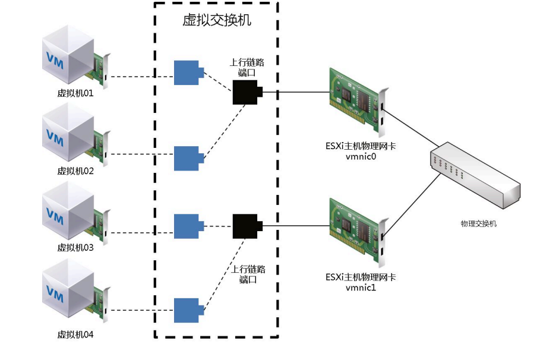

### ESXI

#### VMware vSphere 7.0新特性

- vSphere Lifecycle Manager：新一代基础架构镜像管理器，使用预期状态模型修补、更新或升级ESXI集群
- vCenter Server Profile：用于vCenter Server预期状态配置管理功能，帮助用户为多个vCenter Server定义、验证、应用配置。
- vCenter Server Update Planner：针对升级场景管理vCenter的兼容性和互操作性，能够生成互操作性和预检查报告，帮助用户针对升级进行规划
- 内容库：管理控制和版本控制功能，支持简单有效地击中管理虚拟机模板、虚拟设备、ISO镜像和脚本。
- 借助ADFS实施联合身份验证：保护访问和客户安全
- vSphere Trust Authority：用于敏感工作负载进行远程认证
- Dynamic DirectPath IO：用于支持vGPU和DirectPath I/O初始虚拟机。
- DRS：重新设计的DRS采用以工作负载为中心的方法，可以平衡分配资源给集群
- vMotion：无关虚拟机的大小，vMotion都能提供无中断操作，这对大型负载和关键应用负载非常有用
- vSphere 7.0 with Kubernetes：基于VMware Cloud Foundation服务，通过Kubernetes API为开发人员提供实时基础架构访问权限。
  - VMware Cloud Foundation Services
  - Tanzu Runtime Services
  - Hybrid Infrastructure Services
  - Tanzu Kubernetes Grid服务
  - vSphere pod服务
  - 存储卷服务
  - 网络服务
  - 镜像仓库服务

#### VMware ESXI系统硬件要求

- 处理器
- 内存
- 网卡
- 存储适配器
- 硬盘

### vCenter Server

利用vCenter Server，可以集中管理多个ESXI主机及其虚拟机。

在VMware vSphere架构中，可以在ESXI主机上部署vCenter Server Appliance（VCSA）。VCSA可以实现多个高级功能，如DRS、HA、Fault Tolerance、vMotion和Storage vMotion。

#### vCenter Server架构

- vSphere Client：使用客户端连接vCenter Server，可以集中管理ESXI主机
- vCenter Server数据库：vCenter Server数据库是vCenter Server最重要组件。数据库用于存储vCenter Server清单项、安全角色、资源池、性能数据及其重要信息。
- 托管主机：可以使用vCenter Server管理ESXI主机和在这些主机上运行的虚拟机。

#### SSO

vCenter Single Sign On（SSO），本质上是一个在vSphere应用和Authentication源之间的一个安全交互组件。它通过AD或Open LDAP之类的Identity Sources的通信来实现Authentication。

#### 增强型链接模式

对于中小企业来说，通常部署一个vCenter Server用于管理生产环境中的ESXI主机及虚拟机。一个vCenter Server可以管理大量的设备，但对于一些大型企业或者特殊应用来说，一个vCenter Server无法满足其需求，如果单独部署多个vCenter Server，因为不能统一管理又给管理带来很多问题，VMware vSphere提供了增强型链接模式来解决这个问题。通过增强型连接模式，用户登录任意一个vCenter Server就可以查看和管理所有vCenter Server。

vCenter Server 7.0的增强型链接模式新增功能：

- 无须外部Platform Services Controller支持，简化了部署
- 简化的备份和还原过程，不需负载均衡器
- 最多可将15个vCenter Server链接到一起，并在一个清单视图中显示。
- 对于vCenter HA集群，三个节点视为一个逻辑vCenter Server节点。一个vCenter HA集群需要一个vCenter Server标准许可证。

#### vCenter Server管理后台

端口：5480

vCenter Server管理后台内置有备份功能，通过日常的备份，可以快速重新部署vCenter Server。vCenter内置的备份并不是完整的虚拟机备份，仅备份了vCenter的数据库、配置等信息，通过这些信息重新部署vCenter Server。

### 创建和使用虚拟机

#### 虚拟机

虚拟机与物理机一样，都是运行操作系统和应用程序的计算机。虚拟机包含一组规范和配置文件，并由主机的物理资源提供支持。每个虚拟机都具有一些虚拟设备，这些设备可提供与物理硬件相同的功能，并且可移植性强、更安全且更易于管理。虚拟机包含若干文件（配置、虚拟磁盘、NVRAM设备和日志文件），这些文件存储在存储设备上。

#### 虚拟机组成

- 配置文件：虚拟机名称.vmx。记录了操作系统版本、内存大小、硬盘类型及大小、虚拟网卡MAC地址等信息。
- 交换文件：虚拟机名称.vswp。类似于Windows系统的页面文件，主要用于虚拟机开关机时进行内存交换。
- BIOS文件：虚拟机名称.nvram。为了与物理服务器相同，用于产生虚拟机的BIOS。
- 日志文件：vmware.log。它是虚拟机的日志文件。
- 硬盘描述文件：虚拟机名称.vmdk。它是虚拟硬盘的描述文件，与虚拟硬盘有差别
- 硬盘数据文件：虚拟机名称.flat.vmdk。它是虚拟机使用的虚拟硬盘，实际所使用的虚拟硬盘的容量就是此文件的大小。
- 挂起状态文件：虚拟机名称.vmss。它是虚拟机进入挂起状态时产生的文件
- 快照数据文件：虚拟机名称.vmsn。如果虚拟机快照包含内存状态，就会产生此文件。
- 快照硬盘文件：虚拟机名称.delta.vmdk。使用快照时，源.vmdk文件会保持源状态同时产生delta.vmdk文件，所有的操作都是在.delta.vmdk文件上进行。
- 模板文件：虚拟机名称.vmtx。它是虚拟机创建模板后产生的文件。

#### 虚拟机硬件

创建虚拟机时必须配置相对应的硬件资源。VMware vSphere7.0虚拟机使用发布的虚拟机硬件17版。

#### 虚拟机硬件资源支持

1、VMware vSphere7.0与其他版本支持的虚拟机硬件资源对比

| 最大支持    | VMware vSphere版本 |      |      |      |
| ----------- | ------------------ | ---- | ---- | ---- |
|             | 6.0                | 6.5  | 6.7  | 7.0  |
| vCPU per VM | 128                | 128  | 128  | 256  |
| vRAM per VM | 4TB                | 6TB  | 6TB  | 6TB  |

2、ESXI主机与各个版本的虚拟机硬件兼容性

| ESXi版本           | 虚拟机硬件版本 |
| ------------------ | -------------- |
| VMware ESXi 7.0    | 17             |
| VMware ESXi 6.7 U2 | 16             |
| VMware ESXi 6.7    | 14             |
| VMware ESXi 6.5    | 12、13         |
| VMware ESXi 6.0    | 11             |
| VMware ESXi 5.5    | 10             |
| VMware ESXi 5.1    | 9              |
| VMware ESXi 5.0    | 8              |
| VMware ESXi 4.X    | 7              |

3、ESXi主机及虚拟机支持的存储适配器

​      ESXi支持不同类别的适配器，包括SCSI、iSCSI、RAID、光纤通道、以太网光纤通道（Fibre Channel over Ethernet，FCoE）和以太网。

4、虚拟机磁盘类型

- Thick Provision Lazy Zeroed：厚置备延迟置零。创建虚拟机磁盘时的默认类型，所有空间都被分配，但是源来在磁盘上写入的数据不被删除。存储空间中的现有数据不被删除而是留在物理磁盘上，擦除数据和格式化只在第一次写入磁盘时进行，这会降低性能。阵列集成存储API（vStorage API for Array Integration，vAAI）的块置零特性极大地减轻了这种性能降低的现象。
- Thick Provision Eager Zeroed：厚置备置零。所有磁盘空间被保留，数据完全从磁盘上删除，磁盘创建时进行格式化，创建这样的磁盘花费时间比延迟置零长，但增强了安全性，同时，写入磁盘性能要比延迟置零好。
- Thin Privision：精简置备。使用此类型，.vmdk文件不会一开始就全部使用，而是随数据的增加而增加，例如，虚拟机设置了40GB虚拟磁盘空间，安装操作系统使用了10GB空间，那么.vmdk文件大小应该是10G，而不是40GB，好处是节省了磁盘空间。可以通过UNMAP命令对未使用空间进行回收操作。

5、虚拟机磁盘模式

- Independent Persistent：独立持久。虚拟机的所有硬盘读写都写入.vmdk文件中，这中模式提供最佳性能。
- Independent Nonpersistent：独立非持久。虚拟机启动后进行的所有修改被写入一个文件，此模式的性能不是很好。

6、虚拟网络适配器

对于虚拟机使用的网络适配器，ESXi7.0推荐使用VMXNET3。

- E1000E：Intel 82574L以太网网卡的仿真版本。是Windows8和Windows Server 2012的默认适配器。
- E1000：Intel 82545EM以太网网卡的仿真版本。
- Vlance：AMD 79C970 PCnet32 LANCE网卡的仿真版本。
- VMXNET2（增强型）：基于VMXNET适配器，只适用于ESXI3.5及更高版本客户机操作系统，不支持ESXI6.7及更高版本。
- VMXNET3：专为提高性能而设计的半虚拟化网卡。可提供VMXNET2中的所有可用功能并新增几种功能，如多队列支持、IPv6卸载和MSI/MSI-X中断传递。
- SR-IOV直通
- vSphere DirectPath I/O：允许虚拟机上的客户机操作系统直接访问连接到主机的物理PCI和PCIe设备。直通设备能够高效利用资源和提高性能。可以使用vSphere Client在虚拟机上配置直通PCI设备。
- PVRDMA：允许多个客户机通过使用行业标准结构Verbs API来访问RDMA设备，应用可使用PVRDMA客户机驱动程序与底层物理设备通信。

#### 安装VMware Tools

虚拟机安装操作系统后已经可以使用，但由于其特殊性，只有在安装了VMware Tools后，许多VMware功能才可以被使用。如果虚拟机中未安装VMware Tools，则不能使用工具栏中的关机或者重新启动选项，只能使用电源选项。同时VMware Tools针对虚拟硬件使用专用驱动程序替换了通用驱动程序，该进了虚拟机管理。

CentOS 7版本或其他新版本Linux系统在安装过程中会检测系统是否是虚拟化平台，如果是虚拟化平台，会自动安装open-vm-tools。精简版Linux可能不会自动安装，需要手动进行安装。

```shell
# 卸载非VMware官方vm-tools
yum remove open-vm-tools
# 挂载安装VMware Tools
mount -t iso9660 /dev/cdrom /mnt/cdrom
cp /mnt/cdrom/VMwareTools-10.3.21-14772444.tar.gz /tmp
# tar 解压
# 进入VMwareTools
cd vmware-tools-distrib/
./vmware-install.pl
```

#### 虚拟机模板

Virtual Machine Template，使用虚拟机模板可以在企业环境中大量快速部署虚拟机，并且不容易出现错误。模板是虚拟机的副本，可用于创建和调配新的虚拟机。

#### 克隆虚拟机

​	克隆虚拟机是通过复制源虚拟机的方式创建一台新的虚拟机，新的虚拟机是原有虚拟机的精确副本，在克隆过程中，虚拟机可以是开启或关闭状态。如果要克隆的虚拟机处于开启状态，则克隆虚拟机时，服务和应用不会自动进入静默状态。

- 虚拟机模板会占用存储空间，因此必须相应地规划存储空间。
- 使用模板部署虚拟机比克隆正在运行的虚拟机更快，特别是在第一次部署多个虚拟机的情况下。
- 当使用模板部署多台虚拟机时，所有虚拟机都以相同的基础镜像作为起点，从正在运行的虚拟机克隆虚拟机可能不会创建完全相同的虚拟机，具体取决于克隆虚拟机时，该虚拟机中进行的活动。
- 同时部署具有相同客户机操作系统设置的虚拟机和克隆虚拟机时可能会发生冲突，使用客户机操作系统进行自定义即可避免该问题。

1、创建虚拟机定义规范

​	从VMware vSphere7开始，自定义规范只能自定义网络设置，如IP地址、DNS服务器及网关，无须关闭或重启虚拟机即可更改这些设置。

2、即时克隆操作

​	即时克隆虚拟机时，源虚拟机不会因为克隆过程而丢失其状态。鉴于这种操作的速度和状态保持特性，可以转为即时调配。在即时克隆操作期间，源虚拟机将`昏迷`片刻（少于1秒）。当源虚拟机昏迷时，系统将为每个虚拟磁盘生成一个新的可写增量磁盘，同时选取一个检查点将其传输到目标虚拟机，目标虚拟机将使用源虚拟机的检查点启动，目标虚拟机完全启动后，源虚拟机也将恢复运行。即时克隆的虚拟机是完全独立的vCenter Server清单对象，可以想管理常规虚拟机那样管理即时克隆虚拟机，没有任何限制。

​	对于大规模应用部署，即时克隆非常方便，它能确保内存效率，可以在单个主机上创建大量虚拟机。避免网络冲突，可以在执行即时克隆操作期间自定义目标虚拟机的虚拟硬件。例如，可以自定义目标虚拟机的虚拟网卡的MAC地址或者串行和并行端口配置。

#### 内容库

内容库是由OVF模板和其他文件组成的存储库，这些模板和文件可以在不同的vCenter Server之间进行共享和同步。借助内容库，运维人员可以将OVF模板、ISO镜像或其他文件类型存储在一个中心位置上，可以发布这些模板、镜像和文件，并且其他内容库可以订阅和下载这些内容。

#### 热插拔虚拟机硬件

一般情况下，物理服务器添加设备或从中移除CPU、内存等硬件时，需要关闭物理服务器。对于虚拟机来说，无须关闭虚拟机即可动态添加资源。虚拟机允许在开启状态时添加CPU和内存。只能在支持可热插拔功能的客户机操作系统上使用。默认情况下，这些功能特性处于禁用状态。

要使用热插拔功能特性，必须满足以下要求：

- 虚拟机必须安装VMware Tools。
- 虚拟机硬件版本必须为11.0或以上版本。
- 虚拟机中的客户机操作系统必须支持CPU和内存热插拔功能特性
- 虚拟机虚拟硬件选项卡CPU和内存必须已开启热插拔功能。

> 虽然虚拟机支持硬件热插拔，但生产环境中建议在关机状态下进行调整，因操作系统的原因，有时热插拔硬件会导致虚拟机蓝屏或挂起。同时，生产环境中使用硬件一定要结合操作系统版本，如果不支持，添加的硬件操作系统无法识别。

#### 调整虚拟机磁盘

增强虚拟机磁盘空间时，虚拟机不得附加快照。

#### 使用虚拟机快照

​	快照在生产环境中使用非常广泛，例如，在进行某项操作之前不确定该操作是否对虚拟机有影响，可以制作快照，这样出现问题时可以回退到操作前的状态。快照也可以在对虚拟机的客户机操作系统进行修补丁或升级时使用。

快照能捕获创建时的虚拟机完整状态

- 内存状态：虚拟机内存的内容。当虚拟机已经启动并且勾选 `生成虚拟机内存快照`复选框时才会捕获内存状态
- 设置状态：虚拟机设置
- 磁盘状态：虚拟机的所有虚拟磁盘的状态。创建快照时，还可以将客户机操作系统置于静默状态。此操作会将客户机操作系统的文件系统置于静默状态，仅当不将内存状态捕获为快照的一部分时，此选项才可用。

一台虚拟机可以有一个或多个快照。对于每个快照，将创建以下文件。

- 快照增量文件：此文件包含拍摄快照以来虚拟磁盘数据的变化。拍摄虚拟机快照时，将保留每个虚拟磁盘的状态。
- 磁盘描述符文件：-00000#.vmdk。这是一个包含快照相关信息的小文本文件。
- 配置状态文件：-.vmsn。#代表磁盘依次排列的顺序号，从1开始。该文件拍摄快照时保留虚拟机的活动内存状态，包括虚拟硬件、电源状态和硬件版本。
- 内存状态文件：-.vmem。如果在创建快照期间勾选了 "生成虚拟机内存快照" 复选框，则将创建此文件。
- 快照活动内存文件：-.vmem。选择了将内存包含在内的选项，此文件将包含虚拟机内存中的内容
- 快照列表文件：.vmsd。在创建虚拟机生成的，它用于保存虚拟机快照信息，以便可以在vSphere Client中创建快照列表。
- 快照状态文件的扩展名为：.vmsn。用于存储拍摄快照时的虚拟机状态。创建每个快照时都会生成一个新的.vmsn文件，该文件会在删除快照时删除。
- VMFSsparse：VMFS5对小于2TB的虚拟磁盘使用VMFSsparse格式。
- SEsparse：SEsparse时VMFS6数据存储中所有增量磁盘的默认格式

#### 小结

- 无论是 Windows 还是 Linux 虚拟机，在制作模板前，建议安装好 VMware Tools 工具。
- 对于 Windows 虚拟机模板，建议安装好相应的补丁。
- 对于 Linux 虚拟机模板，建议使用最小安装，根据生产环境的实际情况安装其他组件包。
- 针对不同的操作系统创建不同的自定义规范，在部署过程中进行调用，避免 SID以及 UUID 相同，确保在生产环境中具有唯一性。
- 对于硬件的调整，无论 Windows 还是 Linux 虚拟机都支持热插拔，使用前需要勾选相应的启用复选框。
- 对于生产环境，不建议在虚拟机访问量高的时候进行热插拔硬件调整，因为调整过程多少会存在一些卡顿，特别是 Windows 虚拟机，可能会出现蓝屏，因此建议在访问量较小的时候进行调整。
- 生产环境快照的使用很多，一定要注意不能将快照作为备份工具，以及虚拟机不能有过多的快照。经常在项目中遇到不少由于过多快照导致虚拟机运行缓慢或者虚拟机崩溃的情况，使用整合功能也法操作。
- 生产环境对虚拟机的调整要转变思路，不能用物理服务器思维来调整，特别某些喜欢修改注册表的运维人员，在虚拟机下直接修改注册表调整某些参数可能会导致虚拟机无法启动或者启动蓝屏等情况发生。

### 配置和管理虚拟网络

​	网络在VMware vSphere环境中相当重要，无论是管理ESXi主机还是ESXi主机上运行的虚拟机对外提供服务都依赖于网络。VMware vSphere提供了强大的网络功能，其基本的网络配置就是标准交换机和分布式交换机。

#### 虚拟网络通信原理

​	ESXi主机通过模拟出一个虚拟交换机（Virtual Switch）实现虚拟机对外通信，其功能相当于一台传统的二层交换机。

​	安装完ESXi主机后，会默认创建一个虚拟交换机，物理网卡作为虚拟标准交换机的上行链路接口与物理交换机连接对外提供服务。


#### 虚拟网络组件

1、Standard Switch

Standard Switch，称为标准交换机，简称vSS。是由ESXi主机虚拟出来的交换机，在安装完ESXi后，系统会自动创建一个标准交换机vSwitch0，这个虚拟交换机的主要功能是提供管理、虚拟机与外界通信等功能。在生产环境中，一般会根据应用的需要，创建多个标准交换机对各种流量进行分离，并提供冗余及负载均衡。除了默认的vSwitch0外，还创建vSwitch1用于iSCSI，以及vSwitch2用于vMotion。在生产环境中，应该根据实际情况创建多个标准交换机。

2、Distributed Switch

Distributed Switch，称为分布式交换机，简称vDS。vDS是横跨多台ESXi主机的虚拟交换机。如果使用vSS，需要在每台ESXi主机进行网络配置。如果ESXi主机数量较少，比较适用。如果ESXi主机数量较多，vSS就不适用了，会极大增加管理人员的工作量。

3、vSwitch Port

vSwitch Port，称为虚拟交换机端口。在ESXi主机上创建的vSwitch相当于一个传统的二层交换机，既然是交换机，那么就存在端口，默认情况下，一个vSwitch的端口为120个。

4、Port Group

Port Group，称为端口组。在一个vSwitch中，可以创建一个或多个Port Group，并且针对不同的Port Group进行VLAN及流量控制等方面的配置，然后将虚拟机划入不同的Port Group，这样可以提供不同优先级的网络使用率。在生产环境中可以创建多个端口组以满足不同的应用。

5、Virtual Machine Port Group

称为虚拟机端口组。在ESXi系统安装完成后系统自动创建的vSwitch0上默认创建一个虚拟端口组，提供虚拟机与外部通信使用。在生产环境中，建议将管理网络与虚拟机端口组进行分离

6、VMkernel Port

VMkernel Port在ESXi主机网络中是一个特殊的端口，VMware对其的定义为运行特殊流量的端口，如管理流量、iSCSI流量、NFS流量、vMotion流量等。与虚拟机端口组不同的是，VMkernel Port必须配置IP地址。

#### 虚拟网络VLAN

ESXi主机的标准交换机和分布式交换机都支持802.1Q标准，与传统的支持方式也有一定差异。其比较常用的实现方式有以下两种。

1、External Switch Tagging

简称EST模式。这种模式将ESXi主机物理网卡对应的物理交换机端口划入VLAN，ESXi主机不需要额外配置。该端口就会传递相应的VLAN信息


2、Virtual Switch Tagging

简称VST模式。这种模式要求ESXi主机物理网卡对应的物理交换机端口配置为Trunk模式，同时ESXi主机需要启用Trunk模式，以便端口组接受相应的VLAN Tag信息。然后在ESXi主机网络对应的端口组下配置对应的VLAN信息。


#### 虚拟网络NIC Teaming

如果ESXi主机的虚拟交换机只使用一个物理网卡，那么就存在单点故障隐患；所有当虚拟交换机有多个物理网卡的时候，就可以形成负载均衡。

1、Originating Virtual Port ID

基于源虚拟端口的负载均衡。是ESXi主机网络默认的负载均衡方式。这种方式，系统会将虚拟机网卡与虚拟交换机所属的物理网卡进行对应和绑定，绑定后虚拟机流量始终走虚拟交换机分配的物理网卡，从不管这个物理网卡流量是否过载，除非分配的这个物理网卡发生故障后才会尝试走另外活动的物理网卡。基于源虚拟端口的负载均衡不属于动态的负载均衡方式，但可以实现冗余备份功能。




虚拟机通过算法与ESXi主机物理网卡进行绑定，虚拟机01和虚拟机02与ESXi主机物理网卡vmnic0进行绑定，虚拟机03和虚拟机04与ESXi主机物理网卡vmnic1进行绑定，无论网络流量是否过载，虚拟机只会通过绑定的网卡对外进行通信。当虚拟机03和虚拟机04绑定的ESXi主机物理网卡vmnic1出现故障时，虚拟机才会使用ESXi主机物理网卡vmnic0对外进行通信

2、Source MAC Hash

基于源MAC地址哈希算法的负载均衡。这种方式与基于源虚拟端口的负载均衡方式相似，如果虚拟机只使用一个物理网卡，那么它的源MAC地址不会发生任何变化，系统分配物理网卡及绑定后，无论网络流量是否过载，虚拟机流量始终 "走" 虚拟交换机分配的物理网卡，除非分配的这个物理网卡故障，才会尝试走另外活动的物理网卡。基于源MAC地址哈希算法的负载均衡还有另外一种实现方式，就是虚拟机使用多个虚拟网卡，以边生成多个MAC地址，这样虚拟机就能绑定多个物理网卡以实现负载均衡。


​	基于源MAC地址的负载均衡示意图。虚拟机如果只有一个MAC地址，则与基于源虚拟端口的负载均衡相同，虚拟机01和虚拟机02与ESXi主机物理网卡vmnic0进行绑定，虚拟机03和虚拟机04与ESXi主机物理网卡vmnic1进行绑定，那么无论网络流量是否过载，虚拟机只会通过绑定的网卡对外进行通信。只有当虚拟机03和虚拟机04绑定的ESXi主机物理网卡vmnic1出现故障时，虚拟机才会使用ESXi主机物理网卡vmnic0对外进行通讯。

​	基于源MAC地址的负载均衡还存在另一种方式，就是虚拟机多MAC地址模式。虚拟机有多个虚拟网卡，虚拟机02和虚拟机03有两个网卡，意味着虚拟机有2个MAC地址。在这样的模式下，通过基于源MAC地址哈希算法的负载均衡，虚拟机可能使用不同的ESXi主机物理网卡对外通信。


3、IP Base Hash

基于IP哈希算法的负载均衡。IP哈希算法时基于源IP地址和目标IP地址计算出一个哈希值，源IP地址和不同目标IP地址计算的哈希值不一样，当虚拟机与不同目标IP地址通信时使用不同的哈希值，这个哈希值就会 ''走'' 不同的物理网卡，这样就可以实现动态的负载均衡。在ESXi主机网络上使用基于IP哈希算法的负载均衡，还必须满足一个前提，就是物理交换机必须支持链路聚合控制协议（Link Aggregation Control Protocol，LACP）以及思科私有的端口聚合协议（Port Aggregation Protocol，PAP），同时要求端口必须处于同一物理交换机（如果使用思科Nexus交换机的Virtual Port Channel功能，则不需要端口处于同一物理交换机）。


由于虚拟机源IP地址和不同目标IP地址计算的哈希值不一样，所以虚拟机就不存在绑定某个ESXi主机物理网卡的情况，虚拟机01-04可以根据不同的哈希值，选择不同的ESXi主机物理网卡对外通信。需要注意的是，如果交换机不配做使用链路聚合协议，那么基于IP哈希算法的负载均衡模式无效。

#### 网络虚拟化NSX

NSX Data Center是VMware网络虚拟化的解决方案。借助网络虚拟化，可在软件中重现第2至7层的全套网络连接服务（如交换、路由、访问控制、防火墙、服务质量）。NSX是一个支持虚拟云网络的网络虚拟化和安全性平台，能够以软件定义的方式实现跨数据中心、云环境和应用框架进行延展的网络。借助NSX Data Center，可以使用网络和安全性更贴近应用，而无关应用在何处（包括虚拟机、容器和裸机）运行。与虚拟机的运维模式类似，可独立于底层硬件对网络进行调配和管理。

NSX Data Center通过软件方式重现整个网络模型，从而实现在几秒内创建和调配从简单网络到复杂网络的任何网络拓扑。用户可以创建多个具有不同要求的虚拟网络，利用由NSX或泛第三方集成生态系统（从第一代防火墙到高性能管理解决方案）提供的访问组合结构本质上更明捷、更安全的环境。可以将这些服务延展至同一云环境或跨多个云环境的端点。


#### NSX-T主要功能

| 功能                | 特性                                                         |
| ------------------- | ------------------------------------------------------------ |
| 交换                | 支持逻辑第2层叠加网络在数据中心内部及跨数据中心边界在路由（第三层）结构中进行延展。支持基于VXLAN和GENEVE的网络叠加 |
| 路由                | 在Hypervisor内核中，采用分布式方式在虚拟网络之间执行动态路由，借助物理网络路由器的双活故障转移功能横向扩展路由。支持静态路由和动态路由协议（包括IPv6） |
| 网关防火墙          | 最高可运用到第7层的有状态防火墙保护（包括应用识别和URL白名单），嵌入在NSX网关中，跨整个环境分布且采用集中式策略和管理 |
| 分布式防火墙        | 最高可运用到第 7 层的有状态防火墙保护（包括应用识别和 URL 白名单），嵌入在 Hypervisor 内核中，跨整个环境分布且采用集中式策略和管理。此外，NSX 分布式防 火墙直接集成到云原生平台（如 Kubernetes 和 Pivotal Cloud Foundry）、原生公有云（如 AWS 和 Azure）及裸机服务器中 |
| 负载均衡            | L4、L7 负载均衡器，具备 SSL 负载分流和直通、服务器运行状况检查功能和被动运 行状况检查功能，以及关于可编程性及通过 GUI 或 API 限制流量的应用规则 |
| VPN                 | 站点间和远程访问 VP 功能，通过非代管 VPN 提供云计算网关服务  |
| NSX网关             | 支持将在物理网络和 NSX 叠加网络上配置的 VLAN 桥接起来，以便在虚拟工作负载 和物理工作负载之间建立无缝连接 |
| NSX Intelligence    | 提供自动化安全策略建议，以及针对每个网络流量的持续监控和可视化功能，以便提 高可见性，实现极易审核的安全状况。作为与 NSX-T Data Center 相同的 UI 的一部分， NSX Intelligence 为网络团队和安全性团队均提供了单一窗口 |
| NSX Data Center API | 基于 JSON 的 RESTful API，用于实现与云计算管理平台、DevOps 自动化工具和自定 义自动化功能的集成 |
| 运维                | 中央 CLI、跟踪流、叠加逻辑 SPAN 和 IPFIX 等原生运维功能，可以主动监控虚拟网 络基础架构并进行故障排除。与 VMware vRealize Network Insight 等工具集成，可执 行高级分析和故障排除 |
| 环境感知微分段      | 可以基于属性（不只是 IP 地址、端口和协议）动态创建并自动更新安全组和策略，将 虚拟机名称和标记、操作系统类型，以及第 7 层应用信息等元素包括在内，以启用自 适应微分段策略。以来自 Active Directory 和其他来源的身份信息为基础的策略，可在 远程桌面服务和虚拟桌面基础架构环境中，实现单个用户会话级别的用户级安全性 |
| 自动化和云计算管理  | 与 vRealize Automation/VMware Cloud Automation Services、OpenStack 等原生集成。 完全受支持的 Ansible 模块和 Terraform 模块、与 PowerShell 集成 |
| 第三方合作伙伴集成  | 支持在大量不同领域（例如，新一代防火墙、入侵检测系统、入侵防御系统、无代理 防病毒、交换、运维和可见性、高级安全性等）与第三方合作伙伴进行管理平面、控 制平面和数据平面的集成 |
| 多云网络和安全性    | 无论底层物理拓扑或云计算平台是怎样的，均可跨数据中心站点以及私有云和公有云 边界实现一致的网络和安全性 |
| 容器网络和安全性    | 支持以 Kubernetes 和 Cloud Foundry 为基础而构建并在虚拟机或裸机主机运行的平台 上，对容器执行负载均衡、微分段（分布式防火墙保护）、路由和交换。提供对容器 网络流量（逻辑端口、SPAN/Mi、IPFIX 和跟踪流）的可见性 |

### 部署和使用存储

​	VMware vSphere对于存储的支持是非常完善的，不仅支持传统存储，如 FC SAN、iSCSI、NFS等，而且提供了对最新的软件定义存储VMware Virtual SAN的支持。

#### 常见存储类型

1、本地存储

传统的服务器都配置有本地磁盘，对于ESXi主机来说，这就是本地存储，也是基本存储之一。本地存储可以用来安装ESXi、放置虚拟机等，但使用本地存储，虚拟化架构所有高级特性，如 vMotion、HA、DRS等功能均无法使用。

2、FC SAN存储

FC SAN存储时VMware官方推荐的存储之一，能够最大程度地发挥虚拟化机构的优势，虚拟化架构所有的高级特性，如vMotion、HA、DRS等功能均可实现。同时，FC SAN存储可以支持ESXi主机FC SAN BOOT。

3、iSCSI存储

iSCSI是IP SAN解决方案，它可以使用普通服务器安装 iSCSI Target Software来实现，同时支持 SAN BOOT 引导（取决于iSCSI HBA卡是否支持BOOT）。iSCSI存储存在传输速度较慢、CPU占用率较高等问题。如果使用10GE网络、硬件iSCSI HBA卡，可以在一定程度上解决此问题。

4、NFS存储

NFS是中小企业使用最多的网络文件系统之一。最大的优点是配置管理简单，而且虚拟化架构的主要高级特性，如 vMotion、HA、DRS等功能均可实现。

#### FC SAN介绍

FC全称为Fibre Channel，"光纤通道" ，FC最早是HP、Sun、IBM等公司组成的R&D实验室中的一项研究项目，早期采用同轴电缆进行连接，后来发展到使用光纤连接，因此人们也就习惯将其称为光纤通道。

FC SAN全称为Fibre Channel Storage Area Network，中文翻译为 "光纤/网状通道存储局域网络"，是一种将存储设备、连接设备和接口集成在一个高速网络中的技术。SAN本身就是一个存储网络，承担了数据存储任务，SAN与LAN业务网络相隔离，存储数据流不会占业务网络带宽，使存储空间得到更加充分的利用，安装和管理也更加有效。

1、FC SAN服务器

如果要使用FC SAN存储，网络中必须存在一台FC SAN存储服务器，用于提供存储服务。

2、FC HBA卡

无论是FC SAN服务器还是需要连接FC SAN存储的客户端服务器，都需要配置FC HBA卡，用于连接FC SAN交换机。常用FC HBA卡主要分为单口和双口。比较主流的FC HBA卡速率为16Gbit/s或32Gbit/s，64Gbit/s。

3、FC SAN交换机

对于FC SAN服务器，以及需要连接FC SAN存储的客户端服务器来说，很少会直接进行连接，大多数生产环境会使用FC SAN交换机，这样可以增强FC SAN的安全性，并且提供冗余等特性。市面常用的FC SAN交换机主要有博科、Cisco、华为等品牌。

#### FCoE介绍

全称为Fibre Channel over Ethernet，翻译为 "以太网光纤通道"。FCoE技术表允许将光纤通道映射到以太网，可以将光纤通道信息插入以太网信息包内，从而让服务器至SAN存储设备的光纤通道请求和数据可以通过以太网连接来传输，而无需专门的光纤通道结构就可以在以太网上传输SAN数据。FCoE允许在一根通信线缆上实现LAN和FC SAN通信，融合网络可以支持LAN和FC SAN数据类型。

FCoE面向的是10GE网络，优点是在源有服务的基础上，可以大幅度减少服务器上的网络接口数量，从而降低功耗。FCoE是通过增强的10GE网络技术实现的，通常称为数据中心桥接（Data Center Bridging，DCB）或融合增强型以太网（Converged Enhanced Ethernet，CEE），使用隧道协议，如FCIP和iFCP能够传输长距离FC通信，但FCoE是一个二层封装协议，本质上使用的是以太网物理传输协议传输FC数据。

在生产环境中使用FCoE，一般来说需要比较特殊的交换机，不但需要能够承载10G流量，而且还需要能够承载FC流量。

#### iSCSi存储介绍

全称为Internet Small Computer System Interface，翻译为"小型计算机系统接口"。基于TCP/IP协议，用来建立和管理IP存储设备、主机和客户机等设备之间的相互连接，并创建存储区域网络（SAN）。SAN使得SCSI协议应用于高速数据传输网络称为可能，这种传输以数据块级别在多个数据存储网络间进行。

iSCSI存储的最大好处是能够在不增加专业设备的情况下，利用已有服务器及以太网环境快速搭建。

目前85%的iSCSI存储在部署过程中采用iSCSI Initiator软件方式实施，对于iSCSI传输的数据将使用服务器CPU进行处理，这样会额外增加服务器CPU的使用率。所以，在服务器方面，使用TCP卸载引擎（TCP Offload Engine，TOE）和iSCSI HBA卡可以有效节省CPU，尤其是对速度慢但注重性能的应用程序服务器。

#### NFS介绍

全称为Network File System，翻译为 "网络文件系统"。由Sun公司研制的UNIX表示层协议（presentation layer protocol），能使使用者访问网络上别出的文件，就像在使用自己的计算机一样。NFS是基于UDP/IP协议的应用，其实现主要采用远程过程调用（Remote Procedure Call，RPC）机制，RPC提供了一组与机器、操作系统及底层传输协议无关的存取远程文件的操作。RPC采用了XDR的支持。XDR是一种与机器无关的数据描述编码的协议，以独立于任意机器体系结构的表格对网上传送的数据进行编码和解码，支持异构系统之间数据的传输。

NFS是UNIX和Linux系统中最流行的网络文件系统之一。此外，Windows Server也将NFS作为一个组件，添加配置后可以让Windows Server提供NFS存储服务。

#### Virtual SAN介绍

vSAN，全称为Virtual SAN，是VMware的超融合软件解决方案。Virtual SAN通过内嵌的方式集成于VMware vSphere虚拟化平台，可以为虚拟机应用提供经过闪存优化的超融合存储。Virtual SAN对存储进行了虚拟化，在提供访问共享存储目标与路径的同时具备数据层控制功能，并能够基于服务器硬件创建策略驱动的存储。Virtual SAN 就是一种数据存储方式，其所有与存储相关的控制工作放在相对于物理存储硬件的外部软件中，这个软件不是作为存储设备中的固件，而是在一个服务器上作为操作系统（Operating System，OS）或 Hypervisor 的一部分。Virtual SAN 被集成到 VMware vSphere 中，并与 VMware vSphere高可用、分布式资源调度及 vMotion 深度集成在一起，通过 Web Client 进行管理。Virtual SAN最大的好处在于即使底层物理架构存储乱七八糟、面目全非，但是 Virtual SAN 是透明的，上面的应用、中间件与数据库等部署方式仍然不会发生变化，那么在其上的代码与业务逻辑也不会发生变化。

### 配置和使用vMotion

在VMware vSphere虚拟化架构中，vMotion是所有高级特性的基础，它可以将正在运行的虚拟机在不中断服务的情况下从一台ESXi主机迁移到另一台ESXi主机，或对虚拟机的存储进行迁移。该特性为虚拟机的高可用提供了强大的支持。

在生产环境中使用vMotion迁移虚拟机，推荐使用单独的虚拟机交换机运行vMotion流量。因为vMotion迁移过程会占用大量的网络带宽，如果vMotion与iSCSI存储共用通信端口，会严重影响iSCSI存储的性能。如果生产环境中以太网口数量不够，推荐选择流量较小的虚拟交换机运行vMotion流量。

#### vMtion迁移的原理

vMotion实时迁移原理就是在激活vMotion后，系统先将源ESXi主机上的虚拟机内存状态克隆到目标ESXi主机上，在接管虚拟机硬件文件，当所有操作完成后，在目标ESXi主机上激活虚拟机。


1、虚拟机A运行的ESXi主机进行维护操作，需要在不关机的情况下将其迁移到ESXi02主机。

2、激活vMotion后会在ESXi02主机上产生与ESXi01主机一样的配置的虚拟机，此时ESXi01主机会创建内存位图，在进行vMotion迁移操作时，所有对虚拟机的操作都会记录在内存位图中。

3、开始克隆ESXi01主机虚拟机A的内存到ESXi02上。

4、内存克隆完成后，由于克隆的这段时间，虚拟机A的状态已经发生变化，所以，ESXi01主机的内存位图也需要克隆到ESXi02主机。此时会出现短暂的停止，但由于内存位图克隆的时间非常短，用户几乎感觉不到停止。

5、内存位图完全克隆后，ESXi02主机会根据内存位图激活虚拟机A。

6、此时系统会对网卡MAC地址重新对应，将ESXi01所代表的MAC地址转换成ESXi02的MAC地址，目的是将报文重新定位到ESXi02主机上的虚拟机A。

7、当MAC地址重新对应成功后，ESXi01主机上的虚拟机A会被删除，将内存释放出来，vMotion迁移操作完成。

#### vMotion迁移对虚拟机要求

- 虚拟机所有文件必须存放在共享存储上
- 虚拟机不能与装载了本地映像的虚拟设备（如CD-ROM、USB、串口等）连接
- 虚拟机不能与没有连接上外部网络的虚拟交换机连接
- 虚拟机不能配置CPU关联性
- 如果虚拟机使用的是RDM，目标主机必须能够当问RDM
- 如果目标主机无法访问虚拟机的交换文件，vMotion必须能够创建一个使目标主机可以访问的交换文件，然后才能开始迁移

#### vMotion迁移对主机的要求

- 源主机和目标主机的CPU功能集必须兼容，可以使用增强型vMotion兼容性（Enhanced vMotion Compatibility，EVC）或隐藏某些功能。
- 至少拥有一个1GE网卡。1个1GE网卡同时进行4个并发的vMotion迁移，1个10GE网卡可以同时进行8个并发的vMotion迁移。
- 对相同的物理网络的访问权限
- 能够看到虚拟机使用的所有存储的能力，每个VMFS数据存储可以同时进行128个vMotion迁移。

### 配置和使用DRS服务


